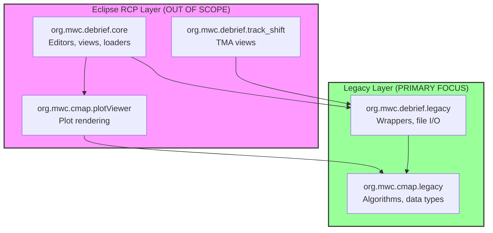
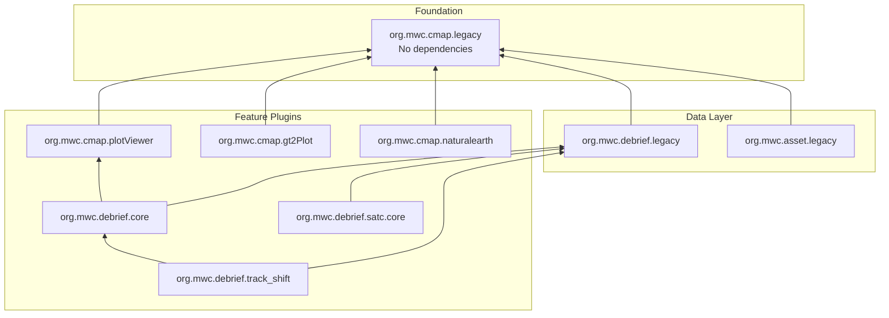
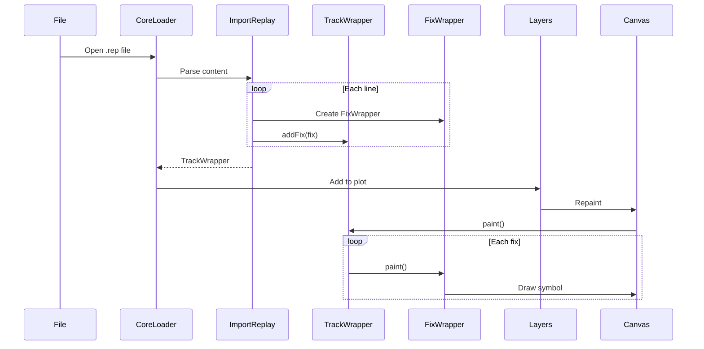
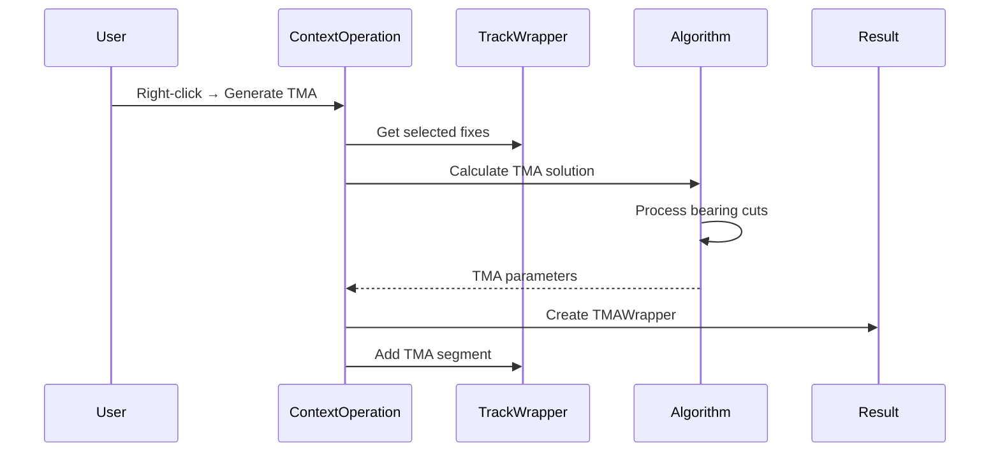
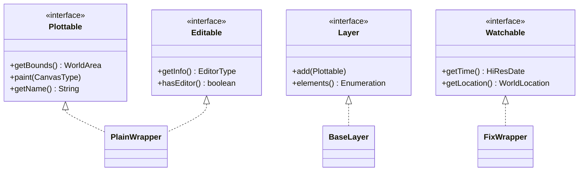
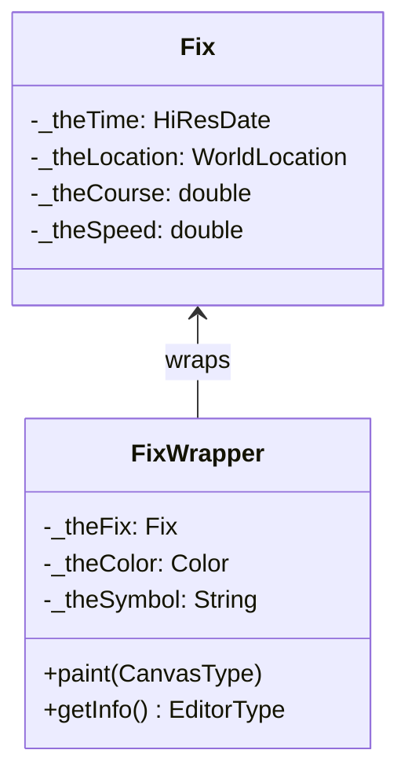
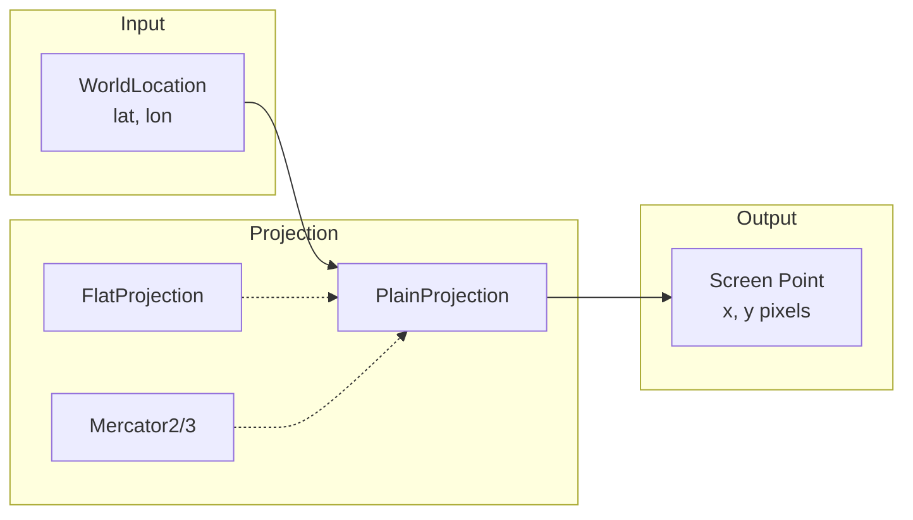
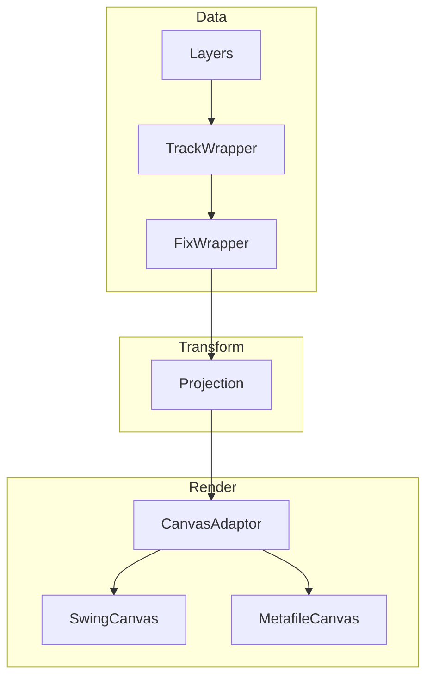

# ARCHITECTURE.md

Module dependencies, data flow, and architectural patterns in the Debrief codebase.

## Two-Layer Architecture

Debrief uses a clean separation between Eclipse RCP integration and core domain logic:



**Key Insight**: The Legacy Layer (`MWC.*`, `Debrief.*`) has no Eclipse dependencies. It can be extracted and used in Future Debrief. **[VERIFIED]**

## Plugin Dependency Graph



## Data Flow: File Load to Display



## Data Flow: Analysis Operation



## Package Structure

### org.mwc.cmap.legacy (Foundation)

```
org.mwc.cmap.legacy/src/
├── MWC/
│   ├── GenericData/          # WorldLocation, WorldSpeed, etc.
│   ├── Algorithms/           # Conversions, projections
│   │   └── Projections/      # FlatProjection, Mercator
│   ├── GUI/
│   │   ├── Canvas/           # CanvasAdaptor, SwingCanvas
│   │   ├── Shapes/           # PlainShape, CircleShape
│   │   └── Layers.java       # Layer container
│   └── TacticalData/         # Fix, tactical primitives
└── [third-party wrappers]
```

**No external dependencies** - pure Java algorithms and data types.

### org.mwc.debrief.legacy (Domain Model)

```
org.mwc.debrief.legacy/src/
├── Debrief/
│   ├── Wrappers/             # TrackWrapper, FixWrapper, etc.
│   │   └── Track/            # TrackSegment, TMASegment
│   ├── ReaderWriter/         # File format handlers
│   │   ├── Replay/           # REP format
│   │   ├── XML/              # DPF format
│   │   └── [other formats]
│   ├── GUI/                  # Tote, panels
│   └── Tools/                # Operations
└── [support classes]
```

**Depends on**: org.mwc.cmap.legacy only

### org.mwc.debrief.core (Eclipse Integration)

```
org.mwc.debrief.core/src/
└── org/mwc/debrief/core/
    ├── ContextOperations/    # 40+ analysis operations
    ├── loaders/              # File loaders
    ├── editors/              # PlotEditor
    └── [Eclipse RCP classes]
```

**Depends on**: org.mwc.debrief.legacy, org.mwc.cmap.plotViewer, Eclipse RCP

## Key Interfaces



**Plottable**: Anything that can be rendered on the canvas. **[VERIFIED]**

**Layer**: Container for plottables with iteration support. **[VERIFIED]**

**Editable**: Objects that can be edited via Eclipse property sheets. **[VERIFIED]**

**Watchable**: Time-indexed objects for time-stepping playback. **[VERIFIED]**

## Wrapper Pattern

All domain objects use a wrapper pattern for Eclipse property sheet integration:



**Rationale**: Separates core tactical data (portable) from GUI concerns (Eclipse-specific). **[VERIFIED]**

## Projection Model



**Default**: `FlatProjection` for local area approximation (most maritime operations). **[VERIFIED]**

**Selection**: Based on view area size and user preference. **[INFERRED]**

## Rendering Pipeline



**Draw Order**: Determined by layer order in `Layers` container. First added = drawn first (bottom). **[VERIFIED]**

## Extension Points

Debrief uses Eclipse extension points for pluggable functionality:

| Extension Point | Purpose | Location |
|-----------------|---------|----------|
| `DebriefPlotLoader` | Custom file format loaders | org.mwc.debrief.core/plugin.xml |
| `XMLLayerHandler` | XML element parsers | org.mwc.debrief.core/plugin.xml |
| `RepReader` | Replay format extensions | org.mwc.debrief.core/plugin.xml |

**Note**: Extension points are Eclipse RCP mechanisms, out of scope for algorithm porting.

## Design Rationale

### Why Two Layers?

The separation between Eclipse RCP and Legacy layers was intentional:
1. **Testability**: Core algorithms can be unit tested without Eclipse runtime
2. **Portability**: Legacy layer can be extracted for Future Debrief
3. **Stability**: Core logic isolated from UI framework changes

**Historical Context**: The codebase predates the Eclipse RCP decision. The `MWC.*` and `Debrief.*` packages were wrapped with Eclipse integration rather than rewritten. **[INFERRED - interview recommended]**

### Why Wrapper Pattern?

Eclipse property sheets require specific interfaces (`IPropertySource`). Rather than polluting domain classes, wrappers provide the Eclipse integration while keeping core classes clean.

### Why Custom Geodetic Math?

No external spatial libraries are used—all geodetic calculations are in-house:
- `MWC.Algorithms.Conversions` - unit conversions
- `MWC.Algorithms.EarthModels` - earth model implementations
- Custom great-circle and rhumb-line calculations

**Rationale**: Maritime precision requirements and historical development predating modern GIS libraries. **[INFERRED - interview recommended]**

## Lessons Learned

### What Worked Well

1. **Layer separation**: Clean boundary between Eclipse RCP and core logic enables extraction
2. **Wrapper pattern**: Keeps domain model portable
3. **Plottable interface**: Consistent rendering contract across all drawable objects

### What Could Be Improved

1. **File I/O coupling**: Some file readers directly create UI objects; could be cleaner
2. **Static utilities**: `Conversions` class is all static methods; harder to test/mock
3. **Large classes**: `TrackWrapper` at 3,941 lines handles many responsibilities

**For Future Debrief**: Consider smaller, focused classes and dependency injection for algorithms.

---

## See Also

- [CLAUDE.md](CLAUDE.md) - Entry point and navigation
- [DOMAIN_GLOSSARY.md](DOMAIN_GLOSSARY.md) - Maritime terminology
- [KEY_CLASSES.md](KEY_CLASSES.md) - Critical class reference
