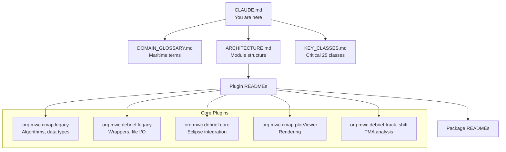

# CLAUDE.md

This file provides guidance to Claude Code (claude.ai/code) when working with code in this repository.

## Quick Navigation



## Common LLM Queries

| If you need to find... | Start here |
|------------------------|------------|
| Track/position handling | `Debrief.Wrappers.TrackWrapper`, `FixWrapper` in org.mwc.debrief.legacy |
| Sensor/bearing data | `Debrief.Wrappers.SensorWrapper`, `SensorContactWrapper` |
| TMA (Target Motion Analysis) | `org.mwc.debrief.track_shift`, `TMAWrapper` |
| Coordinate calculations | `MWC.Algorithms.Conversions`, `MWC.GenericData.WorldLocation` |
| Map projections | `MWC.Algorithms.Projections.FlatProjection`, `PlainProjection` |
| Canvas/rendering | `MWC.GUI.Canvas.*`, `MWC.GUI.Shapes.*` |
| File import (REP) | `Debrief.ReaderWriter.Replay.ImportReplay` |
| File import (XML/DPF) | `Debrief.ReaderWriter.XML.DebriefXMLReaderWriter` |
| Analysis operations | `org.mwc.debrief.core.ContextOperations.*` |
| SATC genetic algorithm | `org.mwc.debrief.satc.core` |

## Project Overview

Debrief is an Eclipse RCP (Rich Client Platform) maritime analysis application. Built with Tycho/Maven for building Eclipse plugins and features. Java 11 target.

### Two-Layer Architecture

```
┌─────────────────────────────────────────────────────────────┐
│  Eclipse RCP Layer (org.mwc.debrief.core, etc.)             │
│  - Views, editors, context operations                       │
│  - Extension points, OSGi bundles                           │
│  - OUT OF SCOPE for algorithm porting                       │
└───────────────────────┬─────────────────────────────────────┘
                        │ calls
┌───────────────────────▼─────────────────────────────────────┐
│  Legacy Layer (MWC.*, Debrief.*)                            │
│  - Pure Java, no Eclipse dependencies                       │
│  - Domain model, algorithms, file I/O                       │
│  - PRIMARY FOCUS for Future Debrief porting                 │
└─────────────────────────────────────────────────────────────┘
```

## Build Commands

```bash
# Full build
mvn clean install

# Build without tests
mvn clean install -DskipTests

# Build specific module
mvn clean install -pl org.mwc.debrief.core

# Run tests for specific module
mvn test -pl org.mwc.debrief.test2
```

## Test Architecture

Unit tests use JUnit and are organized in test suites:
- **Main test suite**: `org.mwc.debrief.test2/src/org/mwc/debrief/test/AllTests.java`
- **Asset tests**: `org.mwc.asset.test/src/org/mwc/asset/test/AllTests.java`
- **Lite tests**: `org.mwc.debrief.lite/src/test/java/org/mwc/debrief/lite/tests/AllTests.java`

Tests run via Tycho Surefire with UI harness. Test classes follow pattern `**/AllTests.class` or `**/*TestSuite*.class`.

UI tests use RCPTT (RCP Testing Tool) in `org.mwc.debrief.ui_test/`.

## Project Structure

Key module namespaces:
- `org.mwc.debrief.*` - Main Debrief application plugins
- `org.mwc.cmap.*` - Core mapping/charting framework
- `org.mwc.asset.*` - ASSET simulation framework
- `MWC.*` - Legacy core utilities (in org.mwc.cmap.legacy)
- `Debrief.*` - Legacy Debrief code (in org.mwc.debrief.legacy)

### Core Plugins (Priority Order)

| Plugin | Purpose | Priority |
|--------|---------|----------|
| `org.mwc.cmap.legacy` | Algorithms, data types, canvas, shapes | HIGH - algorithms + rendering |
| `org.mwc.debrief.legacy` | Track wrappers, file I/O, domain model | HIGH - domain model |
| `org.mwc.debrief.track_shift` | TMA and bearing analysis | HIGH - algorithms |
| `org.mwc.cmap.plotViewer` | Plot/chart rendering | HIGH - spatial rendering |
| `org.mwc.debrief.core` | Eclipse integration, context operations | MEDIUM - entry points |
| `org.mwc.debrief.satc.core` | SATC genetic algorithm | HIGH - algorithm |

## Key Domain Classes

### Domain Model (Wrappers)

| Class | Lines | Purpose |
|-------|-------|---------|
| `TrackWrapper` | 3,941 | Main track container - fixes, sensors, TMA segments |
| `FixWrapper` | 1,833 | Single position fix with time, location, course, speed |
| `SensorWrapper` | 1,639 | Sensor observations container |
| `SensorContactWrapper` | 1,152 | Individual sensor bearing/range observation |
| `TMAWrapper` | 777 | TMA solution container |

Location: `org.mwc.debrief.legacy/src/Debrief/Wrappers/`

### Core Data Types

| Class | Purpose |
|-------|---------|
| `WorldLocation` | Lat/lon/depth position (fundamental) |
| `WorldSpeed` | Speed with unit conversions |
| `WorldDistance` | Distance with unit conversions |
| `WorldArea` | Rectangular bounding region |
| `WorldVector` | Bearing + distance vector |
| `HiResDate` | Microsecond-precision timestamp |

Location: `org.mwc.cmap.legacy/src/MWC/GenericData/`

### Algorithm Classes

| Class | Purpose |
|-------|---------|
| `Conversions` | Unit/bearing/Cartesian conversions |
| `PlainProjection` | Base projection class |
| `FlatProjection` | Flat-earth projection (default) |
| `EarthModel` | Earth model interface |

Location: `org.mwc.cmap.legacy/src/MWC/Algorithms/`

### Rendering Classes

| Class | Purpose |
|-------|---------|
| `CanvasAdaptor` | Abstract canvas interface |
| `SwingCanvas` | Swing rendering implementation |
| `PlainShape` | Base shape class |
| `Layers` | Layer container/manager |

Location: `org.mwc.cmap.legacy/src/MWC/GUI/`

## File Formats

| Format | Extension | Import Class | Export |
|--------|-----------|--------------|--------|
| Replay | `.rep` | `ImportReplay` | `FormatTracks` |
| DPF/XML | `.dpf`, `.xml` | `DebriefXMLReaderWriter` | Same |
| NMEA | `.txt`, `.log` | `ImportNMEA` | - |
| GPX | `.gpx` | `GPXLoader` | `ExportGPX` |
| AIS | `.txt` | `ImportAIS` | - |

Location: `org.mwc.debrief.legacy/src/Debrief/ReaderWriter/`

## Target Platform

Eclipse target platform defined in `org.mwc.debrief.targetplatforms/eclipse-latest.target`. Based on Eclipse 2021-12 with GEF, EMF, Nebula widgets.

## Architecture Notes

- Eclipse plugin architecture with extension points for importers, editors, views
- SWT/JFace for UI, JFreeChart for plotting
- Heavy use of property sheets and Eclipse Outline view for editing
- Context operations in `org.mwc.debrief.core/src/org/mwc/debrief/core/ContextOperations/`

## Companion Documentation

| Document | Purpose |
|----------|---------|
| [DOMAIN_GLOSSARY.md](DOMAIN_GLOSSARY.md) | Maritime analysis terminology (TMA, fixes, bearings, tracks, sensors) |
| [ARCHITECTURE.md](ARCHITECTURE.md) | Module dependencies, data flow, plugin relationships |
| [KEY_CLASSES.md](KEY_CLASSES.md) | The 25 critical classes with roles and relationships |

Each core plugin and key package also has a README.md with detailed documentation.
