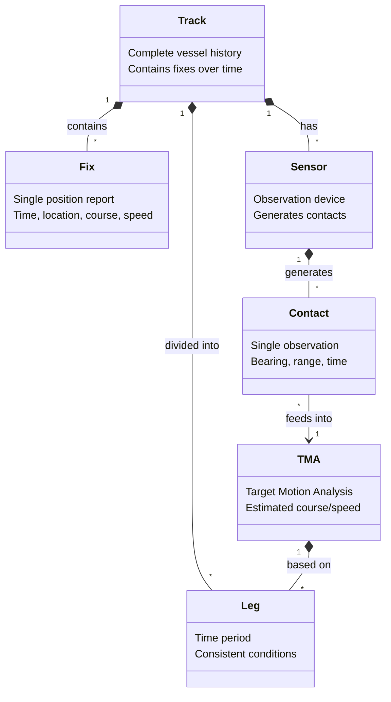

# DOMAIN_GLOSSARY.md

Maritime analysis terminology used in the Debrief codebase. Essential reference for understanding domain model and algorithms.

## Domain Concept Relationships

## Core Terms

### Fix

**Definition**: A single timestamped position report containing time, location, course, and speed. **[VERIFIED]**

**Key Properties**:
- Time stamp (`HiResDate` - microsecond precision)
- Position (`WorldLocation` - lat/lon/depth)
- Course (radians, clockwise from north)
- Speed (yards per second internally)

**Classes**:
- `MWC.TacticalData.Fix` - Raw tactical data
- `Debrief.Wrappers.FixWrapper` - GUI wrapper with display properties

**Usage**: Fundamental building block of tracks. Each fix represents a vessel's state at a moment in time.

**Location**: `org.mwc.cmap.legacy/src/MWC/TacticalData/Fix.java`

---

### Track

**Definition**: Complete historical record of a vessel's movement, composed of sequential fixes. **[VERIFIED]**

**Key Properties**:
- Collection of fixes ordered by time
- Display attributes (color, line style, symbols)
- Associated sensors and TMA solutions
- Track segments for logical grouping

**Classes**:
- `Debrief.Wrappers.TrackWrapper` - Main container (3,941 lines)
- `Debrief.Wrappers.Track.TrackSegment` - Logical grouping

**Usage**: Central data structure. Everything in Debrief revolves around tracks.

**Location**: `org.mwc.debrief.legacy/src/Debrief/Wrappers/TrackWrapper.java`

---

### Track Segment

**Definition**: A collection of consecutive fixes grouped together, forming a coherent section of track. **[VERIFIED]**

**Types**:
| Segment Type | Purpose |
|--------------|---------|
| `TrackSegment` | Base class, normal fixes |
| `CoreTMASegment` | TMA solution segment |
| `AbsoluteTMASegment` | TMA with fixed origin |
| `RelativeTMASegment` | TMA offset from reference |
| `PlanningSegment` | Planned route (course/speed/distance) |
| `DynamicInfillSegment` | Interpolated gap-filling |

**Location**: `org.mwc.debrief.legacy/src/Debrief/Wrappers/Track/`

---

### Sensor

**Definition**: Shipboard observation device (sonar, radar) that generates bearing/range observations. **[VERIFIED]**

**Key Properties**:
- Sensor type identifier
- Collection of contacts
- Display properties (line thickness, visibility)

**Classes**:
- `Debrief.Wrappers.SensorWrapper` - Container for all observations
- Multiple sensors can attach to one track

**Location**: `org.mwc.debrief.legacy/src/Debrief/Wrappers/SensorWrapper.java`

---

### Contact (Sensor Contact / Cut)

**Definition**: A single measurement from ownship sensor—typically bearing and/or range to target. **[VERIFIED]**

**Key Properties**:
- Time stamp
- Bearing (azimuth to target)
- Ambiguous bearing (alternate 180° solution for passive sonar)
- Range (if available)
- Frequency (for acoustic sensors)

**Terminology Note**: "Cut" is the common maritime term for an individual sensor contact. You'll see both terms used interchangeably. **[VERIFIED]**

**Classes**:
- `Debrief.Wrappers.SensorContactWrapper`

**Visualization**: Plotted as bearing lines from ownship position.

**Location**: `org.mwc.debrief.legacy/src/Debrief/Wrappers/SensorContactWrapper.java`

---

### Bearing

**Definition**: The direction from one point to another, measured as an angle from north. **[VERIFIED]**

**Types**:
| Bearing Type | Description |
|--------------|-------------|
| True bearing | Relative to true north |
| Relative bearing | Relative to vessel heading |
| Ambiguous bearing | Two possible solutions (passive sonar) |

**Units**: Internally stored in radians; displayed in degrees.

**Key Class**: `MWC.Algorithms.Conversions` handles bearing calculations.

---

### TMA (Target Motion Analysis)

**Definition**: Analytical process to estimate target vessel course and speed based on ownship sensor observations. **[VERIFIED]**

**Process**: Using bearing-only data from passive sonar, TMA generates hypotheses about target motion. Requires ownship maneuvers ("legs") to resolve ambiguity.

**Key Properties**:
- Estimated course (constant during segment)
- Estimated speed (constant during segment)
- Time range of validity

**Classes**:
- `Debrief.Wrappers.TMAWrapper` - Container for TMA solutions
- `Debrief.Wrappers.Track.CoreTMASegment` - Base TMA segment
- `Debrief.Wrappers.Track.AbsoluteTMASegment` - Absolute position TMA
- `Debrief.Wrappers.Track.RelativeTMASegment` - Relative to ownship

**Location**: `org.mwc.debrief.legacy/src/Debrief/Wrappers/TMAWrapper.java`

---

### Leg

**Definition**: A period of time during which certain conditions remain consistent. **[VERIFIED]**

**Types**:
| Leg Type | Purpose | Minimum |
|----------|---------|---------|
| Ownship Leg | Steady course/speed period | Configurable |
| Bearing Leg (`LegOfCuts`) | Sensor observations for TMA | 8 cuts |

**Usage in TMA**: TMA requires ownship to maintain steady course/speed for each "leg" of analysis. Multiple legs with different headings help resolve bearing ambiguity.

**Classes**:
- `org.mwc.debrief.track_shift.zig_detector.ownship.LegOfData`
- `org.mwc.debrief.track_shift.ambiguity.LegOfCuts`

---

### SATC (Semi-Automated Track Construction)

**Definition**: Automated process for generating TMA solutions from sensor observation data using genetic algorithms. **[VERIFIED]**

**Process**:
1. Input: Ownship positions + bearing observations
2. Genetic algorithm searches solution space
3. Output: Reconstructed target track

**Input File Sections**:
- Positions section (ownship track)
- Bearings section (sensor observations)

**Classes**:
- `org.mwc.debrief.satc.core` - Core genetic algorithm
- `Debrief.ReaderWriter.FlatFile.ImportSATC` - File importer

**Location**: `org.mwc.debrief.satc.core/`

---

### Planning Segment

**Definition**: Projected vessel route defined by course, speed, and distance (intended, not observed). **[VERIFIED]**

**Calculation Modes**:
| Mode | Given | Calculated |
|------|-------|------------|
| Range & Speed | Range, Speed | Time |
| Range & Time | Range, Time | Speed |
| Speed & Time | Speed, Time | Range |

**Usage**: Route planning, mission simulation, what-if analysis.

**Classes**:
- `Debrief.Wrappers.Track.PlanningSegment`
- `Debrief.Wrappers.Track.ClosingSegment` (return to start)

---

## Data Types

### WorldLocation

**Definition**: Fundamental 3D geographic position. **[VERIFIED]**

**Components**:
- Latitude (degrees, -90 to +90)
- Longitude (degrees, -180 to +180)
- Depth (metres, positive downward)

**Class**: `MWC.GenericData.WorldLocation`

---

### WorldSpeed

**Definition**: Speed value with unit conversions. **[VERIFIED]**

**Units Supported**: Knots, m/s, km/h, ft/s

**Internal Storage**: Yards per second (legacy convention)

**Class**: `MWC.GenericData.WorldSpeed`

---

### WorldDistance

**Definition**: Distance value with unit conversions. **[VERIFIED]**

**Units Supported**: Nautical miles, metres, kilometres, yards, feet

**Class**: `MWC.GenericData.WorldDistance`

---

### WorldVector

**Definition**: Combination of bearing and distance representing direction and magnitude. **[VERIFIED]**

**Components**:
- Bearing (radians)
- Range (`WorldDistance`)

**Class**: `MWC.GenericData.WorldVector`

---

### HiResDate

**Definition**: High-resolution timestamp with microsecond precision. **[VERIFIED]**

**Internal Storage**: Milliseconds since epoch (standard Java) plus microseconds offset.

**Usage**: Critical for timeline synchronisation across tracks.

**Class**: `MWC.GenericData.HiResDate`

---

## Coordinate Conventions

### Bearings

| Convention | Value | Notes |
|------------|-------|-------|
| North | 0° / 0 rad | Reference direction |
| East | 90° / π/2 rad | Clockwise from north |
| South | 180° / π rad | |
| West | 270° / 3π/2 rad | |

**Storage**: Radians internally, degrees for display.

### Latitude/Longitude

| Convention | Positive | Negative |
|------------|----------|----------|
| Latitude | North | South |
| Longitude | East | West |

### Depth

**Convention**: Positive values indicate depth below surface. Negative values (rare) indicate altitude above surface.

---

## Historical Context

### Bearing-Only TMA

The TMA algorithms predate GPS availability and assume:
- Ownship position is known (from inertial navigation or manual fixes)
- Target position is unknown
- Only bearing (and sometimes frequency) is observable

This constraint drove the design of the leg-based analysis approach. **[INFERRED - interview recommended]**

### Unit System Origins

Internal storage in yards per second and radians reflects historical naval conventions. The `WorldSpeed`, `WorldDistance` wrappers provide modern unit conversions. **[INFERRED]**

---

## See Also

- [CLAUDE.md](CLAUDE.md) - Entry point and navigation
- [ARCHITECTURE.md](ARCHITECTURE.md) - System structure
- [KEY_CLASSES.md](KEY_CLASSES.md) - Critical class reference
