# DPF (Debrief Plot File) Format Specification

This document provides a comprehensive specification of the DPF file format used by the
Debrief Maritime Analysis Application. It is intended as a reference for implementing a
DPF importer in `debrief-future`.

**XML Namespace:** `http://www.debrief.info/plot`
**XSD Schema:** `org.mwc.debrief.core/schema/debrief_plot.xsd`
**File Extensions:** `.dpf`, `.xml`

---

## Table of Contents

- [1. Document Overview](#1-document-overview)
- [2. Top-Level Structure](#2-top-level-structure)
- [3. Shared Data Types](#3-shared-data-types)
- [4. Session Element](#4-session-element)
- [5. Layers Container](#5-layers-container)
- [6. Track Element](#6-track-element)
- [7. Composite Track Element](#7-composite-track-element)
- [8. Fix Element](#8-fix-element)
- [9. Sensor Elements](#9-sensor-elements)
- [10. TMA Elements](#10-tma-elements)
- [11. Track Segments](#11-track-segments)
- [12. Dynamic Shape Sets](#12-dynamic-shape-sets)
- [13. Shape Layer Elements](#13-shape-layer-elements)
- [14. Geometric Shapes](#14-geometric-shapes)
- [15. Grid, Scale, and Chart Elements](#15-grid-scale-and-chart-elements)
- [16. Narrative Element](#16-narrative-element)
- [17. External Data References](#17-external-data-references)
- [18. Topographic Data](#18-topographic-data)
- [19. SATC Solution](#19-satc-solution)
- [20. Projection Element](#20-projection-element)
- [21. GUI State Element](#21-gui-state-element)
- [22. Importer Special Handling](#22-importer-special-handling)
- [23. Sample DPF Files for Testing](#23-sample-dpf-files-for-testing)

---

## 1. Document Overview

A DPF file is a well-formed XML document that stores the complete state of a Debrief
maritime analysis plot, including tracks, sensor observations, TMA solutions, shapes,
narratives, chart references, projection, and GUI state.

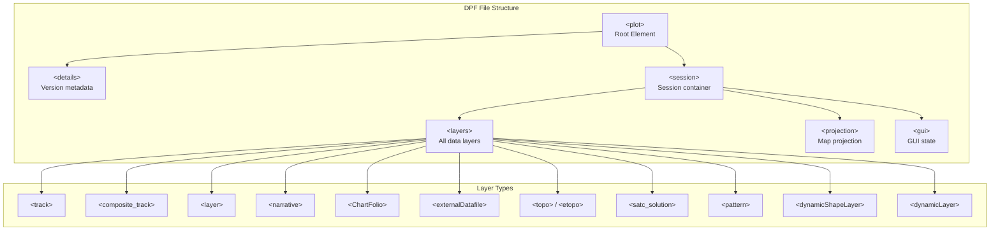

---

## 2. Top-Level Structure

### `<plot>` — Root Element

| Attribute | Type | Required | Description |
|-----------|------|----------|-------------|
| `Created` | string | Yes | Creation timestamp (e.g., `"Fri Aug 14 18:59:12 GMT 2015"`) |
| `Name` | string | Yes | Plot name (typically `"Debrief Plot"`) |
| `PlotId` | string | No | Unique plot identifier (millisecond timestamp) |

**Children:**

| Element | Min | Max | Description |
|---------|-----|-----|-------------|
| `<session>` | 1 | 1 | Contains all plot data |
| `<details>` | 0 | 1 | File metadata |

### `<details>` — Metadata

| Attribute | Type | Required | Description |
|-----------|------|----------|-------------|
| `Text` | string | No | Version string, e.g., `"Saved with Debrief version dated ..."` |

### Minimal Example

```xml
<?xml version="1.0" encoding="UTF-8" standalone="no"?>
<plot xmlns="http://www.debrief.info/plot"
      Created="Fri Aug 14 18:59:12 GMT 2015"
      Name="Debrief Plot"
      PlotId="1439324044183">
  <details Text="Saved with Debrief version dated Fri Aug 14 18:57:13 GMT 2015"/>
  <session>
    <layers>
      <!-- data layers here -->
    </layers>
  </session>
</plot>
```

---

## 3. Shared Data Types

These types are reused throughout the DPF format.

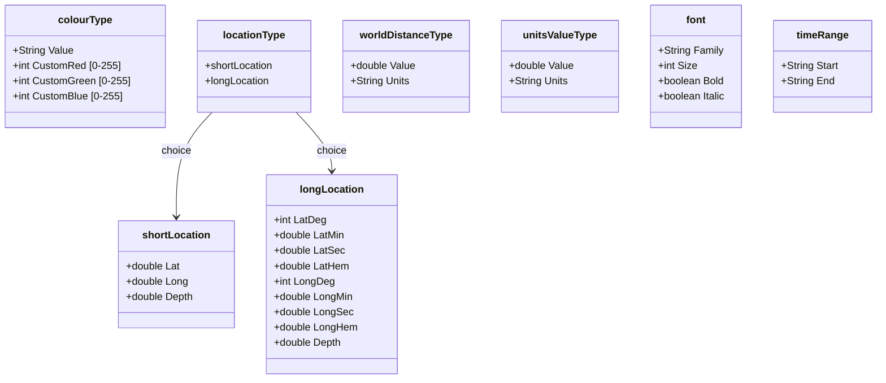

### `<colour>` — Colour Specification

Supports **named colours** or **custom RGB**:

| Attribute | Type | Required | Description |
|-----------|------|----------|-------------|
| `Value` | string | Yes | Named colour or `"custom"` |
| `CustomRed` | int (0-255) | No | Red component (when `Value="custom"`) |
| `CustomGreen` | int (0-255) | No | Green component |
| `CustomBlue` | int (0-255) | No | Blue component |

**Named Colours:** `RED`, `BLUE`, `GREEN`, `YELLOW`, `MAGENTA`, `PURPLE`, `ORANGE`,
`BROWN`, `CYAN`, `LIGHT_GREEN`, `GOLD`, `PINK`, `LIGHT_GREY`, `GREY`, `DARK_GREY`,
`WHITE`, `BLACK`, `DARK_BLUE`, `MEDIUM_BLUE`

```xml
<!-- Named colour -->
<colour Value="RED"/>

<!-- Custom RGB colour -->
<colour CustomBlue="0" CustomGreen="255" CustomRed="128" Value="custom"/>
```

### Location Types

**`<shortLocation>`** — The most common format (decimal degrees):

| Attribute | Type | Required | Description |
|-----------|------|----------|-------------|
| `Lat` | double | Yes | Latitude in decimal degrees (positive = North) |
| `Long` | double | Yes | Longitude in decimal degrees (positive = East) |
| `Depth` | double | Yes | Depth in metres (positive = below surface) |

**`<longLocation>`** — Verbose DMS format:

| Attribute | Type | Required | Description |
|-----------|------|----------|-------------|
| `LatDeg` | int | Yes | Latitude degrees |
| `LatMin` | double | Yes | Latitude minutes |
| `LatSec` | double | Yes | Latitude seconds |
| `LatHem` | double | Yes | Latitude hemisphere |
| `LongDeg` | int | Yes | Longitude degrees |
| `LongMin` | double | Yes | Longitude minutes |
| `LongSec` | double | Yes | Longitude seconds |
| `LongHem` | double | Yes | Longitude hemisphere |
| `Depth` | double | Yes | Depth in metres |

Locations are wrapped in context-specific parent elements:

```xml
<centre>
  <shortLocation Depth="0.000" Lat="54.4730900" Long="8.1202679"/>
</centre>

<tl><!-- top-left -->
  <shortLocation Depth="0.000" Lat="50.98" Long="-1.50"/>
</tl>

<br><!-- bottom-right -->
  <shortLocation Depth="0.000" Lat="50.81" Long="-1.04"/>
</br>
```

### `<WorldDistance>` / worldDistanceType

| Attribute | Type | Required | Description |
|-----------|------|----------|-------------|
| `Value` | double | Yes | Numeric distance |
| `Units` | string | Yes | Unit code |

**Unit Codes:** `nm` (Nautical Miles), `yds` (Yards), `m` (Metres), `km` (Kilometres),
`degs` (Degrees), `kyd` (Kiloyards)

### `<font>` — Font Specification

| Attribute | Type | Required | Description |
|-----------|------|----------|-------------|
| `Family` | string | Yes | Font family (e.g., `"Arial"`, `"Sans Serif"`) |
| `Size` | int | Yes | Point size |
| `Bold` | boolean | No | Bold style |
| `Italic` | boolean | No | Italic style |

### `<timeRange>` — Time Range

| Attribute | Type | Required | Description |
|-----------|------|----------|-------------|
| `Start` | string | Yes | Start date/time |
| `End` | string | No | End date/time (omit for open-ended) |

### Date/Time Format

All DTG (Date-Time Group) values use the Debrief custom format: `yyMMdd HHmmss`

Examples: `700103 013425`, `100112 121314`, `951212 054000`

**Note:** The 2-digit year follows the convention where `70+` = 1970s, etc. The parser
uses `DebriefFormatDateTime.parseThis()` which handles century disambiguation.

### `labelLocationType` — Enum

Valid values: `Top`, `Left`, `Bottom`, `Centre`, `Right`, `Middle`

---

## 4. Session Element

### `<session>`

Contains the three top-level children:

| Element | Min | Max | Description |
|---------|-----|-----|-------------|
| `<layers>` | 1 | 1 | All data layers |
| `<projection>` | 0 | 1 | Map projection state |
| `<gui>` | 0 | 1 | GUI/stepper state |

---

## 5. Layers Container

### `<layers>`

Container for all plot data. Can contain any combination of the following child elements
in any order:

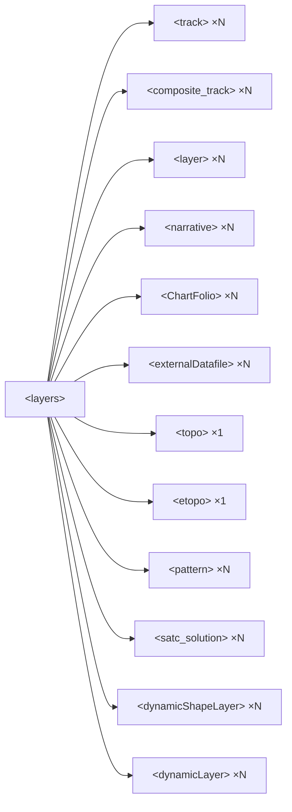

---

## 6. Track Element

The `<track>` is the primary data container for vessel positions and related
observations.

```mermaid
graph TD
    TRACK["&lt;track&gt;<br/>Name, Symbol, Visible, ..."]

    TRACK --> COL["&lt;colour&gt;"]
    TRACK --> SCOL["&lt;SymbolColor&gt;"]
    TRACK --> FONT["&lt;font&gt;"]
    TRACK --> SW["&lt;SYMBOL_WIDTH&gt;"]
    TRACK --> SL["&lt;SYMBOL_LENGTH&gt;"]
    TRACK --> CTL["&lt;CustomTrailLength&gt;"]

    TRACK --> TS["&lt;TrackSegment&gt; ×N"]
    TRACK --> RTS["&lt;RelativeTMASegment&gt; ×N"]
    TRACK --> ATS["&lt;AbsoluteTMASegment&gt; ×N"]
    TRACK --> DIS["&lt;DynamicInfillSegment&gt; ×N"]
    TRACK --> SL2["&lt;SegmentList&gt;"]
    TRACK --> FIX["&lt;fix&gt; ×N<br/>(legacy, unsegmented)"]

    TRACK --> SENS["&lt;sensor&gt; ×N"]
    TRACK --> TMA["&lt;tma&gt; ×N"]
    TRACK --> DSS["&lt;DynamicShapeSet&gt; ×N"]
```

### Track Attributes

| Attribute | Type | Default | Description |
|-----------|------|---------|-------------|
| `Name` | string | **required** | Track identifier |
| `Visible` | boolean | `true` | Display flag |
| `PositionsVisible` | boolean | `true` | Show fix positions |
| `NameVisible` | boolean | `true` | Show track name label |
| `NameAtStart` | boolean | `true` | Place name at track start |
| `NameLocation` | labelLocationType | `Right` | Name label position |
| `Symbol` | string | `SQUARE` | Symbol type (e.g., `Submarine`, `Frigate`, `Unknown`) |
| `LineThickness` | int | `1` | Line width in pixels |
| `LineStyle` | int | `1` | Line style (0=solid, etc.) |
| `PlotArrayCentre` | boolean | `true` | Array centre plotting mode |
| `InterpolatePoints` | boolean | `true` | Interpolate between fixes |
| `LinkPositions` | boolean | `true` | Connect fixes with lines |
| `EndTimeLabels` | boolean | `true` | Show DTG at track start/end |
| `SensorsVisible` | boolean | `true` | Show sensor sub-layers |
| `SolutionsVisible` | boolean | `true` | Show TMA solution sub-layers |
| `ColorMode` | string | **required** | Colour scheme: see below |
| `CustomVectorStretch` | double | `1.0` | Override vector stretch factor |

### ColorMode Values

| Value | Description |
|-------|-------------|
| `Per-fix Shades` | Each fix is shaded individually |
| `Override` | Single colour for entire track |
| *dataset name* | Colour from a named dataset (deferred binding) |

### Track Child Elements

| Element | Description |
|---------|-------------|
| `<colour>` | Track line colour |
| `<SymbolColor>` | Symbol-specific colour |
| `<font>` | Track name label font |
| `<SYMBOL_WIDTH>` | Symbol width as `worldDistanceType` |
| `<SYMBOL_LENGTH>` | Symbol length as `worldDistanceType` |
| `<CustomTrailLength>` | Snail trail length override (`unitsValueType`) |

---

## 7. Composite Track Element

Extends `<track>` with planning-specific features for route planning scenarios.

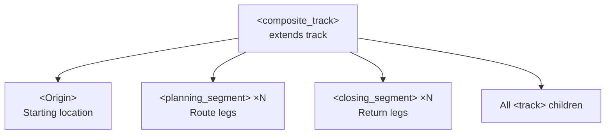

### Additional Attributes (beyond track)

| Attribute | Type | Required | Description |
|-----------|------|----------|-------------|
| `StartTime` | string (DTG) | No | Route start time |
| `SymbolIntervalMillis` | long | No | Symbol display frequency (milliseconds) |
| `LabelIntervalMillis` | long | No | Label display frequency (milliseconds) |

### `<planning_segment>` — Route Leg

| Attribute | Type | Required | Description |
|-----------|------|----------|-------------|
| `Name` | string | No | Leg name |
| `course` | double | No | Course in degrees |
| `depth` | double | No | Depth in metres |
| `calcModel` | enum | No | `Speed/Time`, `Range/Time`, or `Range/Speed` |
| `Visible` | boolean | `true` | Display flag |
| `VectorLabelVisible` | boolean | `true` | Show vector labels |
| `LineStyle` | string | No | Line style name |

**Children:**

| Element | Description |
|---------|-------------|
| `<WorldDistance>` | Leg distance (with units) |
| `<Speed>` | Leg speed (with units) |
| `<Duration>` | Leg duration (with units) |
| `<colour>` | Leg colour |
| `<fix>` | Generated fix positions |

```xml
<composite_track Name="testTrack" StartTime="150811 201513"
                 Symbol="Submarine" SymbolIntervalMillis="300000" ...>
  <colour CustomBlue="0" CustomGreen="0" CustomRed="255" Value="custom"/>
  <Origin>
    <shortLocation Depth="0.000" Lat="50.8544859" Long="-1.3422500"/>
  </Origin>
  <planning_segment Name="leg1" course="45.000" calcModel="Speed/Time">
    <WorldDistance Units="nm" Value="2.4000000"/>
    <Speed Units="kts" Value="12.000"/>
    <Duration Units="minutes" Value="12.000"/>
    <colour CustomBlue="0" CustomGreen="0" CustomRed="255" Value="custom"/>
  </planning_segment>
</composite_track>
```

---

## 8. Fix Element

A `<fix>` represents a single position observation at a point in time.

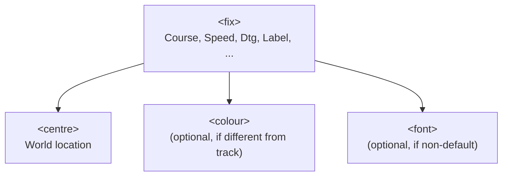

### Fix Attributes

| Attribute | Type | Required | Description |
|-----------|------|----------|-------------|
| `Course` | double | Yes | Heading in **degrees** (stored in radians internally) |
| `Speed` | double | Yes | Speed in **knots** (stored in yards/sec internally) |
| `Dtg` | string | Yes | Date-time group |
| `Label` | string | Yes | Fix label (e.g., `"0134"`) |
| `Visible` | boolean | `true` | Display flag |
| `LabelShowing` | boolean | `true` | Show label |
| `SymbolShowing` | boolean | `true` | Show symbol |
| `LineShowing` | boolean | `true` | Show connecting line |
| `ArrowShowing` | boolean | `false` | Show direction arrow |
| `LabelLocation` | labelLocationType | `Left` | Label position |
| `Comment` | string | No | Optional comment text |
| `DisplayComment` | boolean | No | **Legacy** — mapped to `CommentShowing` |

### Fix Example

```xml
<fix ArrowShowing="false" Course="149.300" Dtg="700103 013425"
     Label="030134" LabelLocation="Right" LabelShowing="false"
     LineShowing="true" Speed="12.000" SymbolShowing="false" Visible="true">
  <centre>
    <shortLocation Depth="0.000" Lat="54.4730900" Long="8.1202679"/>
  </centre>
</fix>
```

---

## 9. Sensor Elements

Sensors represent sonar/radar observations attached to a track.

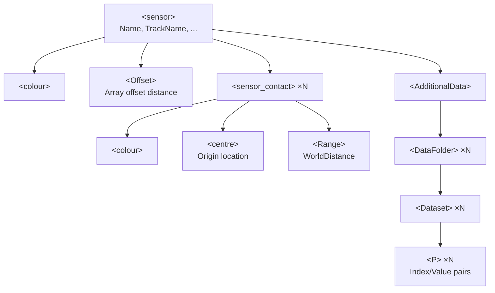

### `<sensor>` Attributes

| Attribute | Type | Default | Description |
|-----------|------|---------|-------------|
| `Name` | string | **required** | Sensor name |
| `TrackName` | string | No | Parent track name |
| `Visible` | boolean | `true` | Display flag |
| `LineThickness` | int | `1` | Line width |
| `WormInHole` | boolean | `false` | **Legacy** — towed array mode |
| `ArrayMode` | string | No | **New** — `"Plain"`, `"Worm in hole"`, or dataset name |
| `BaseFrequency` | double | No | Radiated frequency (f-nought) for tonal tracking |

### `<sensor_contact>` Attributes

| Attribute | Type | Required | Description |
|-----------|------|----------|-------------|
| `Dtg` | string | Yes | Observation time |
| `Label` | string | Yes | Contact label |
| `Bearing` | double | No | Bearing in degrees from observer |
| `Visible` | boolean | `true` | Display flag |
| `HasFrequency` | boolean | `false` | Frequency data present flag |
| `Frequency` | double | No | Measured frequency value |
| `HasAmbiguousBearing` | boolean | `false` | Ambiguity flag |
| `AmbiguousBearing` | double | No | 180-degree ambiguous bearing |
| `LabelShowing` | boolean | `true` | Show label |
| `LabelLocation` | labelLocationType | `Left` | Label position |
| `LineStyle` | string | `SOLID` | Line style name |
| `PutLabelAt` | labelLocationType | `Left` | Label placement on line |
| `Range` | double | No | **Legacy** — range in yards (see special handling) |
| `Comment` | string | No | Optional comment |

### Sensor Contact Children

| Element | Description |
|---------|-------------|
| `<colour>` | Contact-specific colour |
| `<centre>` | Absolute origin location (for positioned sensors) |
| `<Range>` | Range as `worldDistanceType` with explicit units (**preferred**) |

### `<AdditionalData>` — Sensor Measurement Streams

Hierarchical time-series data attached to sensors:

```xml
<AdditionalData>
  <DataFolder Name="Measurements">
    <DataFolder Name="Fore &amp; Aft">
      <Dataset Name="Heading" Units="°">
        <P Index="1263297600000" Value="0.0"/>
        <P Index="1263297650000" Value="227.14"/>
      </Dataset>
      <Dataset Name="Depth" Units="m">
        <P Index="1263297600000" Value="12.75"/>
      </Dataset>
    </DataFolder>
  </DataFolder>
</AdditionalData>
```

- `Index` = Unix timestamp in **milliseconds**
- `Units` = measurement unit string

---

## 10. TMA Elements

TMA (Target Motion Analysis) solutions attached to tracks.

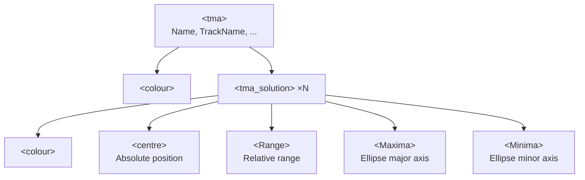

### `<tma>` Attributes

| Attribute | Type | Default | Description |
|-----------|------|---------|-------------|
| `Name` | string | **required** | Solution track name |
| `TrackName` | string | No | Parent track name |
| `Visible` | boolean | `true` | Display flag |
| `LineThickness` | int | `1` | Line width |
| `BearingLineVisible` | boolean | `false` | Show bearing lines to observer |
| `LabelsVisible` | boolean | `true` | Show solution labels |

### `<tma_solution>` Attributes

| Attribute | Type | Required | Description |
|-----------|------|----------|-------------|
| `Dtg` | string | Yes | Solution time |
| `Label` | string | Yes | Solution label |
| `Course` | double | No | Target course (degrees) |
| `Speed` | double | No | Target speed (knots) |
| `Depth` | double | No | Target depth (metres) |
| `Visible` | boolean | `true` | Display flag |
| `LabelShowing` | boolean | `true` | Show label |
| `SymbolShowing` | boolean | `true` | Show symbol |
| `LineShowing` | boolean | `true` | Show line |
| `EllipseShowing` | boolean | `true` | Show error ellipse |
| `Symbol` | string | No | Symbol type |
| `LabelLocation` | labelLocationType | `Left` | Label position |
| `Orientation` | double | No | Ellipse orientation (degrees) |
| `Bearing` | double | No | Relative bearing from observer (for relative solutions) |
| `Range` | double | No | **Legacy** — range in yards |
| `Maxima` | double | No | **Legacy** — ellipse major axis in kiloyards |
| `Minima` | double | No | **Legacy** — ellipse minor axis in kiloyards |

**Positioning:** Either absolute (`<centre>`) or relative (`Bearing` + `<Range>`):

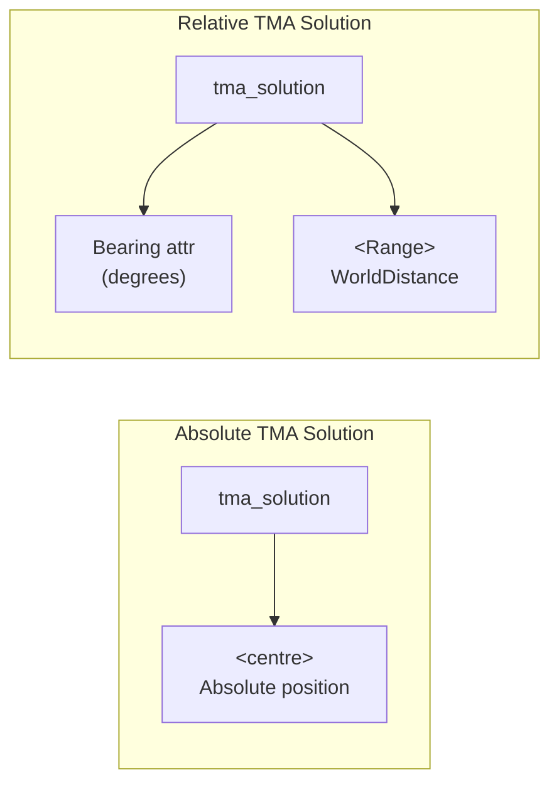

---

## 11. Track Segments

Track segments divide a track into logical legs. Fixes are grouped within segments.

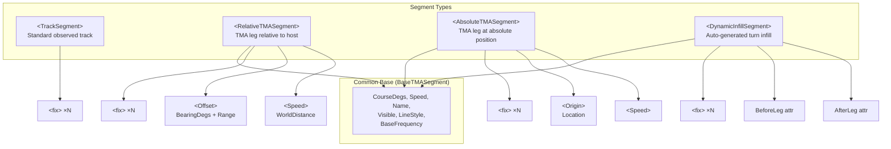

### `<TrackSegment>` — Standard Segment

| Attribute | Type | Default | Description |
|-----------|------|---------|-------------|
| `Name` | string | No | Segment name (typically first fix DTG) |
| `Visible` | boolean | `true` | Display flag |
| `LineStyle` | string | No | Line style name (e.g., `"Solid"`) |
| `PlotRelative` | boolean | `false` | Plot relative to host track |

**Children:** `<fix>` elements

### `<RelativeTMASegment>` — Relative TMA Leg

| Attribute | Type | Required | Description |
|-----------|------|----------|-------------|
| `CourseDegs` | double | No | TMA leg course in degrees |
| `Name` | string | No | Segment name |
| `Visible` | boolean | No | Display flag |
| `LineStyle` | string | No | Line style |
| `HostTrack` | string | **Yes** | Name of reference track |
| `HostSensor` | string | No | Name of sensor for origin |
| `BaseFrequency` | double | No | Radiated frequency |

**Children:**

| Element | Description |
|---------|-------------|
| `<Speed>` | Speed with units |
| `<Offset>` | Bearing + Range vector from host |
| `<fix>` | Position fixes |

**`<Offset>` structure:**
```xml
<Offset BearingDegs="45.0">
  <Range Units="yds" Value="5000.0"/>
</Offset>
```

### `<AbsoluteTMASegment>` — Absolute TMA Leg

Same as relative but uses `<Origin>` location instead of `<Offset>`:

| Attribute | Same as RelativeTMASegment minus HostTrack/HostSensor |
|-----------|------|

**Children:** `<Speed>`, `<Origin>` (location), `<fix>` elements

### `<DynamicInfillSegment>` — Auto-Generated Turn

| Attribute | Type | Required | Description |
|-----------|------|----------|-------------|
| `BeforeLeg` | string | **Yes** | Name of preceding TMA leg |
| `AfterLeg` | string | **Yes** | Name of following TMA leg |

**Note:** Infill segments with 1 or fewer fixes are silently dropped on import.

### `<SegmentList>` — Segment Container

Groups multiple segments within a track:

```xml
<SegmentList>
  <TrackSegment ...>...</TrackSegment>
  <RelativeTMASegment ...>...</RelativeTMASegment>
  <AbsoluteTMASegment ...>...</AbsoluteTMASegment>
</SegmentList>
```

---

## 12. Dynamic Shape Sets

Time-varying sensor coverage patterns attached to tracks.

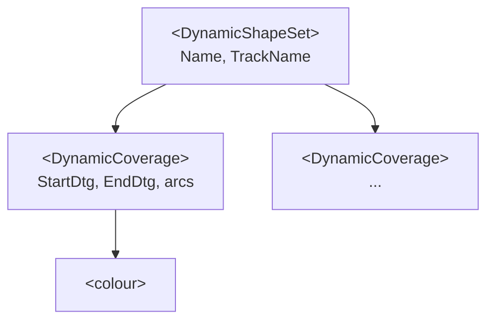

### `<DynamicShapeSet>` Attributes

| Attribute | Type | Required | Description |
|-----------|------|----------|-------------|
| `Name` | string | **Yes** | Shape set name |
| `TrackName` | string | **Yes** | Host track name |
| `Visible` | string | No | Display flag |
| `LineThickness` | int | No | Line width |

### `<DynamicCoverage>` Attributes

| Attribute | Type | Required | Description |
|-----------|------|----------|-------------|
| `arcs` | string | **Yes** | Arc definitions (see below) |
| `Label` | string | **Yes** | Shape label |
| `StartDtg` | string | No | Start time (if omitted, shown until EndDtg) |
| `EndDtg` | string | No | End time (if omitted, shown from StartDtg permanently) |
| `Visible` | string | No | Display flag |
| `LabelShowing` | boolean | `true` | Show label |
| `LabelLocation` | labelLocationType | `Left` | Label position |
| `LineStyle` | string | No | Line style name |
| `filled` | boolean | `true` | Fill the shape |
| `SemiTransparent` | boolean | `true` | Semi-transparent rendering |

### Arc String Format

The `arcs` attribute contains space-separated groups of 4 integers:

```
startAngle endAngle innerRadius outerRadius [startAngle endAngle innerRadius outerRadius] ...
```

- Angles in **degrees relative to ownship heading**
- Radii in **yards**

Examples:
```
arcs="0 360 500 1000"       <!-- Full ring, 500-1000yd -->
arcs="-45 45 0 1000"        <!-- Forward 90° sector, 0-1000yd -->
arcs="-55 55 0 1200"        <!-- Forward 110° sector, 0-1200yd -->
```

---

## 13. Shape Layer Elements

### `<layer>` — Generic Layer

| Attribute | Type | Default | Description |
|-----------|------|---------|-------------|
| `Name` | string | **required** | Layer name |
| `Visible` | boolean | `true` | Display flag |
| `LineThickness` | int | `1` | Default line width |

Can contain any combination of shapes:

```mermaid
graph TD
    LAYER["&lt;layer&gt;"]
    LAYER --> TL["&lt;textlabel&gt;"]
    LAYER --> LINE["&lt;line&gt;"]
    LAYER --> RECT["&lt;rectangle&gt;"]
    LAYER --> CIRC["&lt;circle&gt;"]
    LAYER --> ELLIPSE["&lt;ellipse&gt;"]
    LAYER --> POLY["&lt;polygon&gt;"]
    LAYER --> VEC["&lt;vector&gt;"]
    LAYER --> ARC["&lt;Arc&gt;"]
    LAYER --> WHEEL["&lt;wheel&gt;"]
    LAYER --> COAST["&lt;coastline&gt;"]
    LAYER --> VPF["&lt;vpf_coastline&gt;"]
    LAYER --> VPFDB["&lt;vpf_database&gt;"]
    LAYER --> CR["&lt;ChartReference&gt;"]
    LAYER --> SCALE["&lt;scale&gt;"]
    LAYER --> GRID["&lt;grid&gt;"]
    LAYER --> LG["&lt;LocalGrid&gt;"]
    LAYER --> G4W["&lt;Grid4W&gt;"]
    LAYER --> LWT["&lt;LightweightTrack&gt;"]
```

### `<dynamicShapeLayer>` — Time-Stamped Shape Layer

Only shows the shape nearest to the current replay time.

| Attribute | Type | Default | Description |
|-----------|------|---------|-------------|
| `Name` | string | **required** | Layer name |
| `Visible` | boolean | `true` | Display flag |
| `LineThickness` | int | `1` | Line width |
| `PlotAllShapes` | boolean | `false` | Ignore time, plot all shapes |

**Children:** `<polygon>`, `<rectangle>`, `<circle>`

### `<dynamicLayer>` — Time Display Layer

| Attribute | Type | Default | Description |
|-----------|------|---------|-------------|
| `Name` | string | **required** | Layer name |
| `Visible` | boolean | `true` | Display flag |

**Children:** `<timeDisplay>` elements

### `<timeDisplay>` — Time Display Widget

| Attribute | Type | Default | Description |
|-----------|------|---------|-------------|
| `Name` | string | No | Widget name |
| `Visible` | boolean | `true` | Display flag |
| `Prefix` | string | No | Text prefix before time |
| `Suffix` | string | No | Text suffix after time |
| `FormatTime` | string | No | Time format string |
| `Location` | string | No | Screen position |
| `Origin` | string | No | Time origin reference |
| `Absolute` | boolean | `true` | Absolute vs relative time |
| `FillBackground` | boolean | `false` | Fill background |
| `SemiTransparent` | boolean | `false` | Semi-transparent background |

**Children:** `<Color>`, `<BackgroundColor>`, `<NegativeColor>` (colourType), `<font>`

---

## 14. Geometric Shapes

All shapes share a common base type with these attributes/children:

### Common Shape Base

| Attribute | Type | Default | Description |
|-----------|------|---------|-------------|
| `Label` | string | No | Shape label |
| `LabelLocation` | labelLocationType | No | Label position |
| `LabelVisible` | boolean | No | Show label |
| `LineStyle` | int | No | Line style code |
| `LineThickness` | int | No | Line width |
| `Visible` | boolean | No | Display flag |
| `SemiTransparent` | boolean | No | Semi-transparent rendering |

**Common Children:** `<colour>`, `<fontcolour>`, `<timeRange>`, `<font>`

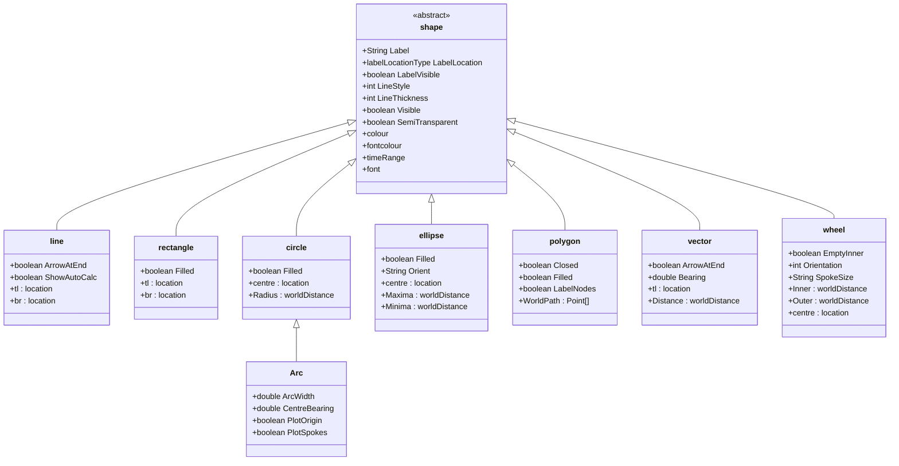

### `<textlabel>` — Text/Symbol Marker

| Attribute | Type | Description |
|-----------|------|-------------|
| `Label` | string | Text content |
| `Scale` | string | Size: `"Small"`, `"Medium"`, `"Large"` |
| `Symbol` | string | Symbol type (e.g., `"FilledCircle"`, `"Square"`, `"FilledSquare"`) |
| `SymbolVisible` | boolean | Show symbol |
| `LabelVisible` | boolean | Show text |
| `LabelLocation` | labelLocationType | Text position |
| `Visible` | boolean | Display flag |

**Children:** `<colour>`, `<font>`, `<centre>`, `<timeRange>`

### `<line>` — Line Segment

Start/end defined by `<tl>` and `<br>` location elements.

| Extra Attribute | Type | Description |
|-----------------|------|-------------|
| `ArrowAtEnd` | boolean | Draw arrowhead |
| `ShowAutoCalc` | boolean | Show range/bearing in line middle |

### `<circle>` — Circle

| Extra Attribute | Type | Description |
|-----------------|------|-------------|
| `Filled` | boolean | Fill the circle |
| `Radius` | string | **Legacy** — radius in kiloyards |

**Children:** `<centre>`, `<Radius>` (worldDistanceType, preferred)

### `<ellipse>` — Ellipse

| Extra Attribute | Type | Description |
|-----------------|------|-------------|
| `Filled` | boolean | Fill the ellipse |
| `Orient` | string | Orientation in degrees |
| `Maxima` | string | **Legacy** — major axis in kiloyards |
| `Minima` | string | **Legacy** — minor axis in kiloyards |

**Children:** `<centre>`, `<Maxima>` (worldDistanceType), `<Minima>` (worldDistanceType)

### `<polygon>` — Polygon

| Extra Attribute | Type | Description |
|-----------------|------|-------------|
| `Closed` | boolean | Close the polygon path |
| `Filled` | boolean | Fill the polygon |
| `LabelNodes` | boolean | Label individual nodes |

**Children:** `<WorldPath>` containing `<Point>` location elements

```xml
<polygon Closed="true" Filled="true" LabelNodes="false" ...>
  <colour Value="GREEN"/>
  <WorldPath>
    <Point><shortLocation Lat="51.0" Long="-1.0" Depth="0.0"/></Point>
    <Point><shortLocation Lat="51.1" Long="-0.9" Depth="0.0"/></Point>
    <Point><shortLocation Lat="51.0" Long="-0.8" Depth="0.0"/></Point>
  </WorldPath>
</polygon>
```

### `<vector>` — Bearing/Distance Vector

| Extra Attribute | Type | Description |
|-----------------|------|-------------|
| `ArrowAtEnd` | boolean | Draw arrowhead |
| `Bearing` | double | Bearing in degrees |

**Children:** `<tl>` (origin), `<Distance>` (worldDistanceType)

### `<Arc>` — Arc (extends circle)

| Extra Attribute | Type | Description |
|-----------------|------|-------------|
| `ArcWidth` | double | Angular width in degrees |
| `CentreBearing` | double | Centre bearing in degrees |
| `PlotOrigin` | boolean | Show origin point |
| `PlotSpokes` | boolean | Show spoke lines |

### `<wheel>` — Range Rings

| Extra Attribute | Type | Description |
|-----------------|------|-------------|
| `EmptyInner` | boolean | Leave inner area empty |
| `Orientation` | int | Orientation in degrees |
| `SpokeSize` | string | Spoke angular size |
| `Inner` | string | **Legacy** — inner radius |
| `Outer` | string | **Legacy** — outer radius |

**Children:** `<centre>`, `<Inner>` (worldDistanceType), `<Outer>` (worldDistanceType)

---

## 15. Grid, Scale, and Chart Elements

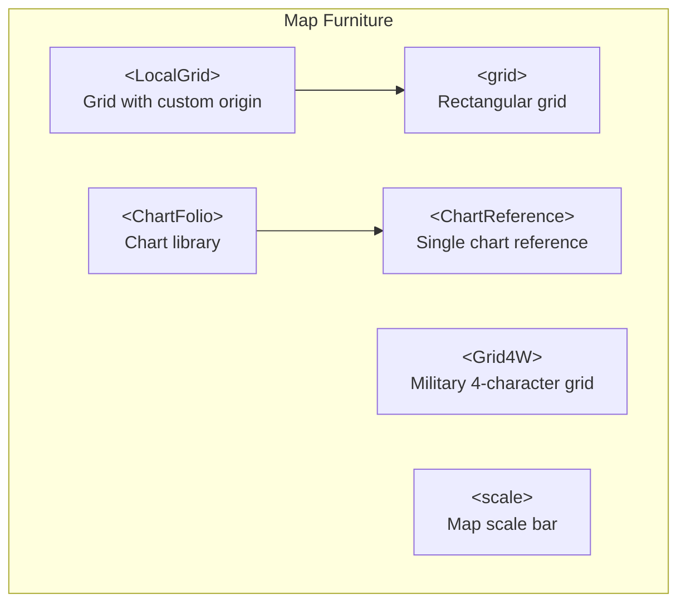

### `<grid>` — Standard Grid

| Attribute | Type | Description |
|-----------|------|-------------|
| `Name` | string | Grid name |
| `Visible` | boolean | Display flag |
| `PlotLabels` | boolean | Show grid labels |
| `Delta` | double | **Legacy** — grid spacing |
| `Units` | string | **Legacy** — spacing units |

**Children:** `<font>`, `<Delta>` (worldDistanceType, preferred), `<colour>`

### `<LocalGrid>` — Grid with Origin (extends grid)

| Extra Attribute | Type | Description |
|-----------------|------|-------------|
| `PlotOrigin` | boolean | Show origin marker |

**Extra Children:** `<Origin>` (location)

### `<Grid4W>` — Military 4-Character Grid

| Attribute | Type | Description |
|-----------|------|-------------|
| `Name` | string | Grid name |
| `Visible` | boolean | Display flag |
| `Orientation` | double | Grid rotation in degrees |
| `PlotLabels` | boolean | Show labels |
| `PlotLines` | boolean | Show grid lines |
| `US_Standard` | boolean | Use US standard format |
| `FillGrid` | boolean | Fill grid cells |
| `xDelta` | double | X-axis spacing |
| `xMin`, `xMax` | string | X-axis range (letter codes) |
| `yDelta` | double | Y-axis spacing |
| `yMin`, `yMax` | int | Y-axis range (numbers) |
| `LineStyle` | int | Line style |

**Children:** `<Origin>`, `<colour>`, `<FillColor>`, `<FontColor>`, `<font>`

### `<scale>` — Map Scale Bar

| Attribute | Type | Default | Description |
|-----------|------|---------|-------------|
| `Name` | string | No | Scale name |
| `Visible` | boolean | `true` | Display flag |
| `AutoMode` | boolean | No | Auto-calculate scale |
| `DisplayUnits` | string | No | Display unit (e.g., `"yd"`, `"nm"`) |
| `FillBackground` | boolean | `false` | Fill background |
| `SemiTransparent` | boolean | `false` | Semi-transparent background |
| `Location` | string | No | Position (e.g., `"BottomRight"`, `"BottomLeft"`) |
| `ScaleMax` | long | No | Maximum scale value |
| `ScaleStep` | long | No | Scale step size |

**Children:** `<colour>`, `<Background>` (colourType), `<font>`

### `<ChartFolio>` — Chart Library

| Attribute | Type | Required | Description |
|-----------|------|----------|-------------|
| `Name` | string | Yes | Folio name |
| `Visible` | boolean | Yes | Display flag |
| `LineThickness` | int | Yes | Line width |
| `SHOW_NAMES` | boolean | Yes | Show chart names |

**Children:** `<colour>`, `<ChartReference>`, `<coastline>`, `<vpf_coastline>`,
`<grid>`, `<LocalGrid>`, `<Grid4W>`, `<scale>`, `<vpf_database>`

### `<ChartReference>` — Chart File Reference

| Attribute | Type | Description |
|-----------|------|-------------|
| `FileName` | string | Path to chart file (typically `.tif`) |
| `Label` | string | Chart name |
| `LabelLocation` | labelLocationType | Label position |
| `LabelVisible` | boolean | Show label |
| `Visible` | boolean | Display flag |

**Children:** `<colour>`, `<font>`, `<TopLeft>` (location), `<BottomRight>` (location)

```xml
<ChartFolio Name="Chart lib:Area_1" SHOW_NAMES="false" ...>
  <ChartReference FileName="/path/to/chart.tif"
                  Label="CHART_NAME" LabelLocation="Centre" ...>
    <colour Value="RED"/>
    <TopLeft><shortLocation Lat="55.0" Long="-6.0" Depth="0.0"/></TopLeft>
    <BottomRight><shortLocation Lat="50.0" Long="0.0" Depth="0.0"/></BottomRight>
  </ChartReference>
</ChartFolio>
```

---

## 16. Narrative Element

### `<narrative>` — Narrative Log

| Attribute | Type | Required | Description |
|-----------|------|----------|-------------|
| `Name` | string | Yes | Narrative layer name |

### `<narrative_entry>` — Log Entry

| Attribute | Type | Required | Description |
|-----------|------|----------|-------------|
| `Dtg` | string | Yes | Event time |
| `Entry` | string | Yes | Narrative text |
| `Track` | string | Yes | Associated track name |
| `Type` | string | Yes | Entry type (e.g., `COMEX`, `CMD_COMMENT`, `SONAR_COMMENT`, `NEW_CONTACT`, `CONTACT_LOST`) |

```xml
<narrative Name="Narratives">
  <narrative_entry Dtg="700103 013400"
                   Entry="COMEX PHASE DELTA"
                   Track="Frigate"
                   Type="COMEX"/>
  <narrative_entry Dtg="700103 023100"
                   Entry="AVOID PINNACLE"
                   Track="New_SSK"
                   Type="CMD_COMMENT"/>
</narrative>
```

---

## 17. External Data References

### `<externalDatafile>` — External Layer Data

| Attribute | Type | Default | Description |
|-----------|------|---------|-------------|
| `DataType` | string | No | Type code: `"GeoTiff"`, `"NELayer"` |
| `LayerName` | string | **required** | Display name |
| `LayerPath` | string | No | File path |
| `Visible` | boolean | `true` | Display flag |

```xml
<externalDatafile DataType="GeoTiff"
                  LayerName="chart.tif"
                  LayerPath="/path/to/chart.tif"
                  Visible="true"/>

<externalDatafile DataType="NELayer"
                  LayerName="Natural Earth"
                  LayerPath=""
                  Visible="true"/>
```

---

## 18. Topographic Data

### `<topo>` — ETOPO Topography

| Attribute | Type | Default | Description |
|-----------|------|---------|-------------|
| `Visible` | boolean | `false` | Display flag |
| `ShowBathy` | boolean | No | Show bathymetry |
| `ShowContours` | boolean | No | Show contour lines |
| `ShowLand` | boolean | No | Show land areas |
| `ContourDepths` | string | No | Contour depth values |
| `NE_SHADES` | boolean | No | Use Natural Earth shading |
| `ScaleLocation` | int | No | Scale bar position |

**Children:** `<colour>`

### `<etopo>` — Enhanced Topography

| Attribute | Type | Default | Description |
|-----------|------|---------|-------------|
| `Visible` | boolean | `false` | Display flag |
| `ShowLand` | boolean | `true` | Show land areas |
| `LineThickness` | int | `1` | Line width |
| `ScaleLocation` | int | No | Scale bar position |

**Children:** `<colour>`

---

## 19. SATC Solution

### `<satc_solution>` — Semi-Automatic Track Construction

| Attribute | Type | Description |
|-----------|------|-------------|
| `NAME` | string | Solution name |
| `LiveRunning` | boolean | Auto-run on contribution changes |
| `ShowBounds` | boolean | Show constraint bounds |
| `ShowSolutions` | boolean | Show generated solutions |
| `ShowAlterationBounds` | boolean | Show alteration bounds |
| `OnlyPlotEnds` | boolean | Only show leg endpoints |

**Children:** `<colour>`

**Note:** The legacy importer uses a mock handler (`SATCHandler_Mock`) that silently
discards SATC solution data with a warning log. The actual SATC solver state is not
persisted in the DPF; only the configuration attributes and the input bearing data
(in sensor contacts) are stored.

---

## 20. Projection Element

### `<projection>` — Map Projection

| Attribute | Type | Default | Description |
|-----------|------|---------|-------------|
| `Type` | string | **required** | Projection type (currently only `"Flat"`) |
| `Border` | double | `1.0` | Data area margin |
| `Relative` | boolean | `false` | Use relative coordinates to tote |
| `PrimaryOrigin` | boolean | `false` | Centre on primary track |
| `PrimaryOriented` | boolean | `false` | Orient to primary track heading |

**Children:**

| Element | Description |
|---------|-------------|
| `<tl>` | Top-left corner of visible area |
| `<br>` | Bottom-right corner of visible area |

```xml
<projection Border="1.100" PrimaryOriented="false"
            PrimaryOrigin="false" Type="Flat">
  <tl><shortLocation Depth="0.000" Lat="50.98" Long="-1.50"/></tl>
  <br><shortLocation Depth="0.000" Lat="50.81" Long="-1.04"/></br>
</projection>
```

---

## 21. GUI State Element

### `<gui>` — GUI Configuration

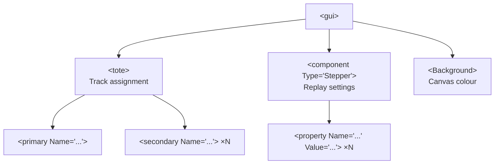

### `<tote>` — Track Assignments

| Child | Description |
|-------|-------------|
| `<primary Name="..."/>` | Primary track name (for relative calculations) |
| `<secondary Name="..."/>` | Secondary track(s) for comparison |

### `<component>` — Stepper/Replay Component

| Attribute | Type | Required | Description |
|-----------|------|----------|-------------|
| `Type` | string | Yes | Component type (typically `"Stepper"`) |

**Children:** Multiple `<property Name="..." Value="..."/>` key-value pairs.

### Stepper Properties

| Property Name | Description | Example Value |
|---------------|-------------|---------------|
| `CurrentTime` | Current replay position | `150811 201513` |
| `DateFormat` | Time display format | `ddHHmm` |
| `SmallStep` | Fine time increment | `1.0 minutes` |
| `LargeStep` | Coarse time increment | `10.0 minutes` |
| `AutoStepInterval` | Animation speed | `1.0 seconds` |
| `VectorStretch` | Speed vector scaling | `1.000` |
| `TrailLength` | Snail trail duration | `15.0 minutes` |
| `Cursor` | Cursor type | `Normal` |
| `Highlighter` | Highlight style | `Default Highlight` |
| `NumRings` | Range ring count | `3` |
| `Radius` | Range ring radius (yards) | `3000.000` |
| `RED`, `GREEN`, `BLUE` | Range ring colour | `64` |
| `FadePoints` | Fade old positions | `true` |
| `LinkPositions` | Connect positions with line | `true` |
| `JustPrimary` | Only show primary track effects | `false` |
| `PlotTrackName` | Show track names | `false` |
| `PointSize` | Position marker size | `5` |
| `SpokeSeparation` | Spoke angle interval | `45` |
| `ShadeArcs` | Shade range arcs | `false` |
| `UseTrackColor` | Use track colour for highlights | `false` |
| `Arc_Finish` | Arc end angle | `180` |
| `Arcs` | Arc start angle | `-180` |
| `RectHighlight_Size` | Rectangle highlight size | `5` |
| `RectHighlight_Color` | Rectangle highlight colour | `128,128,128` |

### `<Background>` — Canvas Background

```xml
<Background>
  <colour Value="DARK_GREY"/>
</Background>
```

---

## 22. Importer Special Handling

This section documents important conversions, legacy support, and edge cases that any
new DPF importer must handle.

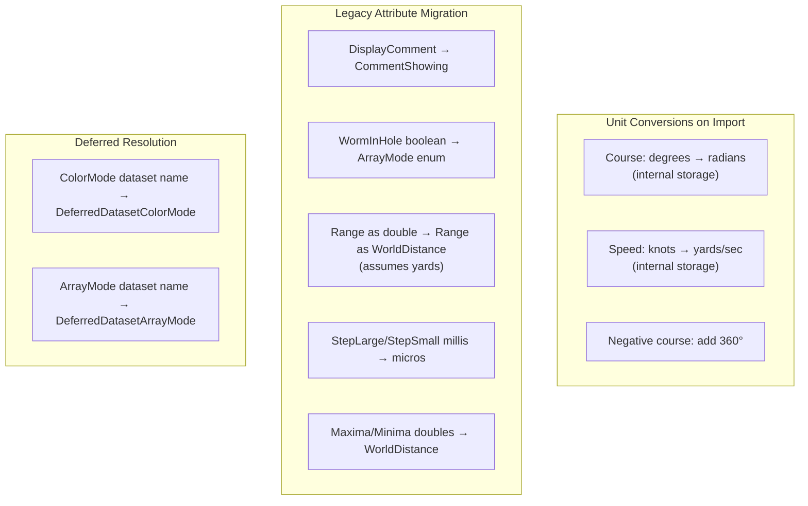

### Unit Conversions

| Field | XML Value | Internal Storage | Conversion |
|-------|-----------|------------------|------------|
| Fix `Course` | Degrees | Radians | `Conversions.Degs2Rads()` |
| Fix `Speed` | Knots | Yards/second | `Conversions.Kts2Yps()` |
| Fix `Course` (negative) | e.g., `-10` | Normalized | Add `360` to make positive |

### Legacy Attribute Mappings

| Old Attribute | New Attribute | Handler | Notes |
|---------------|---------------|---------|-------|
| `DisplayComment` on fix | `CommentShowing` | `FixHandler` | Boolean, same semantics |
| `WormInHole` on sensor | `ArrayMode` | `SensorHandler` | `true` → `"Worm in hole"`, `false` → `"Plain"` |
| `Range` (double) on sensor_contact | `<Range>` element | `SensorContactHandler` | Legacy value assumed in yards |
| `Range` (double) on tma_solution | `<Range>` element | `TMAContactHandler` | Legacy value assumed in yards |
| `Maxima`/`Minima` (double) on tma_solution | `<Maxima>`/`<Minima>` elements | `TMAContactHandler` | Legacy values in kiloyards |
| `StepLarge`/`StepSmall` | `StepLargeMicros`/`StepSmallMicros` | `StepperHandler` | Old values in millis, multiply by 1000 |

### Conditional Import Logic

| Scenario | Behaviour |
|----------|-----------|
| **Track name collision** | Auto-rename using `createUniqueLayerName()` |
| **DynamicInfillSegment with ≤1 fix** | Returns `null`, segment silently dropped with warning |
| **AbsoluteTMASegment without DTG_Start/End** | Derives from first/last fix times |
| **Narrative layer already exists** | Appends entries to existing layer |
| **Custom narrative name** | Pushes narrative name into Type field of entries |
| **Sensor offset value = 0** | Skips setting offset (treated as no offset) |
| **BaseFrequency = 0** | Skips setting (deferred until elementClosed) |
| **TMA ellipse Maxima/Minima < 0.0001** | Skips export (filters near-zero) |
| **SymbolFrequency = SHOW_ALL_FREQUENCY** | Stored as-is (not divided by 1000) |
| **SATC solution elements** | Silently discarded by mock handler with warning |

### Location Long-Format Fractional Minutes

When using `<longLocation>`, if `LatSec` is `0`, the importer auto-calculates seconds
from the fractional part of `LatMin`: `LatSec = (LatMin - floor(LatMin)) * 60`. Same
logic applies for `LongSec`. This provides backward compatibility with files that store
fractional minutes without explicit seconds.

### Line Style Encoding

Line styles use a string ↔ integer mapping. In sensor contacts and dynamic shapes,
underscores replace spaces for storage:

| Display Name | Storage Name | Integer Code |
|--------------|--------------|-------------|
| `Solid` | `Solid` | 0 |
| `Dotted` | `Dotted` | 2 |
| `Dot Dash` | `Dot_Dash` | 3 |
| `Short Dashes` | `Short_Dashes` | 4 |
| `Long Dashes` | `Long_Dashes` | 1 |
| `Unconnected` | `Unconnected` | 5 |

### Colour Export Optimisation

- Fix colour is only written if different from parent track colour
- Fix font is only written if non-default
- TMA solution `LineShowing` is only written if different from parent

### Planning Segment Colour (Legacy No-Op)

The `<colour>` child element under `<planning_segment>` is a **legacy property**. On
import the handler registers a `ColourHandler` but `setColour()` is a no-op — the colour
is silently consumed without being applied. This prevents "unexpected element" warnings
from old files. On export, colour is still written for backward compatibility.

### Track Symbol Colour Fallback

When the track's `<colour>` element is processed, if no separate `<SymbolColor>` has
been set yet, the track colour is also applied as the symbol colour. This provides
backward compatibility for files that predate the separate `<SymbolColor>` element.

### Font Bold+Italic Limitation

The font handler applies bold and italic via sequential `deriveFont()` calls. If both
`Bold="true"` and `Italic="true"`, the italic call overwrites the bold style. Importers
should combine the styles using `Font.BOLD | Font.ITALIC`.

### Grid Delta Dual Handling

The `<grid>` element supports both a legacy `Delta` attribute (double, with optional
`Units` attribute) and a modern `<Delta>` child element (`worldDistanceType`). The
child element takes precedence. If only the legacy attribute is present and `Units` is
absent, the default unit is Nautical Miles.

### Extension Points

The DPF importer supports a plugin extension point (`DPFReaderWriter.exsd`) allowing
plugins to register:
- **`ISAXImporter`** — additional SAX element handlers
- **`IDOMExporter`** — additional DOM export handlers

The `SessionHandler` maintains a registry of `LayerHandlerExtension` objects that are
added to the SAX parser at runtime.

---

## 23. Sample DPF Files for Testing

The following files are available in the repository for testing new importers.
They are categorised by the features they exercise.

### Basic Track Data

| File | Path (relative to repo root) | Key Features |
|------|-----|--------------|
| `sample.dpf` | `org.mwc.cmap.combined.feature/root_installs/sample_data/sample.dpf` | Tracks, shapes, grid, scale, narrative |
| `boat1t.dpf` | `org.mwc.cmap.combined.feature/root_installs/sample_data/boat1t.dpf` | Basic track data |

### Sensor & Bearing Data

| File | Path | Key Features |
|------|------|--------------|
| `sen_tracks_with_narrative.dpf` | `org.mwc.cmap.combined.feature/root_installs/sample_data/sen_tracks_with_narrative.dpf` | Tracks + sensors + narrative + ChartFolio + ExternalDatafile |
| `sample_lots_of_sensors.dpf` | `org.mwc.cmap.combined.feature/root_installs/sample_data/sample_lots_of_sensors.dpf` | Large file with many sensor contacts |

### Ambiguous Bearings & TMA

| File | Path | Key Features |
|------|------|--------------|
| `Ambig_tracks2.dpf` | `org.mwc.cmap.combined.feature/root_installs/sample_data/S2R/Ambig_tracks2.dpf` | Ambiguous bearings (`HasAmbiguousBearing=true`), ArrayMode |
| `Ambig_tracks3.dpf` | `org.mwc.cmap.combined.feature/root_installs/sample_data/S2R/Ambig_tracks3.dpf` | Ambiguous bearings variant |
| `mid_flow.dpf` | `org.mwc.cmap.combined.feature/root_installs/sample_data/S2R/mid_flow.dpf` | Mid-analysis TMA workflow |
| `2648_tx_TMA_to_DR.dpf` | `org.mwc.cmap.combined.feature/root_installs/sample_data/S2R/2648_tx_TMA_to_DR.dpf` | TMA to dead reckoning conversion (large) |

### Frequency Data

| File | Path | Key Features |
|------|------|--------------|
| `Freq_BlueTrack.dpf` | `org.mwc.cmap.combined.feature/Freq_BlueTrack.dpf` | AdditionalData/DataFolder/Dataset time-series |
| `FreqTracks.dpf` | `org.mwc.cmap.combined.feature/root_installs/sample_data/SATC/FreqTracks.dpf` | Frequency track data |
| `FreqTracksQuantized.dpf` | `org.mwc.cmap.combined.feature/root_installs/sample_data/SATC/FreqTracksQuantized.dpf` | Quantized frequency data |
| `WorkingFreqPlot.dpf` | `org.mwc.cmap.combined.feature/root_installs/sample_data/S2R/2553_missing_sensor_data/WorkingFreqPlot.dpf` | Frequency plot with missing data |
| `MultiTonalFreqPlot.dpf` | `org.mwc.cmap.combined.feature/root_installs/sample_data/S2R/freq/MultiTonalFreqPlot.dpf` | Multi-tonal frequency |

### Composite/Planning Tracks

| File | Path | Key Features |
|------|------|--------------|
| `compositeTrack.dpf` | `org.mwc.cmap.combined.feature/root_installs/sample_data/compositeTrack.dpf` | Composite track with planning segments, Origin, calcModel |

### Multistatic Sensors

| File | Path | Key Features |
|------|------|--------------|
| `ThreeBuoys.dpf` | `org.mwc.cmap.combined.feature/root_installs/sample_data/MultiStatics/ThreeBuoys.dpf` | Multiple stationary buoy tracks with sensors |
| `BlueParallelCourses.dpf` | `org.mwc.cmap.combined.feature/root_installs/sample_data/MultiStatics/BlueParallelCourses.dpf` | Parallel course tracks |
| `Sensor_Offset_short.dpf` | `org.mwc.cmap.combined.feature/root_installs/sample_data/MultiStatics/Sensor_Offset_short.dpf` | Sensor array offset data |
| `Vessel_with_Sensor_Offset.dpf` | `org.mwc.cmap.combined.feature/root_installs/sample_data/MultiStatics/Vessel_with_Sensor_Offset.dpf` | Vessel with towed array offset |

### Shapes & Annotations

| File | Path | Key Features |
|------|------|--------------|
| `shapes.dpf` | `org.mwc.cmap.combined.feature/root_installs/sample_data/shapes.dpf` | All shape types: circle, ellipse, polygon, rectangle, line, vector, arc, wheel, textlabel |

### Dynamic Shapes & Time-Varying Data

| File | Path | Key Features |
|------|------|--------------|
| `DynamicShapeSetTest.dpf` | `org.mwc.cmap.combined.feature/root_installs/sample_data/DynamicShapeSetTest.dpf` | DynamicShapeSet with DynamicCoverage arcs |

### Grid, Scale & Chart References

| File | Path | Key Features |
|------|------|--------------|
| `samplescale.dpf` | `org.mwc.cmap.combined.feature/root_installs/sample_data/samplescale.dpf` | Grid4W, grid, scale elements |
| `PlotWithGeoTiff.dpf` | `org.mwc.cmap.combined.feature/root_installs/sample_data/PlotWithGeoTiff.dpf` | ExternalDatafile GeoTiff reference |

### SATC Analysis

| File | Path | Key Features |
|------|------|--------------|
| `BlueTrack.dpf` | `org.mwc.cmap.combined.feature/root_installs/sample_data/SATC/BlueTrack.dpf` | Basic SATC scenario inputs |
| `CompositeStraightTest.dpf` | `org.mwc.cmap.combined.feature/root_installs/sample_data/SATC/CompositeStraightTest.dpf` | SATC with composite straight legs |
| `L2_Scenario.dpf` | `org.mwc.cmap.combined.feature/root_installs/sample_data/SATC/L2_Scenario.dpf` | L2 scenario setup |
| `MDA_Test.dpf` | `org.mwc.cmap.combined.feature/root_installs/sample_data/SATC/MDA_Test.dpf` | MDA analysis test |
| `ScenarioOne_TargetZig.dpf` | `org.mwc.cmap.combined.feature/root_installs/sample_data/SATC_Test/ScenarioOne_TargetZig.dpf` | Target zig-zag scenario |

### Trials Planning

| File | Path | Key Features |
|------|------|--------------|
| `TrialsPlanning1.dpf` | `org.mwc.cmap.combined.feature/root_installs/sample_data/Demo/TrialsPlanning/TrialsPlanning1.dpf` | Planning scenario stage 1 |
| `TrialsPlanning2.dpf` | `org.mwc.cmap.combined.feature/root_installs/sample_data/Demo/TrialsPlanning/TrialsPlanning2.dpf` | Planning scenario stage 2 |
| `TrialsPlanning3.dpf` | `org.mwc.cmap.combined.feature/root_installs/sample_data/Demo/TrialsPlanning/TrialsPlanning3.dpf` | Planning scenario stage 3 |

### Edge Cases & Error Handling

| File | Path | Key Features |
|------|------|--------------|
| `BAD_sample.dpf` | `org.mwc.cmap.combined.feature/root_installs/sample_data/other_formats/BAD_sample.dpf` | Malformed/minimal file — tests error recovery |
| `issue_1621/shorter_os.dpf` | `org.mwc.cmap.combined.feature/root_installs/sample_data/S2R/issue_1621/shorter_os.dpf` | Bug-specific regression test |

### MultiPath

| File | Path | Key Features |
|------|------|--------------|
| `GapsTestTrack.dpf` | `org.mwc.cmap.combined.feature/root_installs/sample_data/MultiPath/GapsTestTrack.dpf` | Track data with gaps |

### ASSET MultiStatic Demos

| File | Path | Key Features |
|------|------|--------------|
| `MultiStatic_Demo.dpf` | `org.mwc.asset.core.feature/root_installs/AssetData/MultiStatics/MultiStatic_Demo.dpf` | Large multistatic demo (1.9MB) |
| `MultiStatic_Demo2.dpf` | `org.mwc.asset.core.feature/root_installs/AssetData/MultiStatics/MultiStatic_Demo2.dpf` | Large multistatic demo variant (2.0MB) |

---

## Appendix A: Complete Element Hierarchy

```mermaid
graph TD
    PLOT["plot"]
    PLOT --> DETAILS["details"]
    PLOT --> SESSION["session"]

    SESSION --> LAYERS["layers"]
    SESSION --> PROJECTION["projection"]
    SESSION --> GUI["gui"]

    LAYERS --> TRACK["track"]
    LAYERS --> COMP_TRACK["composite_track"]
    LAYERS --> LAYER["layer"]
    LAYERS --> NARRATIVE["narrative"]
    LAYERS --> CHART_FOLIO["ChartFolio"]
    LAYERS --> EXT_DATA["externalDatafile"]
    LAYERS --> TOPO["topo"]
    LAYERS --> ETOPO["etopo"]
    LAYERS --> PATTERN["pattern"]
    LAYERS --> SATC_SOL["satc_solution"]
    LAYERS --> DYN_SHAPE_LAYER["dynamicShapeLayer"]
    LAYERS --> DYN_LAYER["dynamicLayer"]

    TRACK --> TRACK_SEG["TrackSegment"]
    TRACK --> REL_TMA_SEG["RelativeTMASegment"]
    TRACK --> ABS_TMA_SEG["AbsoluteTMASegment"]
    TRACK --> DYN_INFILL["DynamicInfillSegment"]
    TRACK --> SEG_LIST["SegmentList"]
    TRACK --> SENSOR["sensor"]
    TRACK --> TMA["tma"]
    TRACK --> DYN_SHAPE_SET["DynamicShapeSet"]

    TRACK_SEG --> FIX["fix"]
    REL_TMA_SEG --> FIX
    ABS_TMA_SEG --> FIX
    DYN_INFILL --> FIX

    SENSOR --> SENSOR_CONTACT["sensor_contact"]
    SENSOR --> ADD_DATA["AdditionalData"]
    TMA --> TMA_SOL["tma_solution"]

    DYN_SHAPE_SET --> DYN_COV["DynamicCoverage"]

    NARRATIVE --> NARR_ENTRY["narrative_entry"]

    LAYER --> TEXTLABEL["textlabel"]
    LAYER --> LINE["line"]
    LAYER --> RECT["rectangle"]
    LAYER --> CIRCLE["circle"]
    LAYER --> ELLIPSE["ellipse"]
    LAYER --> POLYGON["polygon"]
    LAYER --> VECTOR["vector"]
    LAYER --> ARC_SHAPE["Arc"]
    LAYER --> WHEEL["wheel"]
    LAYER --> GRID["grid"]
    LAYER --> LOCAL_GRID["LocalGrid"]
    LAYER --> GRID4W["Grid4W"]
    LAYER --> SCALE["scale"]
    LAYER --> COAST["coastline"]
    LAYER --> VPF_COAST["vpf_coastline"]
    LAYER --> VPF_DB["vpf_database"]
    LAYER --> CHART_REF["ChartReference"]
    LAYER --> LW_TRACK["LightweightTrack"]

    CHART_FOLIO --> CHART_REF2["ChartReference"]

    GUI --> TOTE["tote"]
    GUI --> COMPONENT["component"]
    GUI --> BACKGROUND["Background"]

    PROJECTION --> TL["tl (location)"]
    PROJECTION --> BR["br (location)"]

    COMP_TRACK --> ORIGIN["Origin"]
    COMP_TRACK --> PLAN_SEG["planning_segment"]
    COMP_TRACK --> CLOSE_SEG["closing_segment"]
```

## Appendix B: Handler Class Cross-Reference

| XML Element | Handler Class | Source File Path |
|-------------|---------------|------------------|
| `<plot>` | `PlotHandler` | `Debrief/ReaderWriter/XML/PlotHandler.java` |
| `<session>` | `SessionHandler` | `Debrief/ReaderWriter/XML/SessionHandler.java` |
| `<details>` | `DetailsHandler` | `Debrief/ReaderWriter/XML/DetailsHandler.java` |
| `<layers>` | `DebriefLayersHandler` | `Debrief/ReaderWriter/XML/DebriefLayersHandler.java` |
| `<track>` | `TrackHandler` | `Debrief/ReaderWriter/XML/Tactical/TrackHandler.java` |
| `<composite_track>` | `CompositeTrackHandler` | `Debrief/ReaderWriter/XML/Tactical/CompositeTrackHandler.java` |
| `<fix>` | `FixHandler` | `Debrief/ReaderWriter/XML/Tactical/FixHandler.java` |
| `<sensor>` | `SensorHandler` | `Debrief/ReaderWriter/XML/Tactical/SensorHandler.java` |
| `<sensor_contact>` | `SensorContactHandler` | `Debrief/ReaderWriter/XML/Tactical/SensorContactHandler.java` |
| `<tma>` | `TMAHandler` | `Debrief/ReaderWriter/XML/Tactical/TMAHandler.java` |
| `<tma_solution>` | `TMAContactHandler` | `Debrief/ReaderWriter/XML/Tactical/TMAContactHandler.java` |
| `<TrackSegment>` | `TrackSegmentHandler` | `Debrief/ReaderWriter/XML/Tactical/TrackSegmentHandler.java` |
| `<RelativeTMASegment>` | `RelativeTMASegmentHandler` | `Debrief/ReaderWriter/XML/Tactical/RelativeTMASegmentHandler.java` |
| `<AbsoluteTMASegment>` | `AbsoluteTMASegmentHandler` | `Debrief/ReaderWriter/XML/Tactical/AbsoluteTMASegmentHandler.java` |
| `<DynamicInfillSegment>` | `DynamicInfillSegmentHandler` | `Debrief/ReaderWriter/XML/Tactical/DynamicInfillSegmentHandler.java` |
| `<DynamicShapeSet>` | `DynamicTrackShapeSetHandler` | `Debrief/ReaderWriter/XML/Tactical/DynamicTrackShapeSetHandler.java` |
| `<DynamicCoverage>` | `DynamicTrackCoverageHandler` | `Debrief/ReaderWriter/XML/Tactical/DynamicTrackCoverageHandler.java` |
| `<planning_segment>` | `PlanningSegmentHandler` | `Debrief/ReaderWriter/XML/Tactical/PlanningSegmentHandler.java` |
| `<narrative>` | `NarrativeHandler` | `Debrief/ReaderWriter/XML/Tactical/NarrativeHandler.java` |
| `<layer>` | `DebriefLayerHandler` | `Debrief/ReaderWriter/XML/DebriefLayerHandler.java` |
| `<projection>` | `ProjectionHandler` | `Debrief/ReaderWriter/XML/ProjectionHandler.java` |
| `<gui>` | `GUIHandler` | `Debrief/ReaderWriter/XML/GUIHandler.java` |
| `<tote>` | `ToteHandler` | `Debrief/ReaderWriter/XML/StepperHandler.java` (inner) |
| `<component Type="Stepper">` | `StepperHandler` | `Debrief/ReaderWriter/XML/StepperHandler.java` |
| `<colour>` | `ColourHandler` | `MWC/Utilities/ReaderWriter/XML/Util/ColourHandler.java` |
| `<centre>`, `<tl>`, `<br>`, `<Origin>` | `LocationHandler` | `MWC/Utilities/ReaderWriter/XML/Util/LocationHandler.java` |
| `<WorldDistance>`, `<Radius>`, `<Range>` | `WorldDistanceHandler` | `MWC/Utilities/ReaderWriter/XML/Util/WorldDistanceHandler.java` |
| `<Speed>` | `WorldSpeedHandler` | `MWC/Utilities/ReaderWriter/XML/Util/WorldSpeedHandler.java` |
| `<font>` | `FontHandler` | `MWC/Utilities/ReaderWriter/XML/Util/FontHandler.java` |
| Shapes (line, circle, etc.) | Various in `Shapes/` package | `Debrief/ReaderWriter/XML/Shapes/*.java` |
| `<satc_solution>` | `SATCHandler_Mock` | `Debrief/ReaderWriter/XML/dummy/SATCHandler_Mock.java` |
| `<AdditionalData>` | `AdditionalDataHandler` | `Debrief/ReaderWriter/XML/extensions/AdditionalDataHandler.java` |

---

*This document was generated from analysis of the Debrief codebase XSD schema
(`debrief_plot.xsd`), 48 sample DPF files, and the complete set of XML handler
classes in `org.mwc.debrief.legacy`.*
