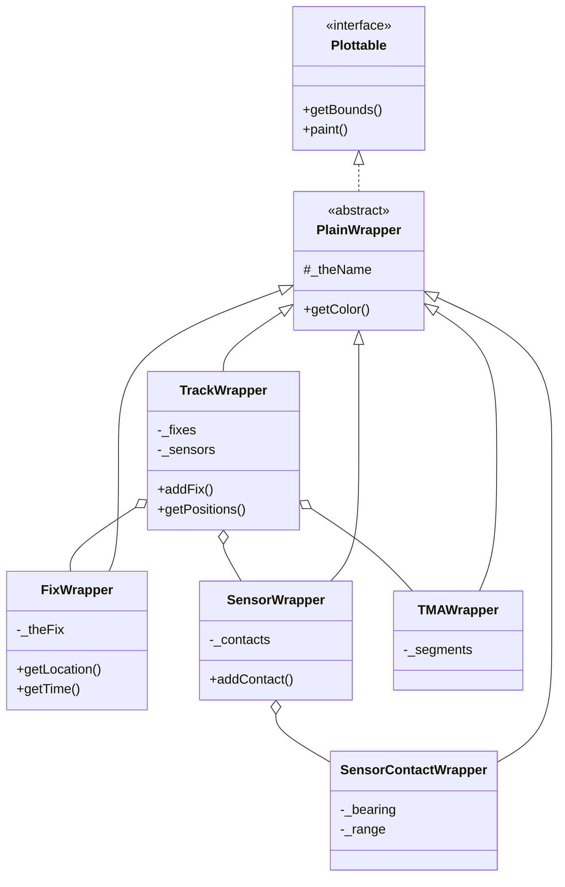
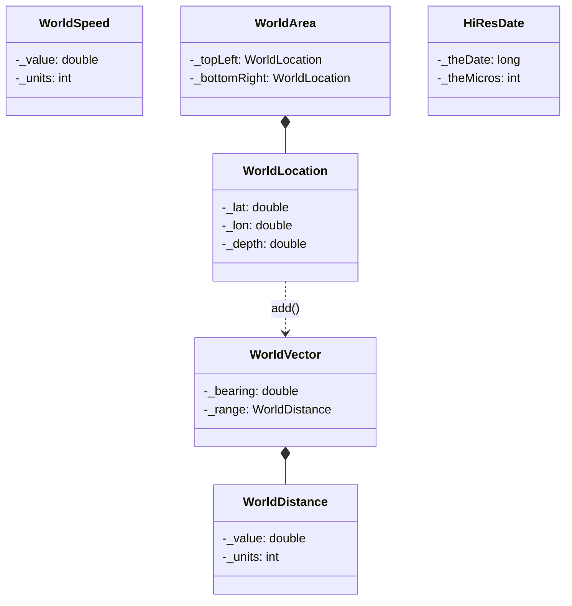

# KEY_CLASSES.md

The 25 critical classes in the Debrief codebase with roles, relationships, and usage guidance.

## Class Hierarchy Overview



## Tier 1: Essential Core (8 classes)

These classes are fundamental—the codebase cannot function without them.

### 1. WorldLocation

**Purpose**: Fundamental 3D geographic position (lat/lon/depth). **[VERIFIED]**

| Attribute | Type | Description |
|-----------|------|-------------|
| `_lat` | double | Latitude in degrees |
| `_lon` | double | Longitude in degrees |
| `_depth` | double | Depth in metres (positive = below surface) |

**Key Methods**:
- `getLat()`, `getLong()`, `getDepth()` - accessors
- `add(WorldVector)` - offset by bearing/distance
- `subtract(WorldLocation)` - get vector between points
- `rangeFrom(WorldLocation)` - distance calculation

**Location**: `org.mwc.cmap.legacy/src/MWC/GenericData/WorldLocation.java` (768 lines)

---

### 2. TrackWrapper

**Purpose**: Main track container—fixes, sensors, TMA segments. Central to all operations. **[VERIFIED]**

| Attribute | Type | Description |
|-----------|------|-------------|
| `_thePositions` | Vector | Collection of FixWrappers |
| `_mySensors` | Vector | Collection of SensorWrappers |
| `_mySegments` | Vector | Track segments (TMA, planning) |

**Key Methods**:
- `addFix(FixWrapper)` - add position
- `getPositions()` - iterate fixes
- `getSensors()` - get sensor data
- `paint(CanvasType)` - render track

**Location**: `org.mwc.debrief.legacy/src/Debrief/Wrappers/TrackWrapper.java` (3,941 lines)

---

### 3. PlainShape

**Purpose**: Base class for all renderable shapes. **[VERIFIED]**

| Attribute | Type | Description |
|-----------|------|-------------|
| `_theColor` | Color | Shape colour |
| `_isVisible` | boolean | Visibility flag |

**Key Methods**:
- `getBounds()` - get bounding area
- `paint(CanvasType)` - render shape
- `rangeFrom(WorldLocation)` - distance to shape

**Subclasses**: CircleShape, RectangleShape, LineShape, PolygonShape, TextLabel

**Location**: `org.mwc.cmap.legacy/src/MWC/GUI/Shapes/PlainShape.java` (487 lines)

---

### 4. Layers

**Purpose**: Container for all layers in a plot. Manages rendering order and selection. **[VERIFIED]**

| Attribute | Type | Description |
|-----------|------|-------------|
| `_theLayers` | Vector | Ordered layer collection |

**Key Methods**:
- `addThisLayer(Layer)` - add layer
- `elements()` - iterate layers
- `findLayer(String)` - find by name
- `paint(CanvasType)` - render all

**Location**: `org.mwc.cmap.legacy/src/MWC/GUI/Layers.java` (1,424 lines)

---

### 5. ImportReplay

**Purpose**: REP (Replay) format parser. Primary file import mechanism. **[VERIFIED]**

**Key Methods**:
- `importThis(String, InputStream, Layers)` - parse file
- Line parsers for each record type (position, sensor, TMA)

**Supported Record Types**: Position fixes, sensor contacts, TMA solutions, shapes, annotations

**Location**: `org.mwc.debrief.legacy/src/Debrief/ReaderWriter/Replay/ImportReplay.java` (2,372 lines)

---

### 6. PlotEditor

**Purpose**: Main Eclipse RCP editor. File loading, saving, zooming, panning. **[VERIFIED]**

**Note**: Eclipse RCP class—out of scope for algorithm porting, but useful to understand as entry point.

**Location**: `org.mwc.debrief.core/src/org/mwc/debrief/core/editors/PlotEditor.java` (2,081 lines)

---

### 7. Conversions

**Purpose**: Static utility for unit and bearing conversions. **[VERIFIED]**

**Key Methods**:
- `Degs2Rads(double)` / `Rads2Degs(double)` - angle conversion
- `Kts2Yps(double)` / `Yps2Kts(double)` - speed conversion
- `calcRange(WorldLocation, WorldLocation)` - distance
- `calcBearing(WorldLocation, WorldLocation)` - bearing

**Location**: `org.mwc.cmap.legacy/src/MWC/Algorithms/Conversions.java` (181 lines)

---

### 8. HiResDate

**Purpose**: High-resolution timestamp with microsecond precision. **[VERIFIED]**

| Attribute | Type | Description |
|-----------|------|-------------|
| `_theDate` | long | Milliseconds since epoch |
| `_theMicros` | int | Microsecond offset |

**Key Methods**:
- `getDate()` - get as java.util.Date
- `getMicros()` - get microsecond component
- `greaterThan(HiResDate)` - comparison

**Location**: `org.mwc.cmap.legacy/src/MWC/GenericData/HiResDate.java` (282 lines)

---

## Tier 2: Critical Infrastructure (10 classes)

### 9. FixWrapper

**Purpose**: Individual position fix with time, location, course, speed. **[VERIFIED]**

| Attribute | Type | Description |
|-----------|------|-------------|
| `_theFix` | Fix | Core tactical data |
| `_theColor` | Color | Display colour |
| `_showLabel` | boolean | Label visibility |

**Key Methods**:
- `getLocation()` - get WorldLocation
- `getTime()` - get HiResDate
- `getCourse()`, `getSpeed()` - motion parameters

**Location**: `org.mwc.debrief.legacy/src/Debrief/Wrappers/FixWrapper.java` (1,833 lines)

---

### 10. WorldArea

**Purpose**: Rectangular bounding region. Critical for zooming and culling. **[VERIFIED]**

| Attribute | Type | Description |
|-----------|------|-------------|
| `_topLeft` | WorldLocation | Northwest corner |
| `_bottomRight` | WorldLocation | Southeast corner |

**Key Methods**:
- `contains(WorldLocation)` - hit testing
- `extend(WorldLocation)` - grow to include point
- `getCentre()` - get centre point

**Location**: `org.mwc.cmap.legacy/src/MWC/GenericData/WorldArea.java` (982 lines)

---

### 11. CanvasAdaptor

**Purpose**: Abstract canvas interface between rendering and drawing. **[VERIFIED]**

**Key Methods**:
- `drawLine(int, int, int, int)` - draw line
- `drawRect(int, int, int, int)` - draw rectangle
- `fillOval(int, int, int, int)` - fill circle
- `setColor(Color)` - set draw colour

**Implementations**: SwingCanvas, MetafileCanvas, SWTChart

**Location**: `org.mwc.cmap.legacy/src/MWC/GUI/Canvas/CanvasAdaptor.java` (385 lines)

---

### 12. BaseLayer

**Purpose**: Abstract base layer implementation. **[VERIFIED]**

| Attribute | Type | Description |
|-----------|------|-------------|
| `_theData` | Vector | Layer contents |
| `_visible` | boolean | Visibility flag |

**Key Methods**:
- `add(Plottable)` - add element
- `elements()` - iterate contents
- `setVisible(boolean)` - toggle visibility

**Location**: `org.mwc.cmap.legacy/src/MWC/GUI/BaseLayer.java` (527 lines)

---

### 13. Editable

**Purpose**: Property descriptor interface for Eclipse property sheets. **[VERIFIED]**

**Key Methods**:
- `getInfo()` - get property metadata
- `hasEditor()` - check if editable
- `getPropertyDescriptors()` - list properties

**Note**: Eclipse integration—understand for debugging but out of scope for porting.

**Location**: `org.mwc.cmap.legacy/src/MWC/GUI/Editable.java` (1,155 lines)

---

### 14. SensorWrapper

**Purpose**: Container for sensor observations. **[VERIFIED]**

| Attribute | Type | Description |
|-----------|------|-------------|
| `_myContacts` | Vector | SensorContactWrappers |
| `_sensorName` | String | Sensor identifier |

**Key Methods**:
- `addContact(SensorContactWrapper)` - add observation
- `getContact(HiResDate)` - get by time
- `elements()` - iterate contacts

**Location**: `org.mwc.debrief.legacy/src/Debrief/Wrappers/SensorWrapper.java` (1,639 lines)

---

### 15. PlainProjection

**Purpose**: Base class for map projections. World to screen coordinate transform. **[VERIFIED]**

**Key Methods**:
- `toScreen(WorldLocation)` - world → screen
- `toWorld(Point)` - screen → world
- `setScreenArea(Dimension)` - set viewport
- `setDataArea(WorldArea)` - set data bounds

**Implementations**: FlatProjection, Mercator2, Mercator3

**Location**: `org.mwc.cmap.legacy/src/MWC/Algorithms/PlainProjection.java` (388 lines)

---

### 16. SwingCanvas

**Purpose**: Swing-based canvas implementation. **[VERIFIED]**

**Key Methods**:
- `paintComponent(Graphics)` - render
- `convertToScreen(WorldLocation)` - coordinate conversion
- Mouse/keyboard event handling

**Location**: `org.mwc.cmap.legacy/src/MWC/GUI/Canvas/Swing/SwingCanvas.java` (1,128 lines)

---

### 17. WorldPath

**Purpose**: Ordered sequence of WorldLocations. **[VERIFIED]**

**Usage**: Track routes, bearing lines, search patterns

**Key Methods**:
- `addPoint(WorldLocation)` - add point
- `getPoints()` - get all points
- `getBounds()` - bounding area

**Location**: `org.mwc.cmap.legacy/src/MWC/GenericData/WorldPath.java` (499 lines)

---

### 18. Plottables

**Purpose**: Collection manager for renderable objects. **[VERIFIED]**

**Key Methods**:
- `add(Plottable)` - add item
- `elements()` - iterate
- `size()` - count

**Location**: `org.mwc.cmap.legacy/src/MWC/GUI/Plottables.java` (696 lines)

---

## Tier 3: Important Specialisation (7 classes)

### 19. TMAWrapper

**Purpose**: TMA solution container. **[VERIFIED]**

| Attribute | Type | Description |
|-----------|------|-------------|
| `_theSegments` | Vector | TMA segments |

**Key Methods**:
- `addSegment(TMASegment)` - add solution
- `getSegments()` - get all solutions

**Location**: `org.mwc.debrief.legacy/src/Debrief/Wrappers/TMAWrapper.java` (777 lines)

---

### 20. SWTChart

**Purpose**: SWT-based chart for Eclipse RCP. **[VERIFIED]**

**Note**: Modern Eclipse canvas implementation.

**Location**: `org.mwc.cmap.plotViewer/src/org/mwc/cmap/plotViewer/editors/chart/SWTChart.java` (1,275 lines)

---

### 21. FlatProjection

**Purpose**: Flat-earth projection implementation. Default for maritime plots. **[VERIFIED]**

**Key Methods**:
- `toScreen(WorldLocation)` - convert using flat-earth approximation
- Faster than Mercator for small areas

**Location**: `org.mwc.cmap.legacy/src/MWC/Algorithms/Projections/FlatProjection.java` (501 lines)

---

### 22. WorldDistance

**Purpose**: Distance value with unit conversions. **[VERIFIED]**

**Units**: YARDS, METRES, KM, NM, FEET

**Key Methods**:
- `getValueIn(int units)` - convert to units
- `getValue()` - get in default units

**Location**: `org.mwc.cmap.legacy/src/MWC/GenericData/WorldDistance.java` (314 lines)

---

### 23. CoreTMASegment

**Purpose**: Base TMA segment implementation. **[VERIFIED]**

| Attribute | Type | Description |
|-----------|------|-------------|
| `_course` | double | Target course |
| `_speed` | WorldSpeed | Target speed |

**Location**: `org.mwc.debrief.legacy/src/Debrief/Wrappers/Track/CoreTMASegment.java`

---

### 24. PlotOutlinePage

**Purpose**: Eclipse Outline view for plot hierarchy. **[VERIFIED]**

**Note**: Eclipse RCP UI class.

**Location**: `org.mwc.debrief.core/src/org/mwc/debrief/core/editors/PlotOutlinePage.java` (1,777 lines)

---

### 25. DebriefXMLReaderWriter

**Purpose**: DPF (Debrief Plot File) XML format handler. **[VERIFIED]**

**Key Methods**:
- `importThis(Document, Layers)` - parse XML
- `exportThis(Layers)` - generate XML

**Location**: `org.mwc.debrief.legacy/src/Debrief/ReaderWriter/XML/DebriefXMLReaderWriter.java` (385 lines)

---

## Data Type Relationships



---

## Usage Patterns

### Creating a Track

```java
// Create track
TrackWrapper track = new TrackWrapper();
track.setName("Target");

// Add fixes
HiResDate time = new HiResDate(System.currentTimeMillis());
WorldLocation loc = new WorldLocation(51.5, -0.1, 0);
Fix fix = new Fix(time, loc, 0.0, 10.0);
FixWrapper fw = new FixWrapper(fix);
track.addFix(fw);
```

### Calculating Range/Bearing

```java
WorldLocation from = new WorldLocation(51.5, -0.1, 0);
WorldLocation to = new WorldLocation(51.6, 0.0, 0);

double rangeYds = from.rangeFrom(to);  // yards
double bearingRads = Conversions.calcBearing(from, to);
```

### Coordinate Conversion

```java
PlainProjection proj = new FlatProjection();
proj.setDataArea(new WorldArea(topLeft, bottomRight));
proj.setScreenArea(new Dimension(800, 600));

Point screenPt = proj.toScreen(worldLocation);
WorldLocation worldLoc = proj.toWorld(screenPt);
```

---

## See Also

- [CLAUDE.md](CLAUDE.md) - Entry point and navigation
- [DOMAIN_GLOSSARY.md](DOMAIN_GLOSSARY.md) - Maritime terminology
- [ARCHITECTURE.md](ARCHITECTURE.md) - System structure
