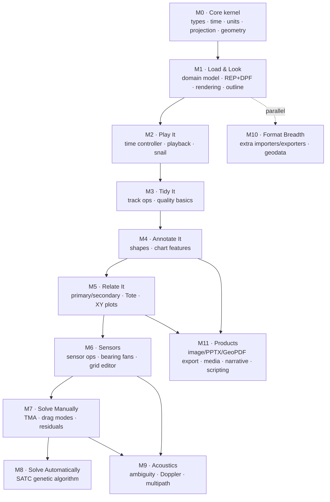

# Debrief Reimplementation Order

> A dependency-ordered roadmap for re-implementing Debrief's capabilities in a new
> language/architecture.
>
> **Companion document:** [`CAPABILITY_AUDIT.md`](CAPABILITY_AUDIT.md) — the full inventory of
> capabilities. This document re-sequences those capabilities by *build order* rather than by
> data-lifecycle category. Section references below (e.g. *§1.1*) point back into the audit.

---

## How to read this document

The capability audit is organised by **data lifecycle** (ingest → operations → exploitation →
export → quality). That is the right way to *understand* Debrief, but it is **not** the right
order to *build* it. Dependencies cut across those categories: you cannot render a track (export)
without the domain model (foundation), and you cannot do TMA (exploitation) without sensor data
(ingest) and track dragging (operations).

This roadmap therefore re-sequences the audit by dependency, grouped into **milestones (M0–M11)**.
Each milestone is a demonstrable vertical slice — something a user or stakeholder can see working —
which de-risks the port and keeps feedback flowing.

### Guiding principles

1. **Dependency-first.** Build the kernel everything else stands on (geometry, time, projections,
   domain model) before any feature.
2. **Vertical slices over horizontal layers.** Each milestone delivers a usable end-to-end
   capability ("load a track and see it", "play it", "solve it"), not a half-finished layer.
3. **Risk-forward on algorithms.** The hard, differentiating algorithms (TMA, SATC, multipath,
   ambiguity resolution) are scheduled *after* the foundations they need are proven, but treated as
   first-class milestones — not left as an afterthought.
4. **Breadth last.** The long tail of importers/exporters (§1.1, §4.1) is high-volume but
   low-risk and embarrassingly parallel. Build one of each *shape* early to prove the abstraction,
   then defer the rest.
5. **One reference format end-to-end early.** REP and DPF are the spine of Debrief interoperability;
   getting them round-tripping early validates the whole data model.

---

## Dependency overview

Solid arrows are hard dependencies. Dashed arrows are "can start in parallel once the abstraction
exists". M10 (format breadth) and much of M11 (products) can be staffed by a separate stream once
M1 establishes the data model and import/export interfaces.

---

## The roadmap

### M0 — Core kernel *(foundation, blocks everything)*

The pure, UI-free, I/O-free heart of the system. Get this right and correct; everything else
inherits its correctness.

| Build | Audit ref | Notes |
|-------|-----------|-------|
| Domain data types | App. C | `WorldLocation`, `HiResDate`, `WorldSpeed`, `WorldDistance`, `WorldVector`, `WorldArea` |
| Unit & bearing conversions | (Algorithms) | knots/m/s/km/h, nm/yds/m/km, degrees↔radians, Cartesian↔polar; 0°/360° wraparound |
| Earth model + projections | App. B | `FlatProjection` first (default, local tactical); Mercator and GeoTools bridge deferred to M10 |
| Time model | §3.1 | microsecond timestamps, DTG parsing/formatting, time ranges |

**Unlocks:** every subsequent milestone.
**Risk:** floating-point parity with legacy is the single biggest cross-language hazard — pin an
epsilon tolerance (legacy uses `1e-9`) and build a conversion test suite from day one.

---

### M1 — "Load & Look" *(first usable slice)*

The walking skeleton: load the two spine formats, build the in-memory model, and draw it.

| Build | Audit ref |
|-------|-----------|
| Core wrappers / data model | App. C — `Fix`, `TrackWrapper`, `SensorWrapper`, `SensorContactWrapper`, `TMAWrapper`, `Layers` |
| REP import — positions & narratives | §1.1, §1.2 (`ImportReplay`, `ImportFix`, `ImportNarrative`) |
| DPF/XML read **and** write | §1.1, §4.1 (`DebriefXMLReaderWriter`) — round-trip early to validate the model |
| Plot rendering (tracks, labels) | App. A (Plot Editor), projection from M0 |
| Outline/tree view + visibility | §2.7, §5.1 (Outline View) |
| Import mechanisms (drag-drop, File>Open) | §1.5 |

**Unlocks:** a tool that opens real sample data and shows it. This is the credibility milestone.
**Why DPF write here, not in the export phase:** round-tripping DPF is the cheapest, strongest test
that the domain model is complete and lossless.

---

### M2 — "Play It"

Time is central to maritime analysis; almost every later feature reacts to "current time".

| Build | Audit ref |
|-------|-----------|
| Time Controller (play/pause/step, variable increment) | §3.1 |
| Normal vs. Snail (trailing history) modes | §3.1 |
| DTG format customisation, bookmarks | §3.1 |
| Time-period filtering (start/end, snap-to-hour) | §2.7, §3.1 |

**Unlocks:** the temporal substrate that M5–M9 hook into. Build the "current time" event/observer
mechanism here deliberately — many later views subscribe to it.

---

### M3 — "Tidy It"

Real data is messy. These operations make loaded tracks analysable and are prerequisites for TMA.

| Build | Audit ref |
|-------|-----------|
| Split / merge / trim / group tracks | §2.1 |
| Interpolate track; generate infill segments | §2.1 |
| Remove & smooth track jumps | §2.1, §5.2 |
| Lightweight ↔ normal conversion; track length | §2.1 |
| Quality basics: jump detection, timestamp-collision check | §5.2 (`FixWrapperCollisionCheck`) |

**Unlocks:** clean ownship tracks — a hard prerequisite for the manual TMA workflow (§3.4 step 1).

---

### M4 — "Annotate It"

Geometry-on-the-plot. Self-contained and a good place to harden the rendering/hit-testing layer
(drag whole/component) before sensors and TMA depend on it.

| Build | Audit ref |
|-------|-----------|
| Drawing features: label, line, rectangle, circle, ellipse, polygon, polyline, vector, wheel | §2.4 |
| Dynamic (time-varying) shapes | §2.4 |
| Chart features: grid, local grid, scale, time display, range rings, coastline | §2.5 |
| Drag whole-feature / component / segment | §2.2 |
| Planning segments (3 calc modes) | §2.6 |

**Unlocks:** the general feature-dragging interaction reused by TMA track dragging in M7.

---

### M5 — "Relate It"

Comparative analysis between tracks — the analytical core that TMA and graphing build on.

| Build | Audit ref |
|-------|-----------|
| Primary/secondary track assignment | §3.2 |
| Track Tote + 20+ real-time calculations (bearing, range, range-rate, Doppler, ATB…) | §3.2 |
| Unit-centric (relative) view | §3.2 |
| XY plotting engine (range/bearing/course vs time, multi-track) | §3.3 |

**Unlocks:** the calculation kernel (relative bearing/range/Doppler) reused by sensors, TMA
residuals, and SATC fitness. The XY plot engine is reused by every residual/graph view later.

---

### M6 — "Sensors"

Sensor data and its visualisation — the input side of all detection-based analysis.

| Build | Audit ref |
|-------|-----------|
| REP sensor sub-types import | §1.2 (`ImportSensor/2/3`, `ImportSensorArc`) |
| Generate sensor / contact / arc | §2.3 |
| Merge contacts; copy bearings; rainbow shading | §2.3, §3.9 |
| Bearing fan overlay; sensor range plot | §3.9 |
| Grid Editor (cell-by-cell bearing/freq editing); interpolation; outlier drag | §2.3 |
| Array offset; ambiguity keep/drop (basic) | §2.3 |

**Unlocks:** groomed sensor data — the second hard prerequisite for TMA (§3.4 step 2).

---

### M7 — "Solve It (Manual)" *(differentiating capability)*

Manual Target Motion Analysis — Debrief's signature workflow. Depends on clean tracks (M3),
groomed sensors (M6), the relative-geometry kernel (M5), and feature dragging (M4).

| Build | Audit ref |
|-------|-----------|
| TMA segment types (Core/Absolute/Relative) | §3.4 |
| TMA generation sources (from cuts/infill/ownship; abs↔rel convert) | §3.4 |
| Four drag modes: translate / rotate / stretch / shear | §2.2 |
| Stacked Dots + Bearing Residuals views with live drag feedback | §3.9, §5.3 |
| Multi-leg generation & final merge | §3.4 |

**Unlocks:** end-to-end single-sided reconstruction. This is the milestone that proves the new
implementation can replace Debrief for its primary mission.
**Risk:** the live-feedback loop (drag → recompute residuals → redraw) is the most
interaction-latency-sensitive part of the app. Budget for performance work here.

---

### M8 — "Solve It (Automatic)" *(differentiating, self-contained algorithm)*

SATC genetic-algorithm TMA. Algorithmically heavy but cleanly separable — it consumes bearing data
and produces a track, so it can be developed against M6 output in parallel with M9.

| Build | Audit ref |
|-------|-----------|
| Scenario + contributions (bearing, speed, leg, ownship legs) | §3.5 |
| Auto ownship-leg detection (3 methods) + zig detection | §3.5 |
| GA engine: islands model, mutation/crossover/elite, fitness = residual + accel penalty | §3.5 |
| Precision levels (LOW/MED/HIGH); solution import as composite track | §3.5 |
| SATC Performance + Contribution-effectiveness views | §5.3 |

**Unlocks:** automated solutions. **Risk:** GA determinism across languages (seeded RNG parity) —
decide early whether to match legacy bit-for-bit or validate statistically against truth tracks.

---

### M9 — "Acoustics"

Specialised acoustic analyses. Share the residual/graph infrastructure from M5/M7 and the sensor
model from M6.

| Build | Audit ref |
|-------|-----------|
| Bearing ambiguity resolution (2^n permutation search, scoring, curve fitting) | §3.6 |
| Doppler/frequency analysis (logistic fit, CPA, frequency residuals, waterfall) | §3.7, §5.3 |
| Multipath target-depth estimation (SVP input, Nelder-Mead optimisation) | §3.8 |

**Unlocks:** completes the analytical toolset. Each item is independent and can be scheduled by
demand.

---

### M10 — "Format Breadth" *(parallel stream from M1)*

The long tail of import/export formats and geodata. Low algorithmic risk, high volume — ideal for a
parallel team once M1 fixes the importer/exporter interfaces.

| Build | Audit ref |
|-------|-----------|
| Additional importers: KML, NMEA(+radar), AIS, GPX, Antares, Nisida, OTH-Gold, BRT, PC Argos, PMRF, CSV variants | §1.1 |
| Document importers (Word/ASW/narrative) | §1.1 |
| Geospatial/background data: Natural Earth, VPF, DNC, ETOPO, shapefiles, GeoTIFF, chart library | §1.3 |
| Extra projections: Mercator, GeoTools bridge | App. B |
| Additional exporters: REP, CSV, GPX, SAM flat-file, GeoJSON, KML | §4.1 |
| Import modes (OTG/DR), clipboard paste | §1.4, §1.5 |

**Sequencing within M10:** build one importer per *structural shape* first (line-oriented text =
NMEA; XML = KML; binary/geo = GeoTIFF) to validate the abstraction, then fan out.

---

### M11 — "Products" *(depends on rendering/analysis being stable)*

Outputs, media, and extensibility. Mostly deferred because they consume finished plots/analyses.

| Build | Audit ref |
|-------|-----------|
| Image export: WMF, BMP, clipboard image, print | §4.2 |
| Presentation export: dynamic & static PPTX, master templates | §4.3 |
| GeoPDF / GeoJSON map products | §4.1 |
| Media synchronisation: video sync, time-stamped image viewer | §3.10 |
| Narrative analysis: viewer, filtering, bidirectional time-linking | §3.11 |
| Scripting/automation: JS/Groovy engine, action recording, custom buttons | §2.8 |
| Quality/validation surfacing: SIF metrics, import validation, solution validation | §5.4–§5.6 |

**Unlocks:** the "deliverable products" that make analysis shareable. Scripting is deliberately
last — it exposes the public object model, which should be stable before it is committed to as an
API.

---

## Milestone summary

| Milestone | Theme | Demoable outcome | Hard prerequisites |
|-----------|-------|------------------|--------------------|
| M0 | Core kernel | Unit/geometry/time test suite green | — |
| M1 | Load & Look | Open REP/DPF sample data, see tracks | M0 |
| M2 | Play It | Step/play through time, snail trails | M1 |
| M3 | Tidy It | Clean a messy ownship track | M1 |
| M4 | Annotate It | Draw shapes & chart furniture | M1 |
| M5 | Relate It | Tote metrics + XY graphs | M2, M3 |
| M6 | Sensors | Load, edit, visualise bearings | M3, M5 |
| M7 | Solve (Manual) | Full manual TMA reconstruction | M4, M5, M6 |
| M8 | Solve (Auto) | SATC solution from bearings | M6 (M5 calc kernel) |
| M9 | Acoustics | Ambiguity / Doppler / multipath | M6, M7 |
| M10 | Format breadth | Import/export the long tail | M1 (parallel) |
| M11 | Products | PPTX/GeoPDF/media/scripting | M4, M5 |

---

## Sequencing rationale in one paragraph

Build the **kernel** (M0) because it is the source of numerical truth. Get to a **usable slice**
fast (M1) so the data model is validated against real files via DPF round-tripping. Add **time**
(M2) because it is the substrate every analytical view subscribes to. **Clean tracks** (M3) and
**annotations + dragging** (M4) are the prerequisites that the signature **TMA** workflow (M7)
needs, and the **relative-geometry/Tote kernel** (M5) is the calculation engine reused by sensors,
TMA residuals, and SATC fitness. **Sensors** (M6) feed both manual (M7) and automatic (M8)
solutions, with **specialised acoustics** (M9) layered on top. The **format long tail** (M10) runs
as a parallel low-risk stream as soon as the importer/exporter interfaces exist, and **products**
(M11) come last because they consume finished plots and a stable object model.

---

*Derived from `CAPABILITY_AUDIT.md` (audit conducted 2026-03-01). This is a proposed build order, not
a commitment — milestones can be re-prioritised by mission need, and M10/M11 work can be pulled
forward wherever a specific format or product is required early.*
