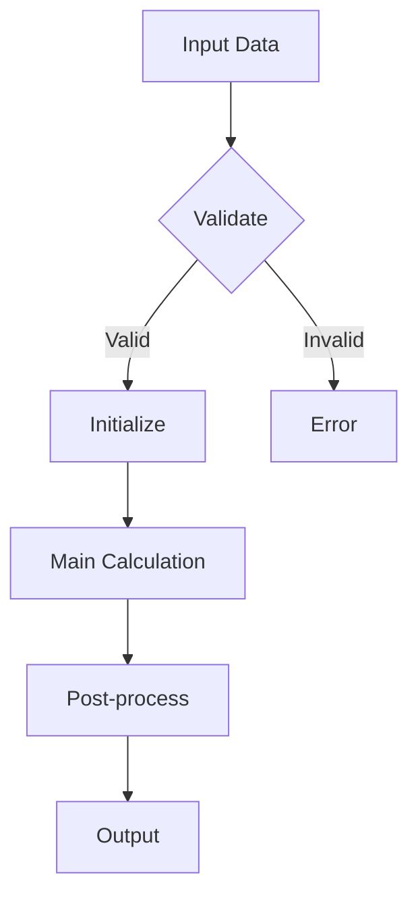

# Algorithm Section Template

Use this template when documenting algorithms in plugin or package READMEs.

---

## Algorithms

### [Algorithm Name]

**Purpose**: [What problem this algorithm solves in 1-2 sentences]

**Context**: [When/why this algorithm is invoked]

#### Inputs

| Parameter | Type | Description |
|-----------|------|-------------|
| [param1] | [Type] | [What this represents] |
| [param2] | [Type] | [What this represents] |

#### Outputs

| Output | Type | Description |
|--------|------|-------------|
| [result] | [Type] | [What is returned/modified] |

#### Key Classes

| Class | Role | Location |
|-------|------|----------|
| [ClassName] | [Entry point / Core logic / Helper] | [package.path] |

#### Algorithm Flow



#### Pseudocode

```text
ALGORITHM [AlgorithmName]
INPUT: param1, param2
OUTPUT: result

1. VALIDATE inputs
   1.1 IF param1 is null THEN return error
   1.2 IF param2 out of range THEN clamp to bounds

2. INITIALIZE
   2.1 state := initial_value
   2.2 accumulator := 0

3. MAIN LOOP
   FOR each element in param1:
       3.1 intermediate := calculate(element, param2)
       3.2 IF condition THEN
           accumulator += intermediate
       3.3 ELSE
           handle_edge_case()

4. POST-PROCESS
   4.1 result := finalize(accumulator)
   4.2 apply_corrections(result)

5. RETURN result
```

#### Edge Cases

| Case | Handling | Confidence |
|------|----------|------------|
| Empty input | [What happens] | [VERIFIED/INFERRED/UNCERTAIN] |
| Extreme values | [What happens] | [VERIFIED/INFERRED/UNCERTAIN] |
| [Domain-specific case] | [What happens] | [VERIFIED/INFERRED/UNCERTAIN] |

#### Performance Notes

- **Time complexity**: [O(n), O(n log n), etc.]
- **Space complexity**: [O(1), O(n), etc.]
- **Optimisation history**: [Any historical performance work]
- **Known bottlenecks**: [What to watch out for]

#### Design Rationale

[Why this algorithm was chosen over alternatives. What trade-offs were made.]

#### Lessons Learned

[What worked well, what didn't, advice for porting to Future Debrief]

#### Related Algorithms

- [Other Algorithm](./other-algorithm.md) - [relationship]

---

## Usage Notes

- Every algorithm MUST have: Purpose, Inputs, Outputs, Key Classes
- Pseudocode required for algorithms with 5+ steps or complex logic
- Mermaid flowchart recommended for multi-branch algorithms
- Sequence diagrams useful for algorithms involving multiple classes
- Always mark Edge Cases with confidence levels
