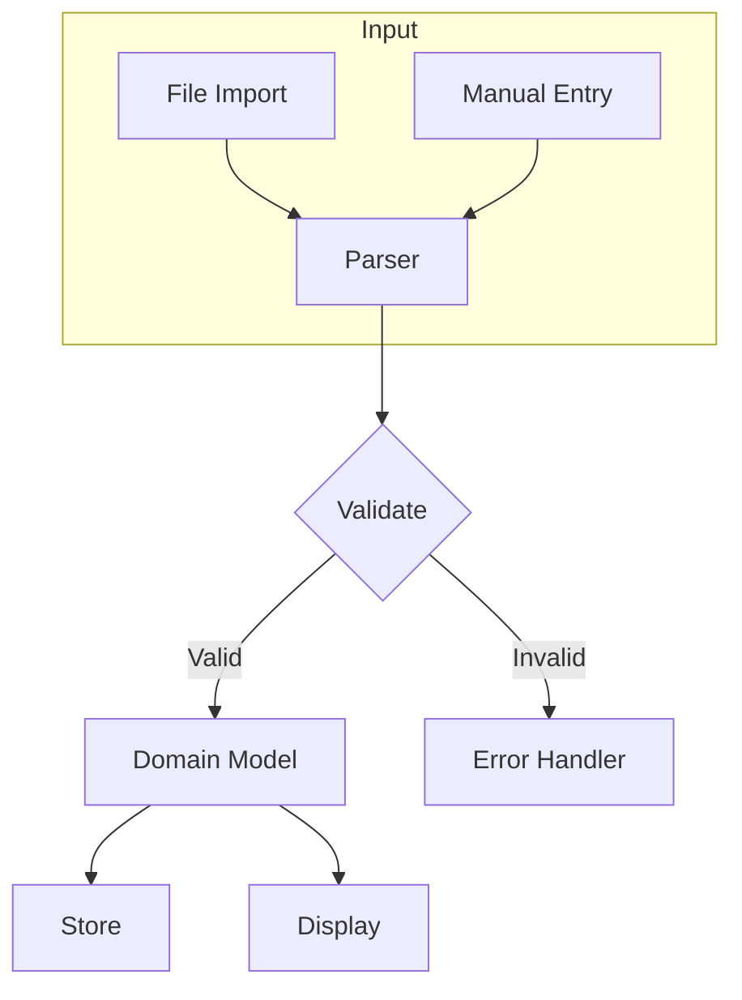
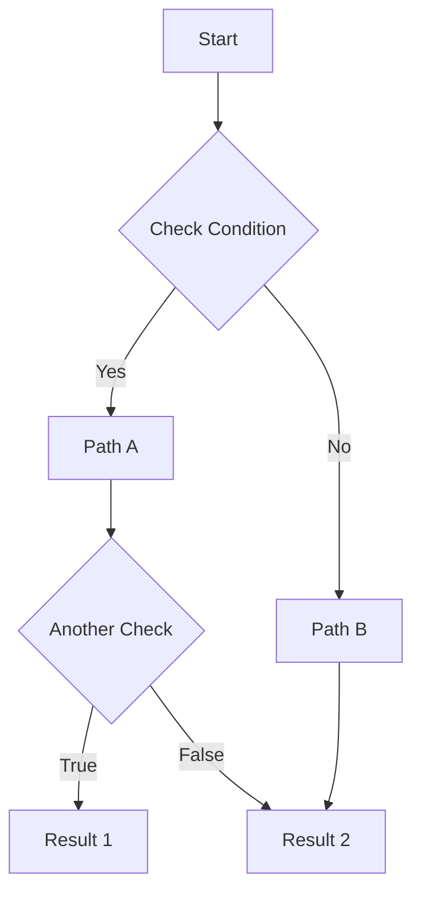
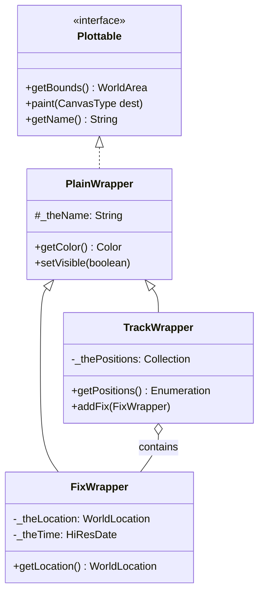
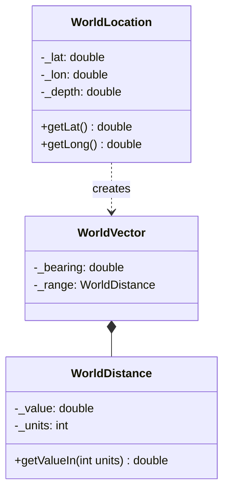
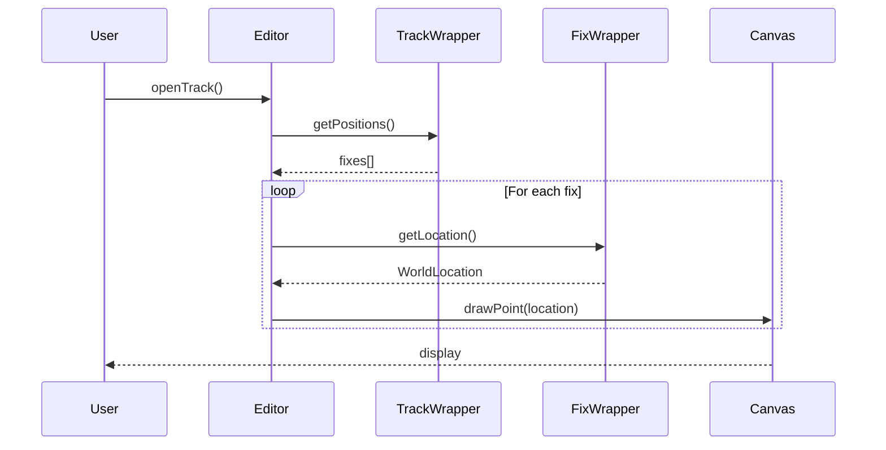
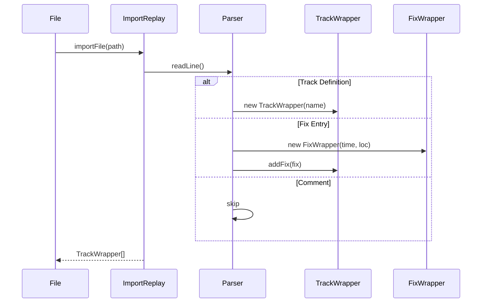
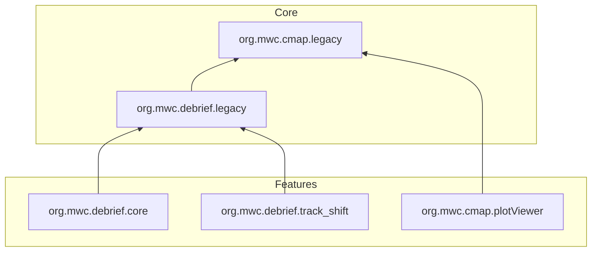
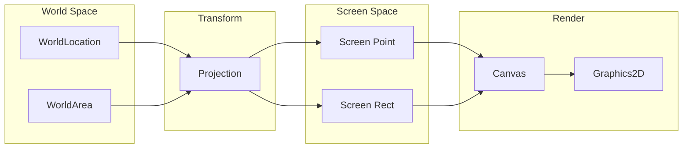
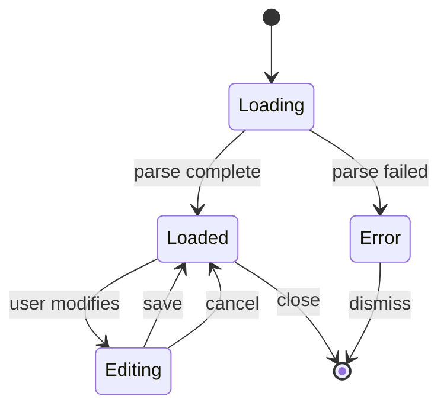

# Mermaid Diagram Examples

Reference examples for LLM documentation diagrams. All render correctly in GitHub.

---

## Flowchart: Data Flow

Use for showing how data moves between components.

## Flowchart: Decision Logic

Use for showing algorithmic branching.

---

## Class Diagram: Inheritance

Use for showing class hierarchies.

## Class Diagram: Composition

Use for showing has-a relationships.

---

## Sequence Diagram: Method Calls

Use for showing runtime interactions.

## Sequence Diagram: File Parsing

Use for showing I/O flows.

---

## Flowchart: Plugin Dependencies

Use for showing module relationships.

---

## Flowchart: Rendering Pipeline

Use for spatial rendering documentation.

---

## State Diagram: Track States

Use for showing state machines (if applicable).

---

## Tips

1. **Keep diagrams focused** - One concept per diagram
2. **Use subgraphs** - Group related elements
3. **Label arrows** - Show what flows between nodes
4. **Use consistent naming** - Match class/method names in code
5. **Add notes for complexity** - Use `Note` elements for context
6. **Test in GitHub** - Preview to ensure rendering works
