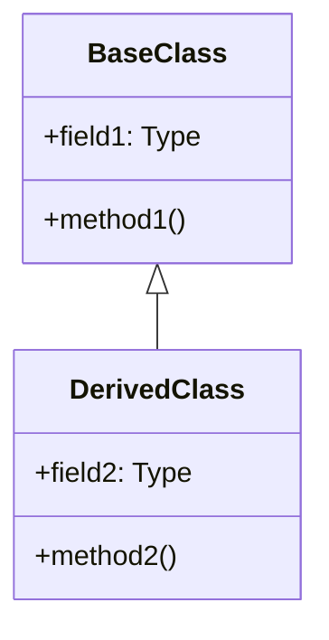
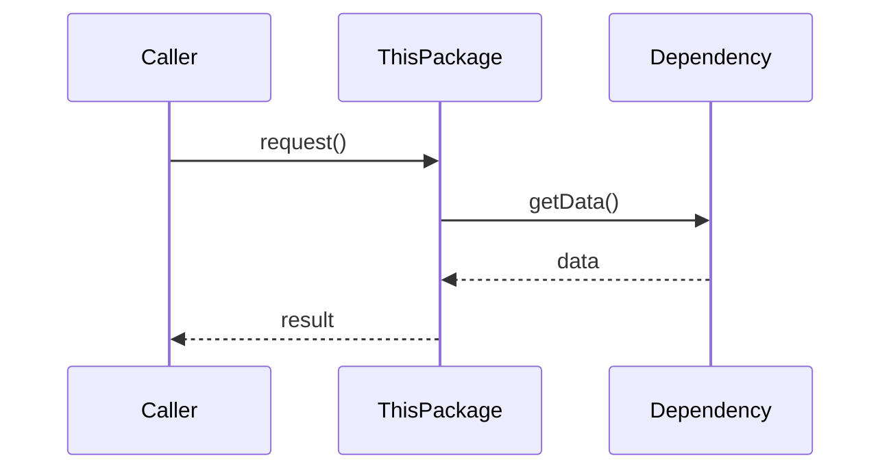
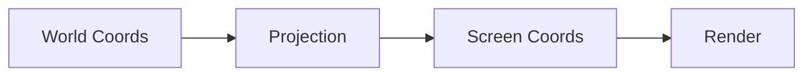

# [PACKAGE_NAME]

## Purpose

[One paragraph: What this package provides to the system]

## Key Classes

| Class | Purpose | Confidence |
|-------|---------|------------|
| [ClassName] | [What this class does] | [VERIFIED/INFERRED/UNCERTAIN] |

## Class Hierarchy



## Usage Patterns

### Common Pattern: [Pattern Name]

```java
// Example usage showing typical pattern
ClassName instance = new ClassName();
instance.doOperation();
```

**When to use**: [Guidance on when this pattern applies]

### Integration Pattern: [Pattern Name]

[How this package integrates with other packages]

## Data Flow



## Edge Cases

| Scenario | Handling | Confidence |
|----------|----------|------------|
| [Edge case description] | [How it's handled] | [VERIFIED/INFERRED/UNCERTAIN] |

## Algorithm Details

> **Include for packages with significant algorithms**

### [Algorithm Name]

- **Purpose**: [What problem it solves]
- **Inputs**: [Data types and sources]
- **Outputs**: [Results and side effects]
- **Complexity**: [Time/space complexity if relevant]

```text
// Pseudocode
1. Initialize state
2. For each element:
   2.1 Calculate intermediate
   2.2 Apply transformation
3. Return result
```

## Spatial Rendering Details

> **Include for packages with rendering code**

### Coordinate Transformations

[How coordinates are transformed]

### Rendering Pipeline



## Design Rationale & Lessons Learned

### Why This Design?

[Explain key design decisions]

### Gotchas & Pitfalls

[Common mistakes and how to avoid them]

### Performance Considerations

[What to watch out for performance-wise]

### Historical Context

[When/why this package evolved]

## See Also

- [Parent Plugin README](../README.md)
- [Related Package](../RelatedPackage/README.md)
- [DOMAIN_GLOSSARY.md](../../../../DOMAIN_GLOSSARY.md)
