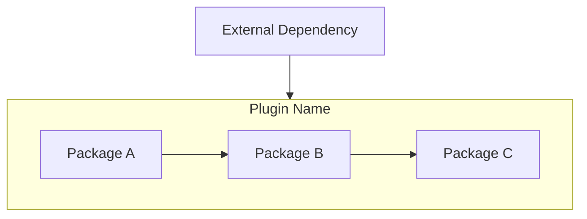

# [PLUGIN_NAME]

## Purpose

[One paragraph: What this plugin does in the Debrief ecosystem]

## Entry Points

| Class | Purpose | Confidence |
|-------|---------|------------|
| [MainClass] | [Primary entry point description] | [VERIFIED/INFERRED/UNCERTAIN] |

## Key Packages

| Package | Purpose |
|---------|---------|
| [package.name] | [What this package provides] |

## Architecture



## Spatial Rendering

> **Include this section only if the plugin contains rendering code**

### Coordinate System

[World coordinates vs screen coordinates handling]

### Projection

[Which projection classes, how selected]

### Draw Order / Z-Index

[How overlapping elements are ordered]

### Shape Rendering

[How shapes translate to screen pixels]

## Algorithms

> **Include this section only if the plugin contains algorithm code**

### [Algorithm Name]

- **Purpose**: [What problem it solves]
- **Inputs**: [Data types and sources]
- **Outputs**: [Results and side effects]
- **Key Classes**: [Entry points and core logic]
- **Edge Cases**: [Known special handling]
- **Performance Notes**: [Constraints, optimisation history]

```text
// Pseudocode for complex algorithms
1. Initialize...
2. For each item...
3. Calculate...
```

## Dependencies

| Plugin | Purpose |
|--------|---------|
| [dependency.plugin] | [Why this dependency is needed] |

## Design Rationale & Lessons Learned

> **Capture historical context and institutional knowledge**

### Why This Design?

[Explain key architectural decisions and trade-offs made]

### Lessons Learned

[Document what worked, what didn't, and advice for Future Debrief]

### Historical Context

[Relevant history: when/why major changes were made]

## See Also

- [Related Plugin README](../other-plugin/README.md)
- [KEY_CLASSES.md](../../KEY_CLASSES.md) for class details
- [DOMAIN_GLOSSARY.md](../../DOMAIN_GLOSSARY.md) for terminology
