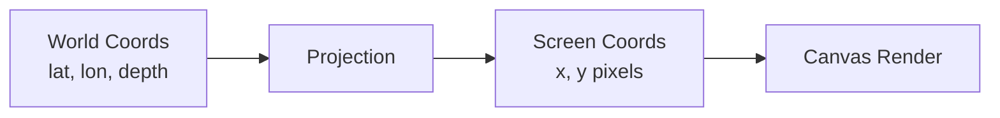
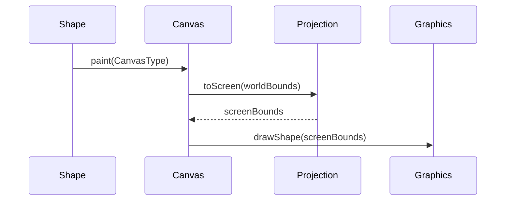

# Spatial Rendering Section Template

Use this template for documenting rendering/visualization code in plugin or package READMEs.

---

## Spatial Rendering

> This section documents how items are drawn on the map plot. Future Debrief must reproduce this rendering faithfully.

### Overview

[Brief description of what this component renders and its role in the visual display]

### Coordinate System

| Coordinate Type | Description | Units |
|-----------------|-------------|-------|
| World Coordinates | [Lat/lon positions] | [degrees] |
| Screen Coordinates | [Pixel positions] | [pixels from origin] |
| [Other type] | [Description] | [Units] |

**Coordinate Flow**:



### Projection

| Projection Class | Use Case | Notes |
|------------------|----------|-------|
| [ProjectionClass] | [When used] | [Confidence: VERIFIED/INFERRED/UNCERTAIN] |

**Projection Selection Logic**:

```text
IF area_size < threshold THEN
    use FlatProjection (local approximation)
ELSE
    use MercatorProjection (global accuracy)
```

**Key Projection Methods**:

| Method | Purpose |
|--------|---------|
| `toScreen(WorldLocation)` | Convert world to screen |
| `toWorld(Point)` | Convert screen to world |

### Draw Order / Z-Index

| Layer/Element Type | Z-Order | Notes |
|--------------------|---------|-------|
| Background | 0 | [Drawn first] |
| [Element Type] | [number] | [Description] |
| Foreground | [highest] | [Drawn last] |

**Ordering Logic**:

```text
1. Background layers (Natural Earth, charts)
2. Shape layers (areas, polygons)
3. Track layers (historical positions)
4. Current positions
5. Labels and annotations
6. Selection highlights
```

### Shape Rendering

| Shape Type | Class | Rendering Method |
|------------|-------|------------------|
| [Circle] | [CircleShape] | [How it renders] |
| [Vector] | [VectorShape] | [How it renders] |
| [Polygon] | [PolygonShape] | [How it renders] |

**Shape-to-Screen Pipeline**:



### Track Rendering

| Track Element | Visual Representation | Confidence |
|---------------|----------------------|------------|
| Position fix | [Symbol/marker type] | [VERIFIED/INFERRED/UNCERTAIN] |
| Track line | [Line style, interpolation] | [VERIFIED/INFERRED/UNCERTAIN] |
| Sensor contact | [Symbol/line type] | [VERIFIED/INFERRED/UNCERTAIN] |

### Label Placement

| Label Type | Placement Strategy | Collision Handling |
|------------|-------------------|-------------------|
| Track label | [Position relative to track] | [How overlaps handled] |
| Fix label | [Position relative to fix] | [How overlaps handled] |

### Rendering Fidelity Notes

> Critical information for reproducing this rendering in Future Debrief

**Must Preserve**:
- [Specific visual behavior that must be maintained]
- [Color conventions]
- [Symbol meanings]

**Known Issues**:
- [Any rendering quirks or bugs that are "features"]

### Performance Considerations

- [What affects rendering performance]
- [Any level-of-detail strategies]
- [Caching approaches]

### Design Rationale

[Why rendering decisions were made this way]

### Lessons Learned

[What worked, what didn't, advice for Future Debrief rendering]

---

## Usage Notes

- Every spatial component MUST document: Coordinate System, Projection, Draw Order
- Include shape rendering details for any component that draws to canvas
- Track rendering section required for anything displaying vessel/track data
- Always note rendering fidelity requirements for Future Debrief
- Mark all implementation details with confidence levels
