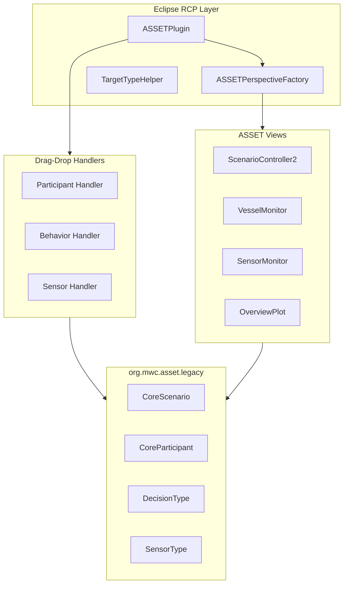

# org.mwc.asset.core

Eclipse RCP integration layer for the ASSET maritime simulation framework.

## Purpose

This plugin provides the **Eclipse RCP presentation layer** for ASSET (ASW Simulation for Evaluation of Tactics). It bridges the ASSET domain simulation engine (in `org.mwc.asset.legacy`) with the Eclipse workbench, providing perspectives, views, drag-drop handlers, and UI controls for scenario editing and execution. **[VERIFIED]**

> **Note**: This is a thin UI wrapper. All simulation logic resides in `org.mwc.asset.legacy`.

## Architecture

## Entry Points

| Class | Purpose | Location |
|-------|---------|----------|
| `ASSETPlugin` | Bundle activator and service container | `org.mwc.asset.core.ASSETPlugin` |
| `ASSETPerspectiveFactory` | "Tactical Simulation" perspective layout | `org.mwc.asset.core.ASSETPerspectiveFactory` |
| `TargetTypeHelper` | Target type property editor | `org.mwc.asset.core.property_support.TargetTypeHelper` |

## Key Classes

### ASSETPlugin

**Purpose**: OSGi bundle activator and service container.

**Responsibilities**:
- Bundle lifecycle management (start/stop)
- Drag-drop handler registration for XML import
- Image helper initialization
- Error logging
- Undo context management

**Drag-Drop Support** (registers handlers for):
- **Participants**: SSK, FixedWing, Torpedo, SSN, Helo, Surface
- **Behaviors**: Waterfall, Sequence, Switch
- **Sensors**: BroadbandSensor, ActiveBroadbandSensor, DippingActiveBroadbandSensor, NarrowbandSensor, OpticLookupSensor, RadarLookupSensor, MADLookupSensor, ActiveInterceptSensor

**[VERIFIED]**

---

### ASSETPerspectiveFactory

**Purpose**: Defines the "Tactical Simulation" Eclipse perspective layout.

**Layout Structure**:
- Left panel (40%): Resource Navigator
- Upper-mid-left (20%): Scenario Controller
- Bottom-left (60%): Outline view + Property Sheet
- Bottom panel (40%): XY plots, live data monitor, task list

**Integrated Views**:
- ScenarioController2 - main scenario control
- VesselMonitor - participant monitoring
- SensorMonitor - sensor management
- OverviewPlot - map display

**[VERIFIED]**

---

### TargetTypeHelper

**Purpose**: Property editor for ASSET target type selection.

**UI Composition**: 3-column grid layout (Force | Type | Environment)

**Domain Integration**: Manages `ASSET.Models.Decision.TargetType` classification with multi-select dialog.

**[VERIFIED]**

## Eclipse Integration

### Extension Points Used

| Extension Point | Purpose |
|-----------------|---------|
| `org.eclipse.ui.perspectives` | "Tactical Simulation" perspective |
| `org.eclipse.ui.startup` | Early startup hook |
| `org.eclipse.core.runtime.products` | AssetNG product definition |
| `org.eclipse.core.contenttype.contentTypes` | .asset, .acon MIME types |
| `org.eclipse.wst.xml.core.catalogContributions` | ASSET.xsd schema |

### Product Definition

- Application: org.eclipse.ui.ide.workbench
- Name: AssetNG
- About text: "Welcome to ASSET NG, from the Maritime Warfare Centre"

## File Format Support

| Format | Extension | Root Element | Purpose |
|--------|-----------|--------------|---------|
| Scenario | `.asset` | `<Scenario>` | Scenario definition |
| Control | `.acon` | `<ScenarioController>` | Execution control |

## Design Patterns

### Thin UI Wrapper Pattern
Core module acts as thin Eclipse integration layer; all simulation logic resides in asset.legacy.

### Dependency Inversion
Core depends on interfaces (DecisionType, MovementType, SensorType), not implementations.

### Observer Pattern
Simulation uses listeners for participant movements, decisions, detections.

**[VERIFIED]**

## Dependencies

| Plugin | Purpose |
|--------|---------|
| `org.mwc.asset.legacy` | Domain model and simulation engine (reexported) |
| `org.mwc.cmap.core` | Charting/mapping utilities |
| `org.mwc.cmap.legacy` | Core data types |
| `org.eclipse.ui` | Eclipse UI framework |

## See Also

- [CLAUDE.md](../CLAUDE.md) - Entry point
- [org.mwc.asset.legacy README](../org.mwc.asset.legacy/README.md) - Simulation engine
- [ARCHITECTURE.md](../ARCHITECTURE.md) - Module relationships
