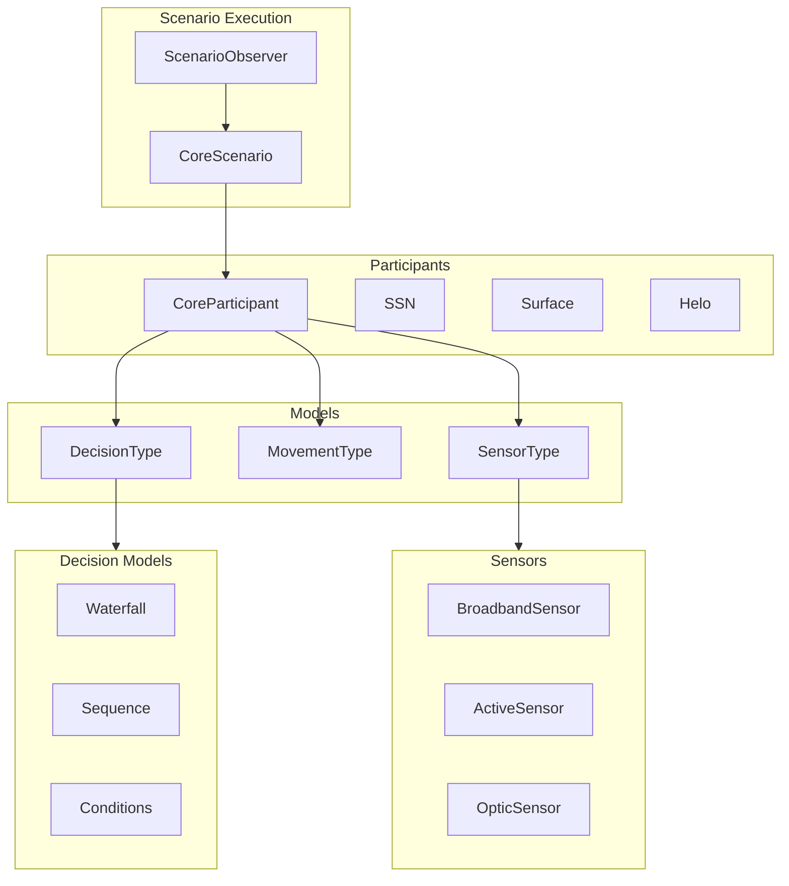
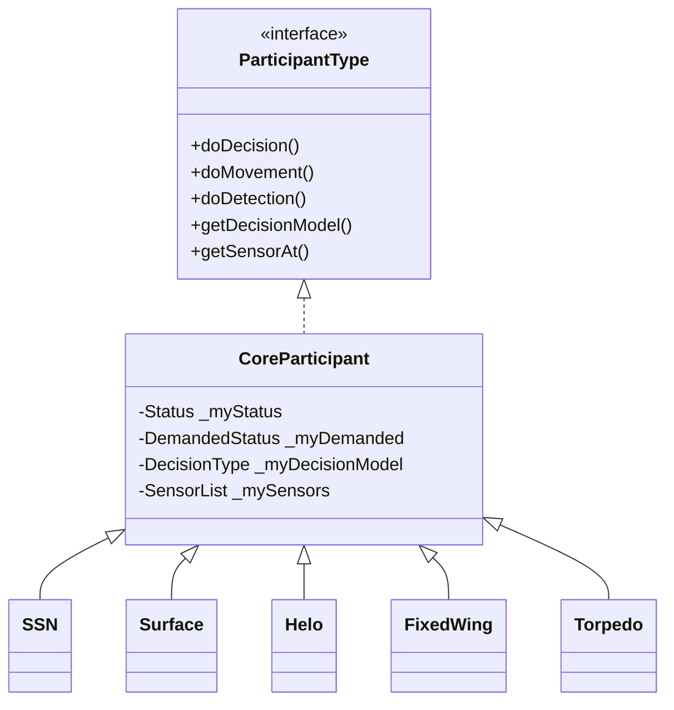
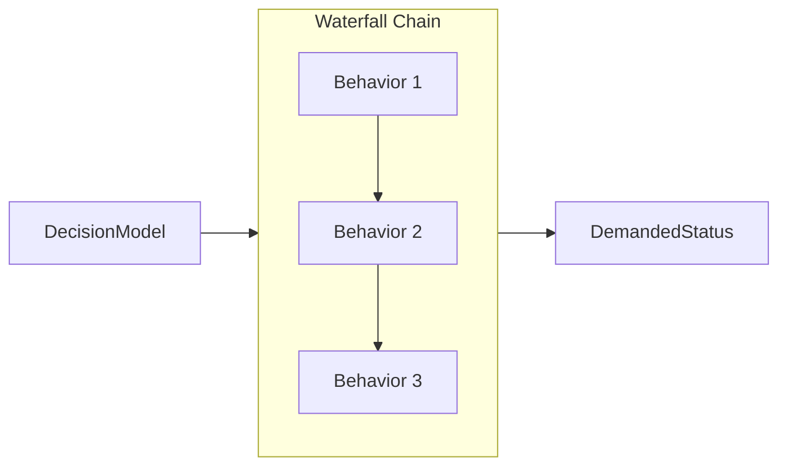

# org.mwc.asset.legacy

ASSET maritime simulation engine - domain model, behaviors, sensors, and scenario execution.

## Purpose

This plugin provides the **core simulation engine** for ASSET (ASW Simulation for Evaluation of Tactics). It contains pure Java implementations of naval simulation concepts: participants (vessels, platforms), sensor models, movement algorithms, behavior decision trees, and scenario execution. No Eclipse dependencies - suitable for porting. **[VERIFIED]**

## Architecture



## Entry Points

| Class | Lines | Purpose |
|-------|-------|---------|
| `CoreScenario` | 1,464 | Scenario execution engine |
| `CoreParticipant` | 971 | Base participant implementation |
| `CoreSensor` | 717 | Sensor base implementation |
| `CoreDecision` | 356 | Decision base implementation |
| `CoreMovement` | 800 | Movement dispatcher |

## Key Packages

| Package | Purpose |
|---------|---------|
| `ASSET.Scenario` | Scenario execution, observers |
| `ASSET.Participants` | Vessel/platform containers |
| `ASSET.Models.Decision` | Behavioral AI (49 classes) |
| `ASSET.Models.Movement` | Platform kinematics |
| `ASSET.Models.Sensor` | Detection models (19 classes) |
| `ASSET.Models.Vessels` | Vessel type definitions |
| `ASSET.Util.XML` | Scenario serialization |

## Domain Model

### Participants



**Vessel Types**:
- `SSN` - Attack submarine
- `SSK` - Diesel-electric submarine
- `Surface` - Surface combatant
- `Helo` - Helicopter
- `FixedWing` - Fixed-wing aircraft
- `Torpedo` - Weapon

**[VERIFIED]**

### Decision Models (Behavioral AI)



**Decision Types**:
| Type | Purpose |
|------|---------|
| `Waterfall` | Prioritized behavior chain (first match wins) |
| `Sequence` | Execute behaviors in series |
| `Switch` | Conditional behavior branching |
| `Conditions` | Trigger evaluation (bearing, distance, time) |
| `Responses` | Tactical actions (maneuver, sensor change) |
| `Tactical` | Search patterns, dipping, etc. |

**Decision Flow**:
1. `CoreParticipant.doDecision()` calls decision model
2. Decision model evaluates conditions against detections
3. Returns `DemandedStatus` (next maneuver) or NULL

**[VERIFIED]**

### Sensor Models

| Category | Sensors |
|----------|---------|
| **Physical** | BroadbandSensor, NarrowbandSensor, OpticSensor, RadarSensor, ActiveBroadbandSensor, MAD |
| **Lookup** | OpticLookupSensor, RadarLookupSensor, MADLookupSensor |

**Detection State Machine**:
```
Undetected → Detected → Classified → Identified
```

**[VERIFIED]**

## Algorithms

### Simulation Loop

**Location**: `ASSET.Scenario.CoreScenario`

```text
SCENARIO STEP
INPUT: Scenario, time T
OUTPUT: Updated participant states

FOR each participant:
    1. doDecision(oldTime, newTime, scenario)
       - Evaluate behavior tree
       - Generate DemandedStatus

    2. doMovement(oldTime, newTime, scenario)
       - Apply kinematics
       - Update position/course/speed

    3. doDetection(oldTime, newTime, scenario)
       - Run sensor models
       - Generate DetectionEvents

Fire listeners:
    - ParticipantMovedListener
    - ParticipantDecidedListener
    - ParticipantDetectedListener
```

**[VERIFIED]**

---

### Waterfall Decision

**Location**: `ASSET.Models.Decision.Waterfall`

```text
WATERFALL DECISION
INPUT: Status, Detections, Scenario
OUTPUT: DemandedStatus or NULL

FOR each behavior in priority order:
    result = behavior.decide(status, detections, scenario)
    IF result != NULL:
        RETURN result  // First match wins

RETURN NULL  // No behavior matched
```

**[VERIFIED]**

## Scenario Observers

Observers hook into scenario execution for analysis:

| Category | Observers |
|----------|-----------|
| **Recording** | DebriefReplayObserver, CSVTrackObserver, NMEAObserver |
| **Analysis** | ProximityObserver, ProportionDetectedObserver, TimeToLaunchObserver |
| **Control** | StopOnElapsedObserver, RemoveDetectedObserver |
| **Plotting** | PlotDetectionStatusObserver, TrackPlotObserver |

**[VERIFIED]**

## Genetic Algorithm Framework

**Location**: `ASSET.Scenario.Genetic`, `ASSET.Util.MonteCarlo`

The module includes a genetic algorithm framework for parameter optimization:

| Class | Purpose |
|-------|---------|
| `GeneticAlgorithm` | Main GA orchestrator |
| `Gene` | Chromosome representation |
| `XMLVariance` | Allele encoding |
| `XMLRange` | Bounded numeric allele |
| `ScenarioRunner` | Fitness evaluation interface |

See [org.mwc.debrief.satc.core README](../org.mwc.debrief.satc.core/README.md) for TMA-specific usage.

**[VERIFIED]**

## File I/O

**XML Format Support** (`ASSET.Util.XML.*`):
- `ASSETReaderWriter` - Scenario serialization
- Handlers for participants, sensors, decisions, movement

**Import**:
```java
ASSETReaderWriter reader = new ASSETReaderWriter();
ScenarioType scenario = reader.importThis(inputStream);
```

## Design Patterns

### Strategy Pattern
- `MovementType` - pluggable movement algorithms
- `DecisionType` - pluggable behavior strategies
- `SensorType` - pluggable detection models

### Composite Pattern
- `Waterfall` composes multiple `DecisionType` behaviors
- `Sequence` chains behaviors in order

### Observer Pattern
- `ParticipantMovedListener`, `ParticipantDecidedListener`, `ParticipantDetectedListener`
- `ScenarioRunningListener`, `ScenarioObserver`

### Factory Pattern
- `ASSETReaderWriter` - XML I/O factory

**[VERIFIED]**

## Dependencies

| Package | Purpose |
|---------|---------|
| `org.mwc.cmap.legacy` | World geometry, conversions |
| `org.mwc.debrief.legacy` | Track wrappers, file I/O |

**External Libraries**:
- PostGIS, PostgreSQL (spatial database)
- Jackson (JSON serialization)
- JTS (geometry operations)

## Future Porting Considerations

This module is a primary candidate for Future Debrief porting because:
1. Pure Java, no Eclipse dependencies
2. Complete domain model self-contained
3. Scenario files are XML (platform-independent)
4. Well-defined interfaces (MovementType, DecisionType, SensorType)
5. Comprehensive observer hooks for analysis

## See Also

- [CLAUDE.md](../CLAUDE.md) - Entry point
- [org.mwc.asset.core README](../org.mwc.asset.core/README.md) - Eclipse integration
- [ARCHITECTURE.md](../ARCHITECTURE.md) - Module relationships
