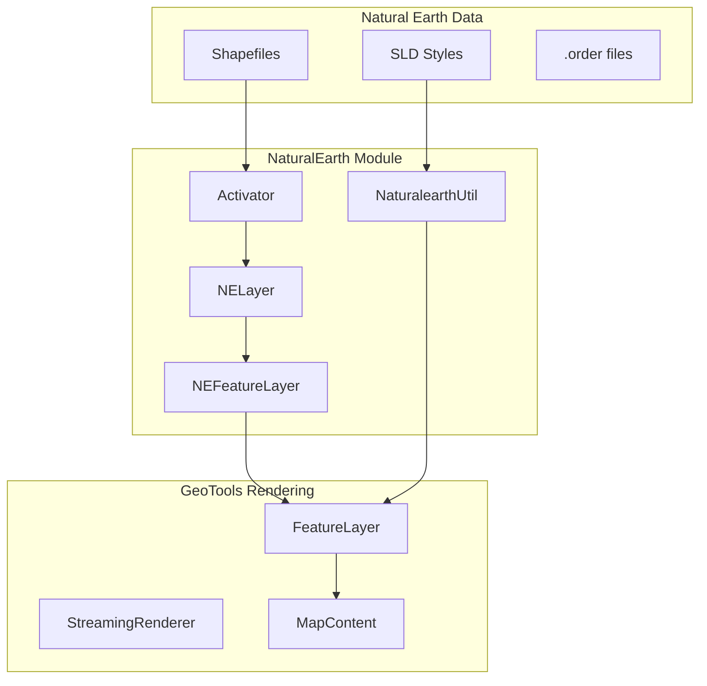
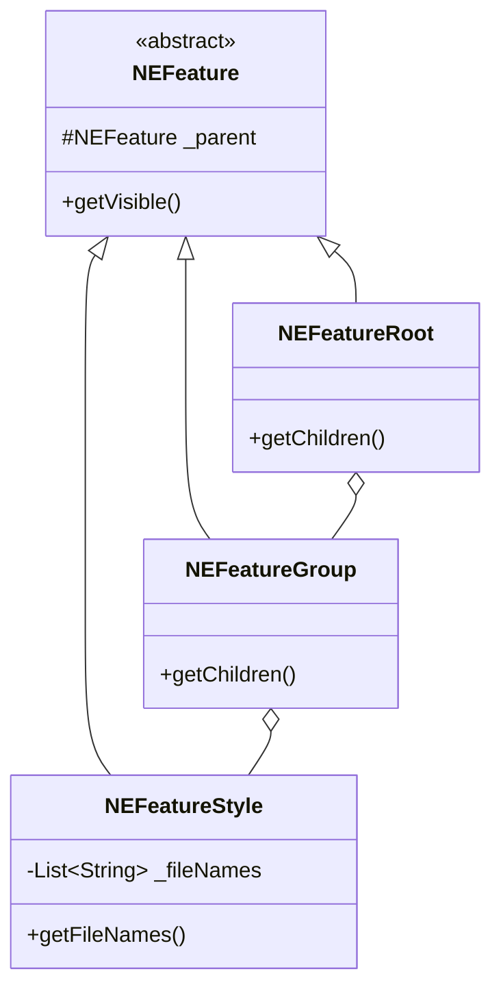
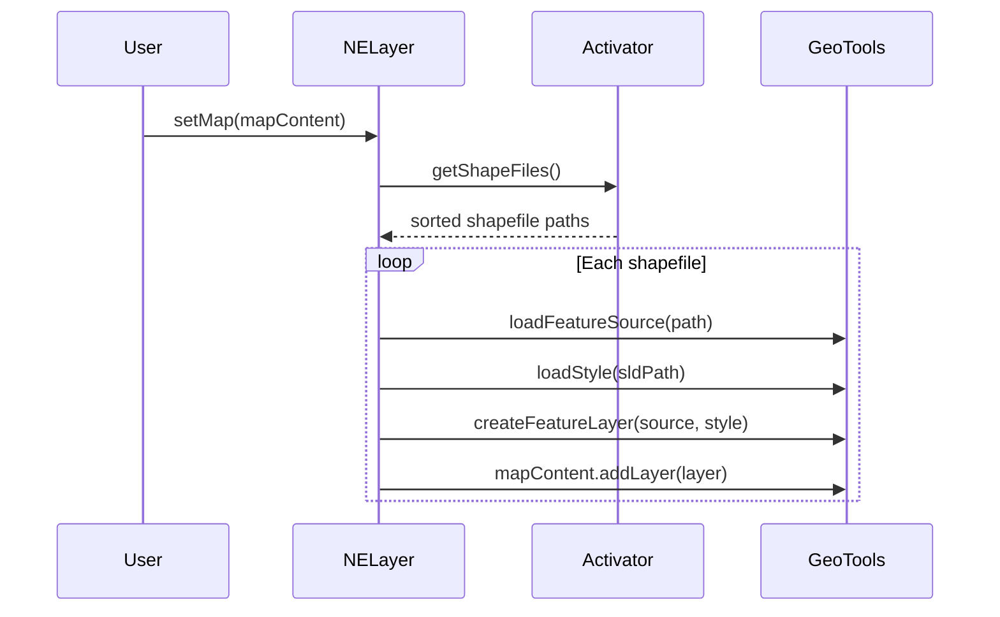

# org.mwc.cmap.NaturalEarth

Natural Earth map data integration for Debrief chart backgrounds.

## Purpose

This plugin provides **Natural Earth cartographic data** for Debrief map visualization. It renders vector-based geographic features (countries, oceans, coastlines) using GeoTools, with configurable styling via SLD (Styled Layer Descriptor) files. **[VERIFIED]**

## Architecture



## Entry Points

| Class | Lines | Purpose |
|-------|-------|---------|
| `Activator` | 365 | Bundle lifecycle, file discovery |
| `NELayer` | 361 | Main layer implementation |
| `NaturalearthUtil` | 362 | Styling utilities |
| `NEFeatureStyle` | 99 | Styled feature definitions |

## Key Classes

### NELayer

**Purpose**: Main Natural Earth layer wrapping multiple GeoTools FeatureLayers.

**Extends**: `GeoToolsLayer` (from org.mwc.cmap.geotools)

**Responsibilities**:
- Load shapefiles from Natural Earth data directory
- Apply SLD styling to each shapefile
- Manage layer ordering (bathymetry at bottom)
- Render bathymetry legend overlay

**Key Methods**:
```java
void setMap(MapContent map)           // Load and style all shapefiles
SimpleFeatureSource getFeatureSource(String path)  // Load single shapefile
void paint(CanvasType canvas)         // Draw bathymetry legend
```

**[VERIFIED]**

---

### Activator

**Purpose**: Bundle lifecycle and data discovery.

**Data Discovery**:
```java
Vector<String> getShapeFiles() {
    File root = getRootFolder();
    // Read .order files for layer stacking
    // Recursively find .shp files
    // Sort by order value (lower = render first)
    // Special sort for bathymetry files
    return sortedShapefiles;
}
```

**Configuration**:
- `DATA_FOLDER` preference - user-configured path
- Falls back to bundled `/data` folder
- Memory mapping configurable via preferences

**[VERIFIED]**

---

### NaturalearthUtil

**Purpose**: GeoTools styling utilities.

**Style Creation**:
```java
Style createPointStyle()    // Blue circles, cyan fill
Style createLineStyle()     // Light gray lines
Style createPolygonStyle()  // Gray fills, 50% opacity
Style loadStyle(File sld)   // Parse SLD file
```

**Image Conversion** (AWT ↔ SWT):
- `convertToSWT()` - Direct/IndexColorModel support
- `awtToSwt()` - Pixel-level conversion with transparency

**[VERIFIED]**

---

### NEFeature Hierarchy



**Visibility Inheritance**: Child visibility depends on parent chain.

**[VERIFIED]**

## Data Formats

### Shapefile (.shp)

Standard GIS vector format loaded via GeoTools FileDataStoreFinder.

**Supporting Files**:
- `.dbf` - Attribute database
- `.shx` - Index file
- `.prj` - Projection metadata (EPSG:4326)
- `.cpg` - Code page encoding
- `.qix` - Spatial index

### SLD (Styled Layer Descriptor)

OGC standard for map styling, parsed via GeoTools SLDParser.

**Style Types**:
- PolygonSymbolizer - fill colors, opacity
- LineSymbolizer - stroke styles
- PointSymbolizer - mark symbols
- TextSymbolizer - labels

### Ordering (.order files)

Control layer stacking order (lower = render first/below).

```
# In dataset directory
12.order   # This dataset renders at position 12
```

## Bundled Data

| Dataset | Purpose |
|---------|---------|
| `ne_110m_admin_0_countries_89S` | Country boundaries |
| `ne_110m_geography_marine_polys` | Ocean/marine polygons |
| `ne_110m_ocean_89N` | Ocean coverage |

> **Note**: Data trimmed to suit Debrief's Mercator projection.

## Configuration

### Preferences

| Preference | Default | Purpose |
|------------|---------|---------|
| `DATA_FOLDER` | bundled `/data` | Natural Earth data path |
| `MEMORY_MAPPED` | true | ShapefileDataStore memory mapping |

### Preference UI

Accessible via: Window → Preferences → Debrief → Natural Earth

- Directory browser for data folder
- Memory mapping toggle
- Link to Natural Earth GitHub data

## Layer Rendering



## Bathymetry Legend

Special handling for bathymetry layers:

- Extracts depth scale from SLD styling
- Renders color key overlay via `paint(CanvasType)`
- Only visible at appropriate zoom levels
- Cell height: 20 pixels

## Design Patterns

### Composite Pattern
NEFeature hierarchy enables tree navigation and visibility propagation.

### Template Method
GeoToolsLayer.loadLayer() skeleton with NELayer-specific implementation.

### Handler Pattern
XML handlers (NELayerHandler, NEFeatureRootHandler) for serialization.

### Strategy Pattern
Style selection based on geometry type (point/line/polygon).

**[VERIFIED]**

## Dependencies

| Plugin | Purpose |
|--------|---------|
| `org.mwc.cmap.geotools` | GeoTools integration bridge |
| `org.mwc.cmap.legacy` | Debrief domain model |
| `org.mwc.cmap.core` | Core services |

**GeoTools Modules**:
- geotools-data-shapefile
- geotools-styling
- geotools-render-lite

## See Also

- [CLAUDE.md](../CLAUDE.md) - Entry point
- [org.mwc.cmap.gt2Plot README](../org.mwc.cmap.gt2Plot/README.md) - GeoTools integration
- [org.mwc.cmap.plotViewer README](../org.mwc.cmap.plotViewer/README.md) - Chart rendering
