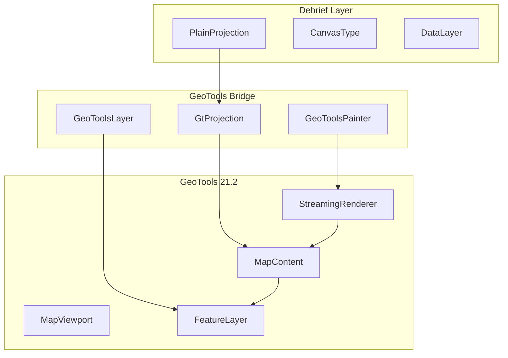
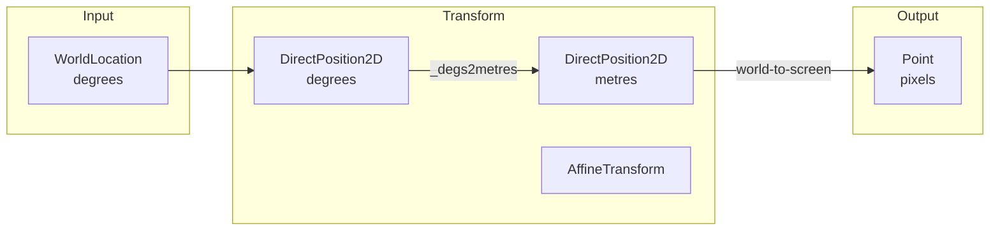
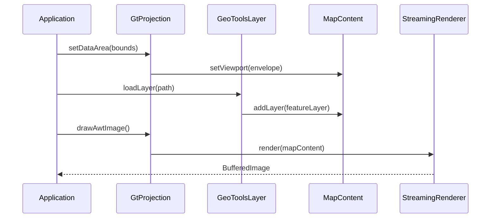

# org.mwc.cmap.gt2Plot

GeoTools integration bridge for Debrief map rendering.

## Purpose

This plugin provides **GeoTools 21.2 integration** for Debrief, enabling GIS data layer rendering (shapefiles, GeoTIFF), coordinate system transformations, and projection handling. It bridges Debrief's legacy projection system with GeoTools' comprehensive geospatial toolkit. **[VERIFIED]**

## Architecture



## Entry Points

| Class | Lines | Purpose |
|-------|-------|---------|
| `GtProjection` | 602 | Coordinate system bridge |
| `GeoToolsLayer` | 156 | Abstract layer wrapper |
| `GeoToolsPainter` | 98 | Map rendering |
| `ShapeFileLayer` | 84 | Shapefile loading |
| `WorldImageLayer` | 244 | GeoTIFF/raster loading |

## Key Classes

### GtProjection

**Purpose**: Bridge between Debrief's PlainProjection and GeoTools coordinate systems.

**Coordinate Systems**:
- **World Projection**: EPSG:3395 (Web Mercator, metres)
- **Data Projection**: EPSG:4326 (WGS84, degrees lat/lon)

**Transform Flow**:
```text
WorldLocation (degrees)
    ↓ [_degs2metres transform]
DirectPosition2D (metres)
    ↓ [MapViewport.getWorldToScreen()]
Point (screen pixels)
```

**Key Methods**:
```java
Point toScreen(WorldLocation val)    // World → screen
WorldLocation toWorld(Point val)     // Screen → world
void zoom(double value)              // Scale adjustment
void setDataArea(WorldArea area)     // Set visible bounds
```

**[VERIFIED]**

---

### GeoToolsLayer

**Purpose**: Abstract base for GIS data layers.

**Responsibilities**:
- Wraps GeoTools Layer in Debrief's layer system
- Manages visibility synchronization
- Registers TIFF URL provider for remote images

**Subclasses**:
- `ShapeFileLayer` - Vector data (.shp)
- `WorldImageLayer` - Raster data (.tif, .img)

**[VERIFIED]**

---

### GeoToolsPainter

**Purpose**: Renders GeoTools MapContent to BufferedImage.

**Rendering Process**:
```java
BufferedImage drawAwtImage(GtProjection proj) {
    MapContent map = proj.getMapContent();
    StreamingRenderer renderer = new StreamingRenderer();

    // Configure hints (OS-aware antialiasing)
    renderer.setRendererHints(hints);
    renderer.setMapContent(map);

    // Render to image
    BufferedImage image = new BufferedImage(width, height, TYPE_INT_ARGB);
    renderer.paint(image.getGraphics(), bounds, envelope);

    return image;
}
```

**OS-Specific Hints**:
- Linux: Antialiasing disabled for LCD text contrast
- Others: Full antialiasing enabled

**[VERIFIED]**

---

### ShapeFileLayer

**Purpose**: Load and render ESRI Shapefiles.

**Loading**:
```java
void loadLayer(String path) {
    FileDataStore store = FileDataStoreFinder.getDataStore(file);
    SimpleFeatureSource source = store.getFeatureSource();
    Style style = Utils.createStyle(source);
    FeatureLayer layer = new FeatureLayer(source, style);
    mapContent.addLayer(layer);
}
```

**[VERIFIED]**

---

### WorldImageLayer

**Purpose**: Load georeferenced raster images (GeoTIFF, World Image).

**Features**:
- Reads georeference from .prj sidecar files
- Extracts bounds from shapefile metadata
- Supports GridCoverage2D via GeoTools readers

**[VERIFIED]**

## Coordinate Transformation



**Cached Transforms**:
- `_degs2metres` - CRS.findMathTransform(4326 → 3395)
- Inverse cached for reverse transformation
- Working objects reused to reduce GC

**[VERIFIED]**

## Layer Integration



## Design Patterns

### Adapter Pattern
GeoToolsLayer adapts Debrief's ExternallyManagedDataLayer to GeoTools Layer.

### Bridge Pattern
GtProjection bridges PlainProjection (Debrief) with MapContent/MapViewport (GeoTools).

### Template Method
GeoToolsLayer.loadLayer() is abstract; subclasses implement specific loading.

### Coordinate Transform Cache
Reuses DirectPosition2D objects to minimize garbage collection.

**[VERIFIED]**

## File Format Support

| Format | Extension | Class | Notes |
|--------|-----------|-------|-------|
| Shapefile | .shp | ShapeFileLayer | With .dbf, .shx, .prj |
| GeoTIFF | .tif | WorldImageLayer | With .tfw for bounds |
| World Image | .img | WorldImageLayer | Generic raster |

## Utilities

### ProjSidecarGenerator

**Purpose**: Generate .prj sidecar files for GeoTIFF/World Image files.

**Creates WKT projection metadata from EPSG codes for georeferencing.**

### FileUtilities

**Purpose**: File operations utility class.

**Features**: Copy, delete, extension substitution, safe filename encoding.

**Origin**: JGrass/HydroloGIS project.

## Dependencies

| Library | Version | Purpose |
|---------|---------|---------|
| GeoTools | 21.2 | Core geospatial toolkit |
| JTS Core | 1.16.0 | Geometry operations |
| JAI | - | Image processing |
| ImageIO Ext | - | TIFF/GeoTIFF I/O |

**Debrief Dependencies**:
- `org.mwc.cmap.legacy` - Projection, data types
- `org.mwc.debrief.legacy` - Domain model

## See Also

- [CLAUDE.md](../CLAUDE.md) - Entry point
- [org.mwc.cmap.plotViewer README](../org.mwc.cmap.plotViewer/README.md) - Chart rendering
- [org.mwc.cmap.NaturalEarth README](../org.mwc.cmap.NaturalEarth/README.md) - Natural Earth data
- [MWC.Algorithms README](../org.mwc.cmap.legacy/src/MWC/Algorithms/README.md) - Projections
