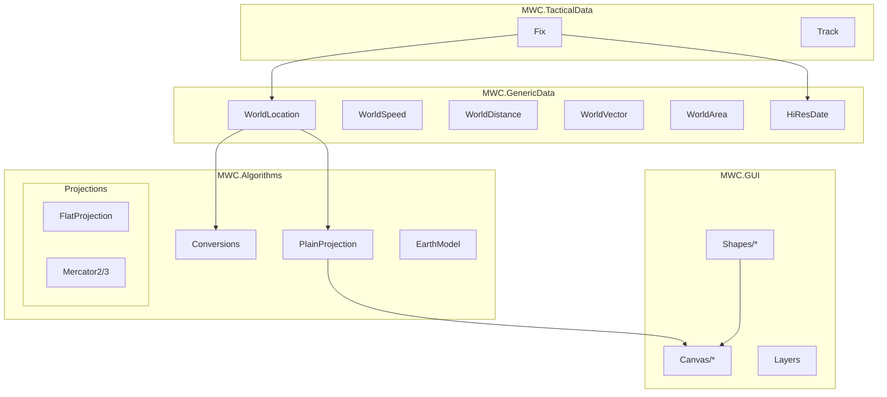
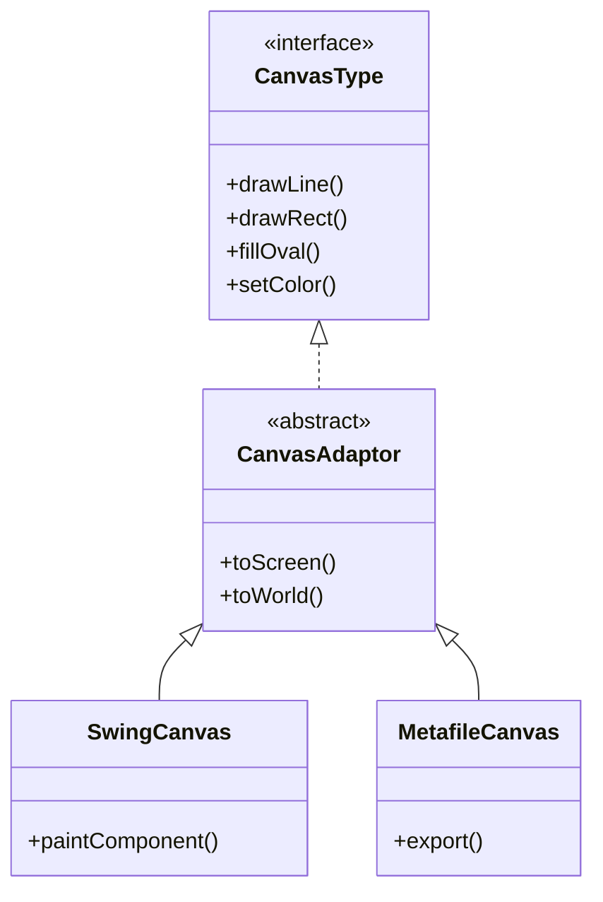

# org.mwc.cmap.legacy

Core foundation plugin providing algorithms, data types, canvas abstraction, and shapes for Debrief.

## Purpose

This is the **mathematical and graphical foundation** for the entire Debrief application. It contains pure Java implementations with no Eclipse dependencies, making it the primary target for extraction into Future Debrief. **[VERIFIED]**

## Architecture



## Entry Points

| Class | Purpose | Location |
|-------|---------|----------|
| `WorldLocation` | Fundamental geographic position | `MWC.GenericData.WorldLocation` |
| `Conversions` | Unit and bearing calculations | `MWC.Algorithms.Conversions` |
| `PlainProjection` | Coordinate transformation base | `MWC.Algorithms.PlainProjection` |
| `CanvasType` | Rendering abstraction | `MWC.GUI.CanvasType` |
| `PlainShape` | Shape base class | `MWC.GUI.Shapes.PlainShape` |
| `Layers` | Layer container | `MWC.GUI.Layers` |

## Key Packages

| Package | Purpose |
|---------|---------|
| `MWC.GenericData` | Core data types: WorldLocation, WorldSpeed, WorldDistance, WorldVector, HiResDate |
| `MWC.Algorithms` | Conversions, projections, earth models |
| `MWC.Algorithms.Projections` | FlatProjection, Mercator implementations |
| `MWC.GUI.Canvas` | Canvas implementations: SwingCanvas, MetafileCanvas |
| `MWC.GUI.Shapes` | Shape hierarchy: PlainShape, CircleShape, VectorShape |
| `MWC.TacticalData` | Tactical primitives: Fix, Track |

## Algorithms

### Unit Conversions

**Purpose**: Convert between maritime units (knots, nautical miles, yards) and metric/SI units.

**Key Class**: `MWC.Algorithms.Conversions`

**Key Methods**:
| Method | Purpose |
|--------|---------|
| `Degs2Rads()` / `Rads2Degs()` | Angle conversion |
| `Kts2Yps()` / `Yps2Kts()` | Speed: knots ↔ yards/sec |
| `Degs2Nm()` / `Nm2Degs()` | Distance: degrees ↔ nautical miles |
| `clipRadians()` | Normalize angle to [0, 2π] |

```text
CONVERSIONS (Key Constants)
  NM_M_CONV = 1852          // Nautical mile in metres
  DEGS_M_CONV = 60 * 1852   // Degree arc in metres
  KTS_MPS_CONV = 1852/3600  // Knots to m/s
```

**[VERIFIED]**

---

### Coordinate Projection

**Purpose**: Transform between geographic (lat/lon) and screen (pixel) coordinates.

**Key Classes**:
- `PlainProjection` - Abstract base
- `FlatProjection` - Flat-earth approximation (default)
- `Mercator2`, `Mercator3` - Mercator projections

```text
PROJECTION ALGORITHM (FlatProjection)
INPUT: WorldLocation (lat, lon), DataArea, ScreenArea
OUTPUT: Screen Point (x, y)

1. Calculate scale factors:
   scaleX = screenWidth / dataWidth
   scaleY = screenHeight / dataHeight

2. Convert world to screen:
   x = (lon - dataLeft) * scaleX
   y = (dataTop - lat) * scaleY  // Y inverted

3. Apply projection origin offset
```

**[VERIFIED]**

---

### Earth Model

**Purpose**: Pluggable earth shape for geodetic calculations.

**Interface**: `MWC.Algorithms.EarthModel`

**Implementations**:
| Model | Use Case |
|-------|----------|
| `FlatEarth` | Local tactical operations (default) |
| `CompletelyFlatEarth` | Pure Cartesian approximation |

**Key Methods**:
- `add(WorldLocation, WorldVector)` → Offset position
- `subtract(WorldLocation, WorldLocation)` → Get separation vector
- `rangeBetween()`, `bearingBetween()` → Measurements

**[VERIFIED]**

## Spatial Rendering

### Coordinate System

| Type | Description | Units |
|------|-------------|-------|
| World Coordinates | Geographic position | Degrees (lat/lon) |
| Screen Coordinates | Pixel position | Pixels from top-left |


### Canvas Hierarchy



**[VERIFIED]**

### Shape Rendering

| Shape | Class | Purpose |
|-------|-------|---------|
| Circle | `CircleShape` | Sensor ranges, areas |
| Arc | `ArcShape` | Bearing sectors |
| Line | `LineShape` | Bearings, boundaries |
| Polygon | `PolygonShape` | Complex regions |
| Vector | `VectorShape` | Direction/magnitude |
| Text | `TextLabel` | Annotations |

**Shape-to-Screen Pipeline**:
1. Shape calculates world bounds
2. Projection converts to screen coordinates
3. Canvas draws using screen primitives

### Draw Order

Layers are drawn in enumeration order (first = bottom, last = top). **[VERIFIED]**

## Dependencies

**No external dependencies** - pure Java. This is the only plugin with zero external requirements.

## Design Rationale & Lessons Learned

### Why Custom Geodetic Math?

Maritime precision requirements and historical development (25+ years) predate modern GIS libraries. All calculations are in-house for full control and auditability. **[INFERRED - interview recommended]**

### Why Pluggable Earth Models?

Tactical operations (short range) use flat-earth approximation for performance. Navigation operations (long range) require spherical/ellipsoidal models for accuracy. Strategy pattern allows switching without code changes. **[VERIFIED]**

### Why Object Pooling?

`WorldVector` reuse in `FlatEarth.subtract()` reduces garbage collection pressure during intensive calculations. **[VERIFIED]**

### Lessons Learned

**What worked well**:
- Unit-aware types (`WorldDistance`, `WorldSpeed`) prevent unit confusion
- Canvas abstraction allows multiple rendering backends
- Pluggable projections support different use cases

**What could improve**:
- `Conversions` is all static methods - harder to test/mock
- Consider dependency injection for Earth models in Future Debrief

**For Future Debrief**: Extract this plugin wholesale. It has no Eclipse dependencies and represents the core algorithm library.

## See Also

- [CLAUDE.md](../CLAUDE.md) - Entry point
- [KEY_CLASSES.md](../KEY_CLASSES.md) - Critical class reference
- [MWC.GenericData README](src/MWC/GenericData/README.md) - Data types detail
- [MWC.Algorithms README](src/MWC/Algorithms/README.md) - Algorithm detail
