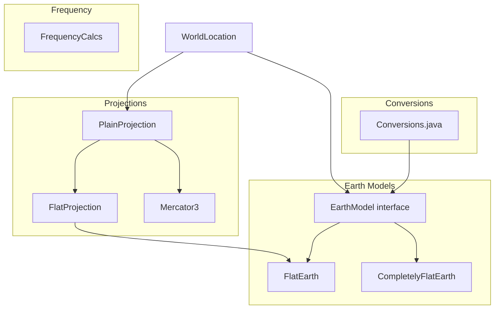
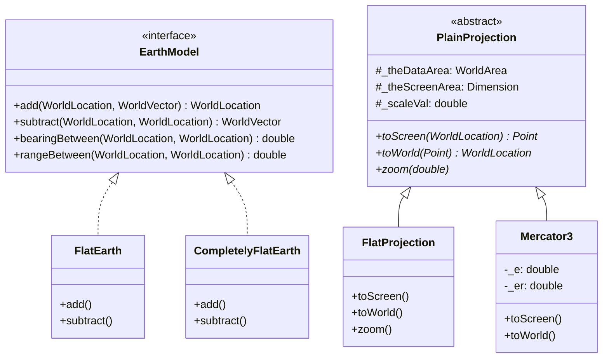

# MWC.Algorithms

Geodetic calculations, coordinate conversions, and map projections for Debrief.

## Purpose

This package provides the **mathematical foundation** for maritime analysis: unit conversions, earth models for bearing/range calculations, map projections for screen rendering, and Doppler shift calculations for frequency analysis. **[VERIFIED]**

## Architecture



## Entry Points

| Class | Purpose | Location |
|-------|---------|----------|
| `Conversions` | Unit conversion constants and methods | `MWC.Algorithms.Conversions` |
| `EarthModel` | Geodetic calculation interface | `MWC.Algorithms.EarthModel` |
| `FlatEarth` | Short-sailing earth model | `MWC.Algorithms.EarthModels.FlatEarth` |
| `PlainProjection` | Base projection class | `MWC.Algorithms.PlainProjection` |
| `FlatProjection` | Default screen projection | `MWC.Algorithms.Projections.FlatProjection` |
| `Mercator3` | Ellipsoidal Mercator | `MWC.Algorithms.Projections.Mercator3` |
| `FrequencyCalcs` | Doppler shift calculations | `MWC.Algorithms.FrequencyCalcs` |

## Key Packages

| Package | Purpose |
|---------|---------|
| `EarthModels/` | FlatEarth, CompletelyFlatEarth implementations |
| `Projections/` | FlatProjection, Mercator2, Mercator3 |
| `LiveData/` | Real-time attribute tracking |

## Algorithms

### Unit Conversions

**Location**: `Conversions.java`

**Key Constants**:
```java
RADIAN_CONV = 180 / π           // radians ↔ degrees
NM_M_CONV = 1852                // nautical mile in meters
DEGS_KM_CONV = 111.12           // 1° = 111.12 km
DEGS_M_CONV = 111120            // 1° = 111,120 m
KTS_MPS_CONV = 0.51444          // 1 knot = 0.51444 m/s
FT_M_CONV = 0.3048              // 1 foot = 0.3048 m
```

**Key Methods**:
```java
Conversions.Degs2Nm(val)    // degrees → nautical miles (×60)
Conversions.Degs2m(val)     // degrees → meters (×111120)
Conversions.Degs2Rads(val)  // degrees → radians
Conversions.Kts2Mps(val)    // knots → m/s
Conversions.clipRadians(val) // normalize to [0, 2π]
```

**[VERIFIED]**

---

### Short Sailing (FlatEarth)

**Purpose**: Geodetic approximation for short distances using latitude correction.

**Location**: `EarthModels/FlatEarth.java`

**Reference**: Admiralty Manual of Navigation

```text
SUBTRACT (Reverse Calculation)
INPUT: from (lat1, lon1), to (lat2, lon2)
OUTPUT: WorldVector (bearing, range)

1. Convert to radians:
   LAT1 = Degs2Rads(lat1)
   LONG1 = Degs2Rads(lon1)
   LAT2 = Degs2Rads(lat2)
   LONG2 = Degs2Rads(lon2)

2. Calculate deltas:
   ΔLONG = LONG2 - LONG1
   ΔLAT = LAT2 - LAT1

3. Find mean latitude (for meridian convergence):
   MEAN_LAT = LAT1 + ΔLAT/2

4. Calculate departure (E-W component):
   DEPARTURE = ΔLONG × cos(MEAN_LAT)

5. Calculate course (bearing):
   COURSE = atan2(DEPARTURE, ΔLAT)

6. Calculate distance:
   IF ΔLAT ≠ 0:
      DISTANCE = ΔLAT / cos(COURSE)
   ELSE:
      DISTANCE = DEPARTURE

7. Convert back to degrees:
   range_deg = Rads2Degs(|DISTANCE|)

OUTPUT: WorldVector(COURSE, range_deg, depth_delta)
```

```text
ADD (Forward Calculation)
INPUT: start (lat, lon), vector (bearing, range_deg)
OUTPUT: WorldLocation

1. Convert to radians
2. DEPARTURE = DISTANCE × sin(COURSE)
3. ΔLAT = DISTANCE × cos(COURSE)
4. MEAN_LAT = LAT + ΔLAT/2
5. ΔLONG = DEPARTURE / cos(MEAN_LAT)
6. NEW_LAT = LAT + ΔLAT
7. NEW_LONG = LONG + ΔLONG

OUTPUT: WorldLocation(Rads2Degs(NEW_LAT), Rads2Degs(NEW_LONG), depth)
```

**Accuracy**: Valid for distances up to ~100 nautical miles.

**[VERIFIED]**

---

### Flat Projection (Screen Transformation)

**Purpose**: Convert world coordinates to screen pixels.

**Location**: `Projections/FlatProjection.java`

```text
TO SCREEN
INPUT: WorldLocation
OUTPUT: Screen Point (pixels)

1. Get origin (from relative plotter or data origin)
2. Calculate vector from origin:
   delta = location.subtract(origin)
   range = delta.getRange()
   bearing = delta.getBearing()

3. Account for heading-up mode:
   adjusted_bearing = bearing - heading_offset

4. Convert range to pixels:
   screen_range = range / _scaleVal

5. Convert to screen Cartesian:
   deltaX = sin(adjusted_bearing) × screen_range
   deltaY = -cos(adjusted_bearing) × screen_range  // invert Y

6. Add screen origin:
   screen_x = screen_origin_x + deltaX
   screen_y = screen_origin_y + deltaY

OUTPUT: Point(screen_x, screen_y)
```

```text
TO WORLD
INPUT: Screen Point (pixels)
OUTPUT: WorldLocation

1. Calculate offset from screen origin
2. Invert Y-axis back to world conventions
3. Calculate bearing and range:
   range_pixels = √(screenX² + screenY²)
   bearing = atan2(screenX, screenY)
4. Convert range to world units
5. Add vector to origin

OUTPUT: WorldLocation
```

**[VERIFIED]**

---

### Mercator Projection

**Purpose**: Accurate projection for larger geographic scales.

**Location**: `Projections/Mercator3.java`

**Earth Parameters (WGS84)**:
```java
Equatorial radius: 6,378,137 metres
Eccentricity: 0.0818191908
```

```text
TO SCREEN (Mercator Transform)
INPUT: WorldLocation (lat, lon)

1. Normalize longitude around central meridian
2. Calculate easting:
   easting = (lon - centralMeridian) × 0.01745329 × earth_radius

3. Calculate Mercator conformal latitude:
   ratio = (1 - e×sin(lat)) / (1 + e×sin(lat))
   transform = ratio^(e/2)

4. Calculate northing:
   northing = ln(tan(45° + lat/2) × transform) × earth_radius

OUTPUT: Point(easting, northing)
```

```text
TO WORLD (Inverse Mercator)
INPUT: Point (easting, northing)

1. Calculate longitude from easting
2. Initial latitude estimate:
   lat = 90° - 2 × atan(e^(-northing)) × (180/π)

3. Iterative refinement (up to 100 iterations):
   sin_lat = sin(lat_radians)
   ratio = (1 - e×sin_lat) / (1 + e×sin_lat)
   new_lat = 90° - 2 × atan(e^(-northing) × ratio^(e/2)) × (180/π)
   IF |new_lat - lat| < 0.00001°: break
   lat = new_lat

OUTPUT: WorldLocation(lat, lon)
```

**Tolerance**: 0.00001° latitude (~1 metre)

**[VERIFIED]**

---

### Doppler Shift Calculation

**Purpose**: Calculate observed frequency due to relative motion.

**Location**: `FrequencyCalcs.java`

```text
DOPPLER FREQUENCY
INPUT:
  speedOfSound (m/s)
  osHeading, tgtHeading (radians)
  osSpeed, tgtSpeed (m/s)
  bearing (radians) - bearing to target
  f0 (Hz) - transmitted frequency

1. Calculate relative bearing to target:
   relB = bearing - osHeading

2. Calculate target heading in reverse:
   hisBearing = π + bearing
   angleOffOtherBearing = hisBearing - tgtHeading

3. Ownship velocity component toward target:
   OSL = cos(relB) × osSpeed

4. Target velocity component along bearing:
   TSL = cos(angleOffOtherBearing) × tgtSpeed

5. Apply Doppler formula:
   f_observed = f0 × (speedOfSound + OSL) / (speedOfSound - TSL)

OUTPUT: f_observed (Hz)
```

**Speed of Sound**: Default 2951 knots (~1500 m/s in water)

**[VERIFIED]**

## Class Hierarchy



## Projection Selection

| Projection | Range | Accuracy | Speed | Best For |
|-----------|-------|----------|-------|----------|
| FlatProjection | <100 nm | High | Very Fast | Tactical displays |
| Mercator3 | Global | High | Fast | Large area charts |

## Design Patterns

### Earth Model Plugin
```java
// Pluggable geodetic implementation
WorldLocation.setModel(new FlatEarth());
```

### Template Method (PlainProjection)
Abstract base defines transformation contract; subclasses implement specifics.

### Object Reuse
Working vectors/locations minimize garbage collection in tight loops.

### Property Change Events
Projection fires events for UI synchronization on zoom/pan.

**[VERIFIED]**

## Constants Reference

**Distance Conversions (1°)**:
- 60 nautical miles (by definition)
- 111.12 kilometres
- 111,120 metres

**Earth Parameters**:
- Mean radius: 6,371 km
- WGS84 equatorial: 6,378.137 km
- Nautical mile: 1,852 m (exact)

**Speed Conversions**:
- 1 knot = 0.51444 m/s
- 1 knot ≈ 1.151 mph

## Common Usage Patterns

```java
// Bearing/distance to new position
WorldVector delta = new WorldVector(bearingRads, distanceDegs, depth);
WorldLocation newPos = EarthModel.add(currentPos, delta);

// Calculate bearing between points
double bearing = EarthModel.bearingBetween(from, to);
double range = EarthModel.rangeBetween(from, to);

// Screen-to-world conversion
WorldLocation worldPos = projection.toWorld(screenPoint);
Point screenPos = projection.toScreen(worldPos);

// Doppler correction
double correctedFreq = FrequencyCalcs.getPredictedFreq(
   f0, speedOfSoundKts, rxSpeedKts, rxCourseDegs,
   txSpeedKts, txCourseDegs, bearingDegs
);
```

## Dependencies

| Package | Purpose |
|---------|---------|
| `MWC.GenericData` | WorldLocation, WorldVector, WorldArea |
| `java.beans` | PropertyChangeSupport for projections |

## See Also

- [CLAUDE.md](../../../../CLAUDE.md) - Entry point
- [org.mwc.cmap.legacy README](../../../README.md) - Parent plugin
- [MWC.GenericData README](../GenericData/README.md) - Data types
- [KEY_CLASSES.md](../../../../KEY_CLASSES.md) - Projection relationships
