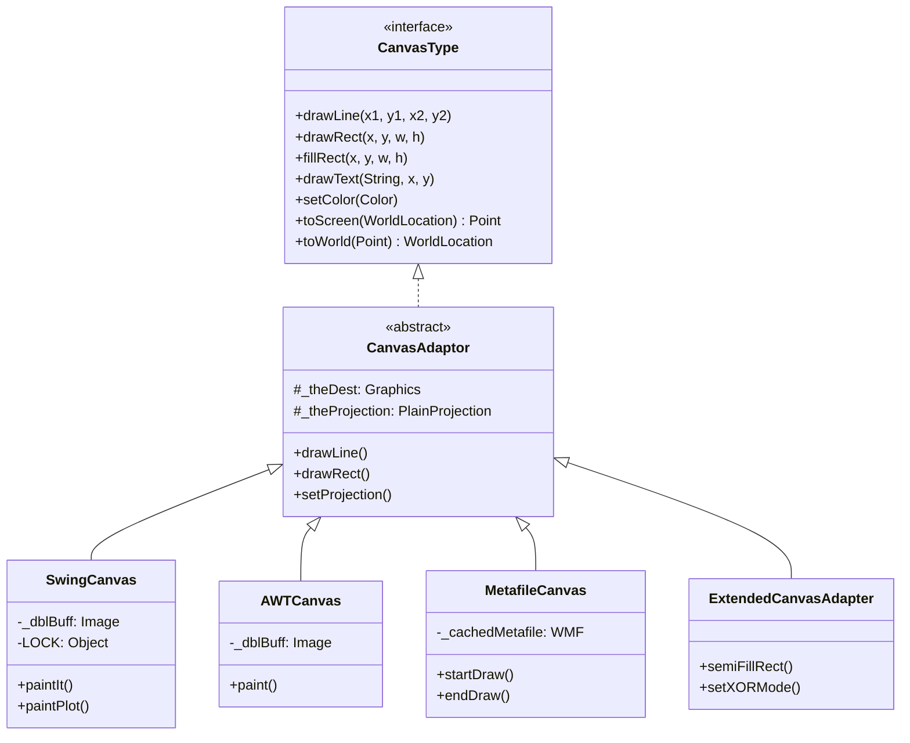
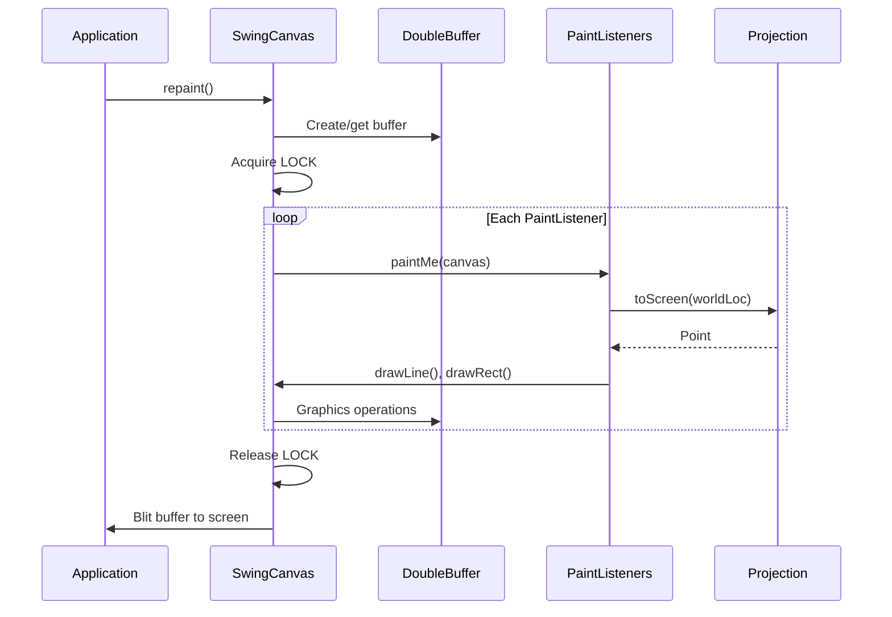

# MWC.GUI.Canvas

Canvas rendering abstraction layer for Debrief.

## Purpose

This package provides a **pluggable graphics backend** architecture supporting multiple rendering targets (Swing, AWT, WMF export) through a unified `CanvasType` interface. All canvas implementations are projection-aware and integrate with spatial coordinate transformations. Pure Java with no Eclipse dependencies. **[VERIFIED]**

## Architecture



## Entry Points

| Class | Purpose | Location |
|-------|---------|----------|
| `CanvasAdaptor` | Abstract adapter with common utilities | `MWC.GUI.Canvas.CanvasAdaptor` |
| `SwingCanvas` | Production Swing implementation | `MWC.GUI.Canvas.Swing.SwingCanvas` |
| `MetafileCanvas` | WMF export canvas | `MWC.GUI.Canvas.MetafileCanvas` |
| `ExtendedCanvasAdapter` | Transparency & XOR extensions | `MWC.GUI.Canvas.ExtendedCanvasAdapter` |

## Key Classes

### CanvasAdaptor

**Purpose**: Common delegate adapter for all CanvasType operations.

**Drawing Primitives**:
```java
// Lines and shapes
drawLine(x1, y1, x2, y2)
drawRect(x, y, width, height)       // outline
fillRect(x, y, width, height)       // filled
drawOval(x, y, width, height)
fillOval(x, y, width, height)

// Polygons
drawPolygon(xPoints[], yPoints[], count)
fillPolygon(xPoints[], yPoints[], count)
drawPolyline(xPoints[], yPoints[], count)

// Arcs
drawArc(x, y, width, height, startAngle, arcAngle)
fillArc(x, y, width, height, startAngle, arcAngle)
```

**Text Rendering**:
```java
drawText(String, x, y)
drawText(Font, String, x, y)
drawText(String, x, y, rotationDegrees)
getStringWidth(Font, String)
getStringHeight(Font)
```

**Color & Style**:
```java
setColor(Color)
setBackgroundColor(Color)
setLineWidth(float pixels)
setLineStyle(int style)  // SOLID, DOTTED, DOT_DASH, SHORT_DASHES, LONG_DASHES
```

**Projection Integration**:
```java
Point screenPt = canvas.toScreen(worldLocation);
WorldLocation worldLoc = canvas.toWorld(screenPoint);
PlainProjection proj = canvas.getProjection();
canvas.setProjection(projection);
```

**[VERIFIED]**

---

### SwingCanvas

**Purpose**: Production Swing/JComponent canvas with double-buffering.

**Key Characteristics**:
- Extends `javax.swing.JComponent`
- Thread-safe synchronized painting via `LOCK` object
- Anti-aliasing heuristics for fonts and lines
- Coordinate validation (rejects values outside [-9000, 9000])

**Double-Buffering Pattern**:
```java
private final Object LOCK = new Object();
private Image _dblBuff;  // transient, recreated on resize

// Painting sequence:
synchronized(LOCK) {
    // 1. Check if _dblBuff needs recreation
    // 2. Swap _dblBuff reference
    // 3. Paint to temp buffer
    // 4. Restore reference
}
```

**Anti-Aliasing Heuristics**:
```java
antiAliasThis(Font font) {
    return font.getSize() >= 14 || (font.isBold() && font.getSize() >= 12);
}

antiAliasThisLine(float width) {
    return width > 1;
}
```

**Line Style Cache**:
| Style | Pattern |
|-------|---------|
| SOLID | `{5, 0}` |
| DOTTED | `{2, 6}` |
| DOT_DASH | `{4, 4, 12, 4}` |
| SHORT_DASHES | `{4, 4, 4, 4, 12, 4}` |
| LONG_DASHES | `{12, 6}` |

**[VERIFIED]**

---

### MetafileCanvas

**Purpose**: Generate Windows Metafile format for export.

**Key Features**:

**State Optimization**:
```java
// Only updates graphics state if changed
private Color _currentColor = null;

void setColor(Color theCol) {
    if (theCol != _currentColor) {
        g.setColor(theCol);
        _currentColor = theCol;
    }
}
```

**Text Rotation** (WMF-specific):
```java
int newEscapement = (int)(-rotate * 10);
g.setFontEscapement(newEscapement);
drawText(str, x, y);
g.setFontEscapement(old);
```

**File Management**:
```java
getOutputFileName()   // "d3_MM_SS.wmf"
getLastFileName()     // static for clipboard ops
getLastScreenSize()   // for clipboard WMF size
```

**[VERIFIED]**

---

### ExtendedCanvasAdapter

**Purpose**: Transparency and visual effects extensions.

**New Capabilities**:
```java
// Semi-transparent fills (50% alpha)
semiFillRect(x, y, w, h)
semiFillOval(x, y, w, h)
semiFillPolygon(xPoints[], yPoints[], count)
semiFillShape(Shape)

// Shape rendering
emptyShape(Shape)  // outline
fillShape(Shape)   // filled

// XOR mode for rubber-band selection
setXORMode(boolean)
getXORMode()

// Transparent line drawing
drawLine(x1, y1, x2, y2, transparency)  // 0-255 alpha
```

**Implementation Pattern**:
```java
Composite makeComposite(float alpha) {
    return AlphaComposite.getInstance(AlphaComposite.SRC_OVER, alpha);
}

void semiFillRect() {
    Composite original = _dest.getComposite();
    _dest.setComposite(makeComposite(0.5f));
    _dest.fillRect(...);
    _dest.setComposite(original);
}
```

**[VERIFIED]**

## Rendering Pipeline



## Design Patterns

### Adapter Pattern
CanvasAdaptor decouples application code from Graphics/Graphics2D.

### Strategy Pattern
Multiple canvas implementations (Swing, AWT, WMF) share same interface.

### Double-Buffering
Prevents flicker in high-frequency redraws.

### Projection Awareness
Every canvas holds PlainProjection reference; toScreen/toWorld delegate to it.

### Painter Registration (Observer)
```java
canvas.addPainter(paintListener);
// paintIt() iterates all painters in registration order
```

**[VERIFIED]**

## Rendering Optimizations

1. **Coordinate Range Checking** (SwingCanvas):
   - Rejects coordinates outside [-9000, 9000]
   - Prevents OS crashes from invalid drawing commands

2. **State Caching** (MetafileCanvas):
   - Color/line style caching reduces WMF file size ~30%

3. **Anti-Aliasing Heuristics**:
   - Only enables for large fonts (≥14pt or bold ≥12pt)
   - Only enables for line width >1px

4. **Graphics Object Pooling**:
   - `getGraphicsTemp()` returns disposable copy

5. **Lazy Initialization**:
   - Double buffer created on first paint
   - Line style HashMap created on-demand

**[VERIFIED]**

## Integration with Projections

```text
CanvasType.toScreen(WorldLocation)
    ↓
PlainProjection.toScreen(WorldLocation)
    ↓
FlatProjection calculations
    ↓
Point (pixel coordinates)
```

## File Inventory

| File | Lines | Purpose |
|------|-------|---------|
| `CanvasAdaptor.java` | 386 | Abstract adapter |
| `Swing/SwingCanvas.java` | 1129 | Production Swing impl |
| `AWT/AWTCanvas.java` | 672 | Legacy AWT impl |
| `MetafileCanvas.java` | 680 | WMF export |
| `MetafileCanvasGraphics2d.java` | 2032 | Graphics2D WMF wrapper |
| `ExtendedCanvasAdapter.java` | 121 | Transparency extensions |
| `BasicTooltipHandler.java` | 307 | Hover tooltips |

## Design Rationale

### Why CanvasAdaptor instead of direct Graphics?
- Abstracts AWT/Swing differences
- Enables projection-aware coordinate transforms
- Supports painter registration (observer pattern)
- Easy to swap export backends

### Why Double-Buffering Lock in SwingCanvas?
- Application may paint from multiple threads
- Prevents torn frames during resize
- Synchronization at paint lifecycle, not per-draw (performance)

### Why WMFGraphics.textOut() instead of Graphics2D.drawString()?
- JDK 1.2 AttributedIterator not always available
- Direct WMF text commands support rotation via escapement
- WMF format predates Graphics2D in codebase

**[VERIFIED]**

## Future Porting Considerations

For Future Debrief (non-Eclipse):
- CanvasAdaptor interface requires NO modifications
- SwingCanvas can be ported as-is (javax.swing is portable)
- Consider replacing WMF with PDF export for modern systems
- MetafileCanvasGraphics2d can become PDFGraphics2d

## Dependencies

| Package | Purpose |
|---------|---------|
| `MWC.Algorithms.PlainProjection` | Coordinate transformation |
| `MWC.GenericData.WorldLocation` | Geographic positions |
| `javax.swing` | SwingCanvas base |

## See Also

- [CLAUDE.md](../../../../../CLAUDE.md) - Entry point
- [org.mwc.cmap.legacy README](../../../../README.md) - Parent plugin
- [MWC.GUI.Shapes README](../Shapes/README.md) - Shape rendering
- [org.mwc.cmap.plotViewer README](../../../../../org.mwc.cmap.plotViewer/README.md) - Chart rendering
