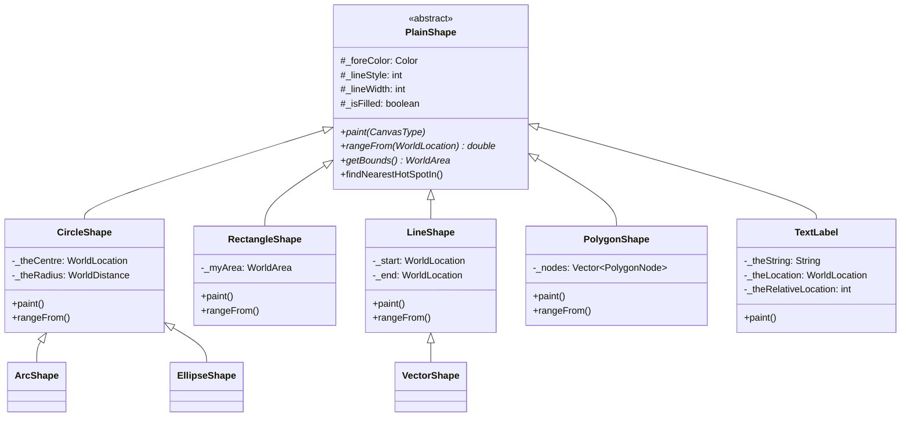
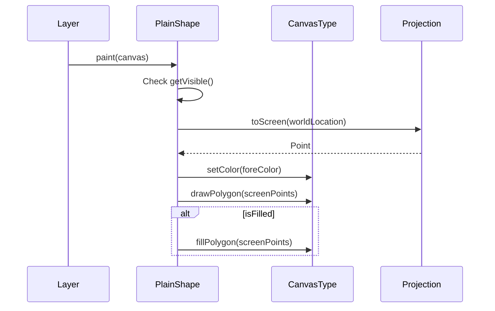
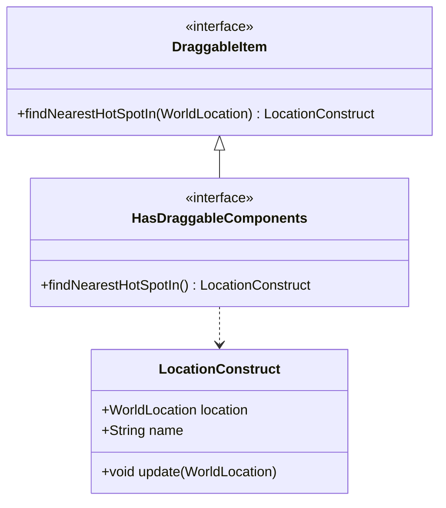

# MWC.GUI.Shapes

Geographic shape rendering system for maritime analysis.

## Purpose

This package provides **geographic shapes** for map visualization: circles, rectangles, lines, polygons, ellipses, arcs, and text labels. Shapes use world coordinates (lat/lon) and transform to screen coordinates via projections. All shapes support rendering, hit-testing, and drag editing. **[VERIFIED]**

## Architecture



## Entry Points

| Class | Purpose | Location |
|-------|---------|----------|
| `PlainShape` | Abstract base class | `MWC.GUI.Shapes.PlainShape` |
| `CircleShape` | Circle via 40 segments | `MWC.GUI.Shapes.CircleShape` |
| `RectangleShape` | Rectangle with corners | `MWC.GUI.Shapes.RectangleShape` |
| `LineShape` | Line with optional arrow | `MWC.GUI.Shapes.LineShape` |
| `PolygonShape` | Multi-vertex polygon | `MWC.GUI.Shapes.PolygonShape` |
| `TextLabel` | Text annotation | `MWC.GUI.Shapes.TextLabel` |
| `VectorShape` | Bearing/range vector | `MWC.GUI.Shapes.VectorShape` |
| `EllipseShape` | Rotated ellipse | `MWC.GUI.Shapes.EllipseShape` |
| `ArcShape` | Circular arc segment | `MWC.GUI.Shapes.ArcShape` |

## Key Classes

### PlainShape (Base Class)

**Purpose**: Abstract base for all geographic shapes.

**Key Properties**:
- `_foreColor` - Drawing color
- `_lineStyle` - Line style (solid, dashed, etc.)
- `_lineWidth` - Line thickness (default 2 pixels)
- `_isFilled` - Whether shape is filled
- `_semiTransparent` - Use 50% alpha fill

**Abstract Methods**:
```java
abstract void paint(CanvasType dest);           // render shape
abstract double rangeFrom(WorldLocation point); // hit testing (degrees)
abstract WorldArea getBounds();                 // geographic bounds
```

**Common Features**:
- PropertyChangeSupport for UI updates
- Draggable component support via `DraggableItem` interface
- Anchor points for label positioning

**[VERIFIED]**

---

### CircleShape

**Purpose**: Circle defined by centre and radius.

**Key Fields**:
- `_theCentre` - WorldLocation centre point
- `_theRadius` - WorldDistance (stored as YARDS)
- `_myPoints` - ArrayList of 40 perimeter points

**Rendering**:
```java
// Circle approximated as 40-segment polygon
for (angle = 0; angle < 360; angle += 9) {
    point = centre.add(new WorldVector(angle, radius, 0));
    screenPoints.add(canvas.toScreen(point));
}
canvas.drawPolygon(screenPoints);
```

**Hit Testing**:
```java
double rangeFrom(WorldLocation point) {
    double toCentre = centre.rangeFrom(point);
    double radiusDeg = radius.getValueIn(DEGS);
    return Math.min(toCentre, Math.abs(toCentre - radiusDeg));
}
```

**Dragging**: Centre and radius are both draggable.

**[VERIFIED]**

---

### RectangleShape

**Purpose**: Rectangle defined by WorldArea corners.

**Rendering**: Converts 4 corners to screen, draws/fills polygon.

**Dragging**: All 4 corners + centre draggable with auto-normalisation.

**[VERIFIED]**

---

### LineShape

**Purpose**: Line with optional arrow and range/bearing display.

**Key Fields**:
- `_start`, `_end` - WorldLocation endpoints
- `_arrowAtEnd` - Draw arrow at end
- `_showAutoCalc` - Display range/bearing at midpoint

**Arrow Drawing**:
```java
// 15px lines from end at 20° angles
arrowLength = 15;
arrowAngle = 20°;
// Calculate arrow points relative to line bearing
```

**Auto-Calc Display**: Shows formatted range, units, and bearing at line centre.

**[VERIFIED]**

---

### VectorShape (extends LineShape)

**Purpose**: Bearing/range vector from start point.

**Key Difference**: End point calculated from start + bearing/distance.

```java
// Setting bearing/distance recalculates end point
void setBearing(double bearingDegs) {
    _bearingDegs = bearingDegs;
    recalculateEnd();
}

void recalculateEnd() {
    WorldVector vec = new WorldVector(Degs2Rads(_bearingDegs), _distance, 0);
    _end = _start.add(vec);
}
```

**Use Case**: Sensor bearing visualization, TMA contacts.

**[VERIFIED]**

---

### PolygonShape

**Purpose**: Multi-vertex polygon/polyline.

**Key Fields**:
- `_nodes` - Vector of PolygonNode vertices
- `_closePolygon` - Connect first and last
- `_showLabels` - Display node numbers

**Inner Class - PolygonNode**:
```java
class PolygonNode implements Editable, Plottable {
    WorldLocation _myLocation;
    String _name;
    PolygonShape _parent;
}
```

**Hit Testing**:
```java
double rangeFrom(WorldLocation point) {
    // Test distance to each node
    // Test distance to each edge (line segment)
    return minimum;
}
```

**Dragging**: Each node individually draggable.

**[VERIFIED]**

---

### TextLabel

**Purpose**: Text annotation at geographic position.

**Key Fields**:
- `_theString` - Text to display (supports `\n`)
- `_theLocation` - WorldLocation anchor
- `_theRelativeLocation` - Position relative to anchor (LEFT/RIGHT/TOP/BOTTOM/CENTRE)
- `_theShape` - Optional shape to track for dynamic anchoring

**Multi-Line Layout**:
```java
String[] lines = text.split("\n");
for (int i = 0; i < lines.length; i++) {
    int lineY = baseY + (i * lineHeight * 1.3);  // 30% extra spacing
    int lineX = centreX - (lineWidth / 2);       // centre-aligned
    canvas.drawText(lines[i], lineX, lineY);
}
```

**[VERIFIED]**

---

### EllipseShape

**Purpose**: Rotated ellipse with major/minor axes.

**Key Fields**:
- `_theCentre` - WorldLocation centre
- `_theMaxima` - Major axis (WorldDistance)
- `_theMinima` - Minor axis (WorldDistance)
- `_theOrientation` - Rotation in degrees

**Edge Calculation**:
```java
// Parametric ellipse with rotation
for (t = 0; t < 2π; t += step) {
    x = sin(t) * maxima;
    y = cos(t) * minima;
    bearing = atan2(y, x) + orientation;
    distance = sqrt(x² + y²);
    point = centre.add(new WorldVector(bearing, distance, 0));
}
```

**Hit Testing**: Samples 50 points on ellipse edge, returns minimum distance.

**Dragging**: Top point adjusts maxima; left point adjusts minima.

**[VERIFIED]**

---

### ArcShape (extends CircleShape)

**Purpose**: Circular arc segment.

**Key Fields**:
- Inherits radius/centre from CircleShape
- `_centreBearing` - Bearing to midpoint (degrees)
- `_arcWidth` - Angular width (degrees)
- `_plotOrigin` - Mark centre point
- `_plotSpokes` - Draw radial lines to arc ends

**Use Case**: Sensor sweep visualization, bearing sectors.

**[VERIFIED]**

## Rendering Pipeline



## Hit Testing Algorithm

All shapes implement `rangeFrom(WorldLocation)`:

```text
HIT TESTING
INPUT: Cursor world location
OUTPUT: Distance in degrees (smaller = closer)

1. Each shape calculates minimum distance:
   - Circle: min(dist-to-centre, abs(dist - radius))
   - Rectangle: dist to nearest edge or corner
   - Polygon: min(dist-to-nodes, dist-to-edges)
   - Line: min(dist-to-start, dist-to-end)

2. Layer iterates shapes, finds smallest rangeFrom()

3. If rangeFrom < threshold, shape is "hit"
```

**[VERIFIED]**

## Draggable Component System



**Pattern**: Anonymous inner classes wrap WorldLocation with update logic.

```java
// Circle centre dragging
new LocationConstruct() {
    public WorldLocation getLocation() { return _theCentre; }
    public void update(WorldLocation newLoc) {
        _theCentre = newLoc;
        recalculate();
    }
}
```

**[VERIFIED]**

## Transparency Handling

```java
static final int TRANSPARENCY_SHADE = 160;  // out of 255

void paint(CanvasType dest) {
    if (getSemiTransparent()) {
        Color c = new Color(foreColor.getRed(),
                           foreColor.getGreen(),
                           foreColor.getBlue(),
                           TRANSPARENCY_SHADE);
        dest.setColor(c);
    }
    dest.semiFillPolygon(points);  // via ExtendedCanvasType
}
```

## File Inventory

| Class | Lines | Purpose |
|-------|-------|---------|
| PlainShape | 487 | Abstract base |
| CircleShape | 524 | Circle via 40 segments |
| RectangleShape | 494 | Rectangle with corners |
| LineShape | 516 | Line with optional arrow |
| VectorShape | 149 | Bearing/distance vector |
| PolygonShape | 674 | Multi-vertex polygon |
| EllipseShape | 710 | Rotated ellipse |
| TextLabel | 618 | Multi-line text |
| ArcShape | 564 | Circular arc segment |

## Design Patterns

### World Coordinates Throughout
All shapes store data as WorldLocation; rendering converts via projection.

### Template Method (PlainShape)
Base class defines lifecycle; subclasses implement specifics.

### Composite (PolygonShape)
PolygonShape acts as Layer container for PolygonNodes.

### Decorator (TextLabel)
Wraps PlainShape to provide auto-positioned labels.

### Observer (PropertyChangeSupport)
Shapes fire events on modifications for UI updates.

**[VERIFIED]**

## Rendering Lessons

1. **Early Visibility Check**: Check `getVisible()` first in paint()
2. **Null Checks**: `toScreen()` returns null if off-screen
3. **Alpha Management**: Create new Color object with custom alpha
4. **Font Caching**: TextLabel caches string width
5. **WorldVector for Geometry**: Use for bearing/distance math

## Dependencies

| Package | Purpose |
|---------|---------|
| `MWC.GenericData` | WorldLocation, WorldDistance, WorldArea |
| `MWC.GUI.CanvasType` | Rendering interface |
| `MWC.GUI.Editable` | Property sheet integration |

## See Also

- [CLAUDE.md](../../../../../CLAUDE.md) - Entry point
- [org.mwc.cmap.legacy README](../../../../README.md) - Parent plugin
- [MWC.GUI.Canvas README](../Canvas/README.md) - Canvas rendering
- [KEY_CLASSES.md](../../../../../KEY_CLASSES.md) - Shape relationships
