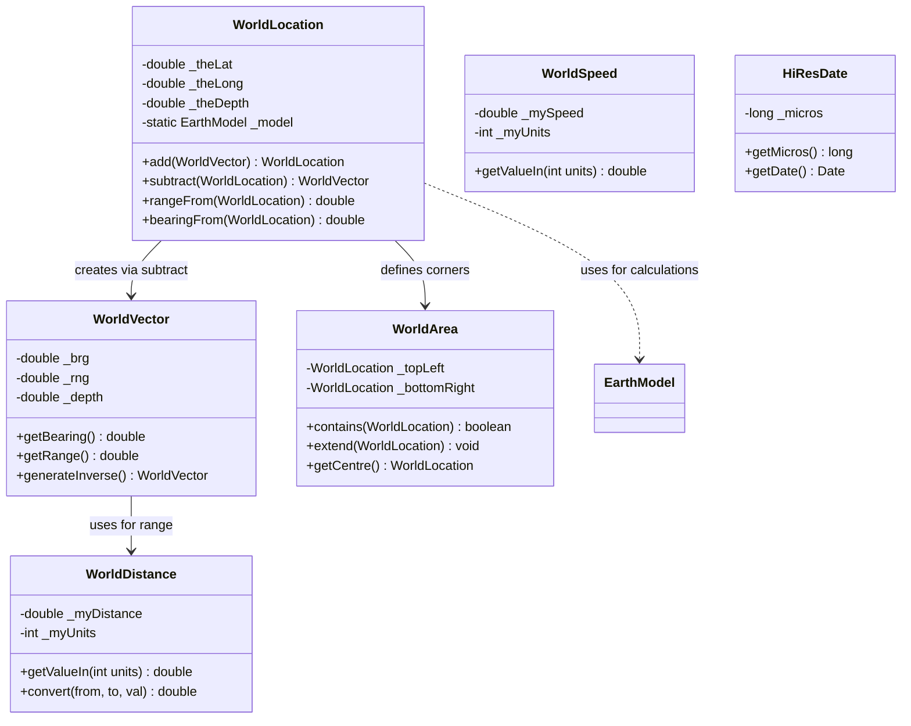

# MWC.GenericData

Core maritime domain data types and coordinate system classes for Debrief.

## Purpose

This package provides the **fundamental data types** for maritime analysis: positions, speeds, distances, vectors, time, and geographic areas. All classes are pure Java with no Eclipse dependencies, designed for network serialization (Kryo support) and unit-aware calculations. **[VERIFIED]**

## Architecture



## Entry Points

| Class | Purpose | Location |
|-------|---------|----------|
| `WorldLocation` | 3D position (lat/lon/depth) | `MWC.GenericData.WorldLocation` |
| `WorldDistance` | Distance with unit conversion | `MWC.GenericData.WorldDistance` |
| `WorldSpeed` | Speed with unit conversion | `MWC.GenericData.WorldSpeed` |
| `WorldVector` | Bearing + range offset | `MWC.GenericData.WorldVector` |
| `WorldArea` | Rectangular bounding region | `MWC.GenericData.WorldArea` |
| `HiResDate` | Microsecond-precision timestamp | `MWC.GenericData.HiResDate` |

## Key Classes

### WorldLocation

**Purpose**: Fundamental 3D position in world coordinates (lat/lon/depth).

**Key Fields**:
- `_theLat` - Latitude in degrees (-90 to +90)
- `_theLong` - Longitude in degrees (-180 to +180)
- `_theDepth` - Depth in metres (positive = down)
- `_model` - Static EarthModel for geodetic calculations

**Constructors** (7 varieties):
1. `(double lat, double lon, double depth)` - Direct decimal degrees
2. `(BigDecimal lat, BigDecimal lon, BigDecimal depth)` - GPX precision
3. `(int latDeg, int latMin, double latSec, char latHem, ...)` - DMS format with cascading
4. `(WorldLocation other)` - Copy constructor

**Key Methods**:
```java
// Arithmetic
WorldLocation newLoc = location.add(worldVector);
WorldVector offset = location2.subtract(location1);

// Measurements
double rangeDeg = location1.rangeFrom(location2);
double bearingRad = location1.bearingFrom(location2);

// Validation
boolean valid = location.isValid();  // lat±90, lon±180
boolean hasDepth = location.hasValidDepth();  // not NaN
```

**DMS Cascading**: Constructor handles `22.5°` as `22° 30'` (cascades decimal to minutes/seconds).

**[VERIFIED]**

---

### WorldVector

**Purpose**: 3D displacement vector (bearing + range + depth change).

**Key Fields**:
- `_brg` - Bearing in radians (0 = North, π/2 = East)
- `_rng` - Range in degrees (angular distance)
- `_depth` - Depth change in metres

**Usage Pattern**:
```java
// Calculate separation between points
WorldVector sep = location2.subtract(location1);

// Create new location from offset
WorldVector delta = new WorldVector(bearingRads, distanceDegs, depthMetres);
WorldLocation newLoc = startLocation.add(delta);

// Reverse direction
WorldVector inverse = vector.generateInverse();  // bearing + π
```

**[VERIFIED]**

---

### WorldDistance

**Purpose**: Distance with flexible units (8 types supported).

**Unit Constants**:
| Constant | Value | Description |
|----------|-------|-------------|
| `METRES` | 0 | SI unit |
| `YARDS` | 1 | Imperial |
| `KM` | 2 | Kilometres |
| `NM` | 3 | Nautical Miles (baseline) |
| `MINUTES` | 4 | Arc-minutes (1/60°) |
| `DEGS` | 5 | Degrees |
| `KYDS` | 6 | Kiloyards |
| `FT` | 7 | Feet |

**Key Methods**:
```java
WorldDistance dist = new WorldDistance(5.0, WorldDistance.NM);
double metres = dist.getValueIn(WorldDistance.METRES);
double converted = WorldDistance.convert(WorldDistance.NM, WorldDistance.KM, 5.0);
boolean isAngular = dist.isAngular();  // true for DEGS/MINUTES
```

**Scale Factor Algorithm**: Converts via nautical minutes baseline.

**[VERIFIED]**

---

### WorldSpeed

**Purpose**: Speed with flexible units (4 types).

**Unit Constants**:
| Constant | Value | Conversion |
|----------|-------|------------|
| `M_sec` | 0 | Metres/second (SI) |
| `Kts` | 1 | Knots (1 kts = 0.5144 m/s) |
| `ft_sec` | 2 | Feet/second |
| `ft_min` | 3 | Feet/minute |

**[VERIFIED]**

---

### WorldArea

**Purpose**: 3D rectangular bounding box (axis-aligned in lat/lon/depth).

**Key Methods**:
```java
WorldArea area = new WorldArea(topLeft, bottomRight);

// Containment
boolean inside = area.contains(location);
boolean overlaps = area.overlaps(otherArea);

// Expansion
area.extend(newLocation);
area.grow(degreesDelta, metresDepth);

// Access
WorldLocation centre = area.getCentre();
double width = area.getWidth();  // degrees
double height = area.getHeight();  // degrees

// Distance
double distToEdge = area.rangeFromEdge(location);  // 0 if inside
```

**Normalisation**: Constructor ensures topLeft is always north-west corner.

**[VERIFIED]**

---

### HiResDate

**Purpose**: Microsecond-precision timestamp (beyond standard Java milliseconds).

**Key Methods**:
```java
HiResDate date = new HiResDate(milliseconds, microseconds);
long micros = date.getMicros();
Date javaDate = date.getDate();  // loses microsecond precision

// Comparison
boolean later = date1.greaterThan(date2);
HiResDate latest = HiResDate.max(date1, date2);

// Utilities
HiResDate.copyOnlyTime(source, target);  // copy HH:MM:SS, keep date
boolean uninit = HiResDate.isNotInitialized(date);
```

**Special Values**:
- `NULL_DATE` - Static instance (value: -1 micros) for property editors

**[VERIFIED]**

---

### Duration

**Purpose**: Time span with flexible units (6 types).

**Unit Constants**: MICROSECONDS, MILLISECONDS, SECONDS, MINUTES, HOURS, DAYS

**Smart Formatting**:
```java
Duration dur = new Duration(90000, Duration.MILLISECONDS);
String str = dur.toString();  // "1.5 minutes" (finds best unit)
Duration parsed = Duration.fromString("12.0 minutes");
```

**[VERIFIED]**

---

### WorldPath

**Purpose**: Ordered sequence of locations forming a polyline path.

**Key Methods**:
```java
WorldPath path = new WorldPath();
path.addPoint(location1);
path.addPoint(location2);

WorldArea bounds = path.getBounds();
double totalDist = path.getTotalDistance();

// Subdivide into equal-length legs
WorldPath[] sections = path.breakIntoStraightSections(numStops);
```

**[VERIFIED]**

---

### Watchable Interface

**Purpose**: Observable entity protocol for tracks, fixes, and maritime objects.

```java
public interface Watchable {
    WorldLocation getLocation();
    double getSpeed();      // knots
    double getCourse();     // radians
    double getDepth();      // metres
    HiResDate getTime();
    WorldArea getBounds();
    String getName();
    boolean getVisible();
}
```

Implemented by: `TrackWrapper`, `FixWrapper`, and other domain classes.

**[VERIFIED]**

## Algorithms

### Point-to-Line-Segment Distance

**Purpose**: Calculate minimum distance from point to line segment.

**Location**: `WorldArea.distancePointLine()`

```text
POINT-TO-LINE DISTANCE
INPUT: Point P, Line segment (A, B)
OUTPUT: Minimum distance from P to segment AB

1. Calculate vectors:
   AB = B - A
   AP = P - A

2. Project P onto line AB:
   t = dot(AP, AB) / dot(AB, AB)

3. Clamp to segment bounds:
   IF t < 0: closest = A
   IF t > 1: closest = B
   ELSE: closest = A + t * AB

4. RETURN distance(P, closest)
```

Used by `rangeFromEdge()` and `perpendicularDistanceBetween()`.

**[VERIFIED]**

---

### DMS Cascading

**Purpose**: Convert decimal portions to smaller units in DMS constructor.

```text
DMS CASCADING
INPUT: degrees (22.5), minutes (0), seconds (0)
OUTPUT: degrees (22), minutes (30), seconds (0)

1. Extract decimal from degrees:
   dec = decimalComponentOf(22.5) = 0.5

2. Cascade to minutes:
   degs = 22
   mins = 0.5 * 60 = 30

3. Extract decimal from minutes:
   dec = decimalComponentOf(30) = 0

4. If decimal, cascade to seconds:
   (no further cascade needed)

RESULT: 22° 30' 0"
```

**[VERIFIED]**

## Design Patterns

### Value Object Pattern
All World* classes are immutable or near-immutable with copy constructors.

### Unit-Aware Converter Pattern
```java
// Standard across Distance/Speed/Duration
static double convert(int from, int to, double val);
static String getLabelFor(int units);
static int getUnitIndexFor(String units);
```

### Earth Model Plugin
```java
// Pluggable geodetic model
WorldLocation.setModel(new FlatEarth());
EarthModel model = WorldLocation.getModel();
```

### Lazy Caching
WorldArea caches centre point; WorldLocation reuses working vectors.

**[VERIFIED]**

## Edge Cases & Gotchas

1. **Depth Sign Convention**: Positive depth = deeper underwater (not height)

2. **DMS Input Flexibility**: Accepts decimal in any position; 22.5° degs → 22°30'

3. **Static Earth Model**: All WorldLocations share single model instance (thread-unsafe if changed mid-calculation)

4. **NaN Depth Handling**: `hasValidDepth()` checks for Double.NaN; extend() ignores NaN depths

5. **Equality Precision**: WorldLocation allows 1.0E-11 degree tolerance (~millimeter)

6. **Invalid TimePeriod Semantics**: If both start/end are INVALID_DATE, `contains()` returns TRUE for all dates

7. **Unit Immutability**: WorldSpeed/Distance store units as int; create new instance to change units

**[VERIFIED]**

## Dependencies

| Package | Purpose |
|---------|---------|
| `MWC.Algorithms.EarthModel` | Bearing/range calculations |
| `MWC.Algorithms.Conversions` | Unit conversion helpers |
| `MWC.Utilities.TextFormatting` | Date/location string formatting |

## See Also

- [CLAUDE.md](../../../../CLAUDE.md) - Entry point
- [org.mwc.cmap.legacy README](../../../README.md) - Parent plugin
- [MWC.Algorithms README](../Algorithms/README.md) - Geodetic calculations
- [KEY_CLASSES.md](../../../../KEY_CLASSES.md) - Data type relationships
