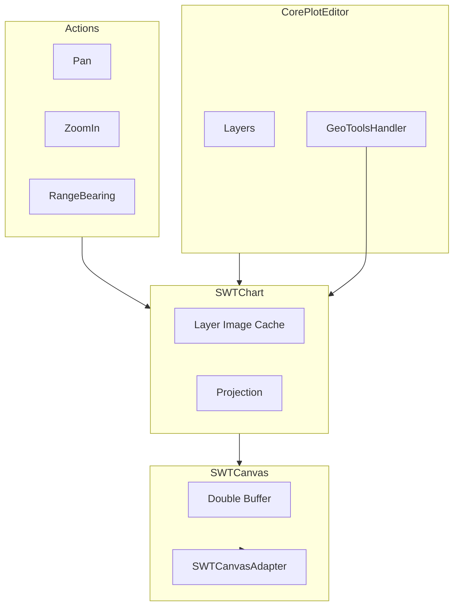
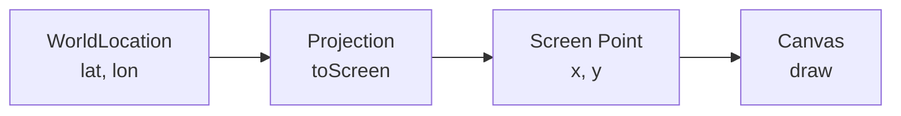
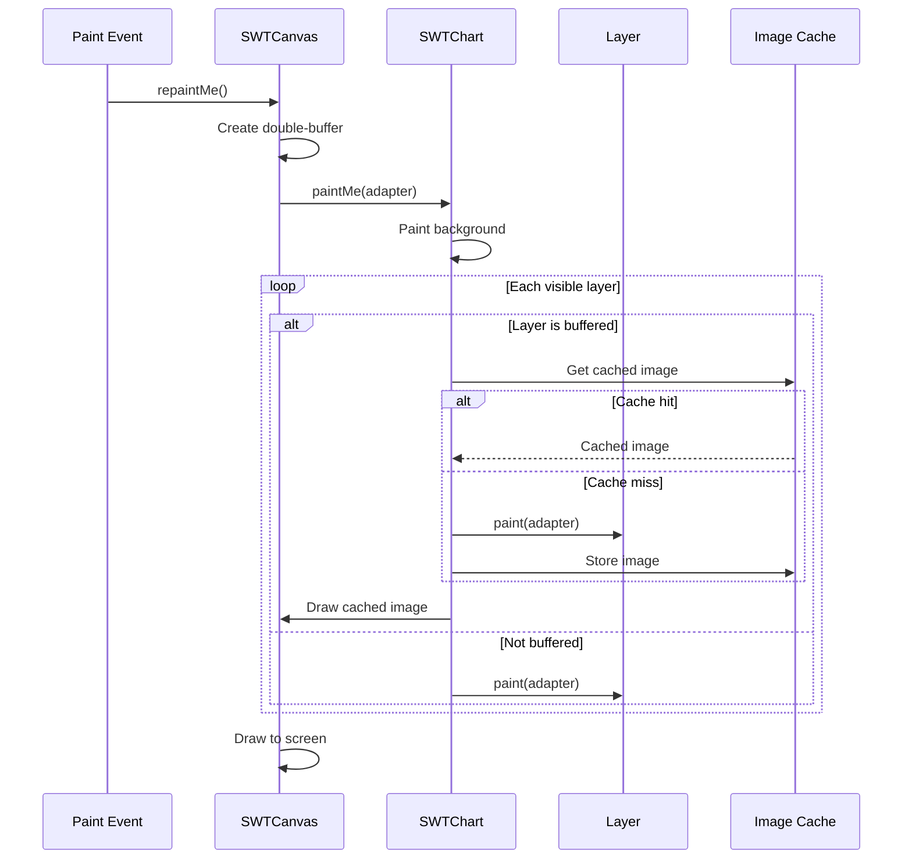

# org.mwc.cmap.plotViewer

Plot/chart rendering engine for Debrief using SWT canvas.

## Purpose

This plugin provides the **rendering infrastructure** for map plots, implementing a sophisticated layered rendering system with per-layer caching, coordinate transformation, and interactive viewport control. **[VERIFIED]**

## Architecture



## Entry Points

| Class | Purpose | Location |
|-------|---------|----------|
| `SWTChart` | Rendering orchestrator | `editors.chart.SWTChart` |
| `SWTCanvas` | SWT canvas wrapper | `editors.chart.SWTCanvas` |
| `CorePlotEditor` | Eclipse editor base | `editors.CorePlotEditor` |

## Key Packages

| Package | Purpose |
|---------|---------|
| `editors.chart` | SWTChart, SWTCanvas, trackers |
| `editors` | CorePlotEditor |
| `actions` | Pan, ZoomIn, RangeBearing, Export |

## Spatial Rendering

### Coordinate System

| Type | Description | Units |
|------|-------------|-------|
| World | Geographic position | Degrees (lat/lon) |
| Screen | Pixel position | Pixels from top-left |



### Projection Integration

```java
// World to screen conversion
Point screenPt = projection.toScreen(worldLocation);

// Screen to world conversion
WorldLocation worldLoc = projection.toWorld(screenPoint);
```

**Projection Types**:
- `PlainProjection` - Base interface
- `FlatProjection` - Flat-earth (default for maritime)
- `GtProjection` - GeoTools integration

**[VERIFIED]**

### Rendering Pipeline



**[VERIFIED]**

### Draw Order / Z-Index

Layers are drawn in enumeration order from `Layers.sortedElements()`:
1. Background (GeoTools imagery, Natural Earth)
2. Buffered layers (areas, shapes)
3. Track layers
4. Annotations and labels
5. Selection highlights (top)

**[VERIFIED]**

### Image Caching Strategy

```java
// Per-layer image caching
HashMap<Layer, Image> _myLayers;

// Cache invalidation on:
// - Data area change
// - Layer visibility change
// - Layer content modification
```

**Purpose**: Avoid re-rendering unchanged layers. Significant performance improvement for complex plots. **[VERIFIED]**

## Algorithms

### Pan Operation

**Purpose**: Drag viewport to new position.

**Location**: `actions/Pan.java`

```text
PAN ALGORITHM
INPUT: Drag start point, drag end point
OUTPUT: Updated data area

1. Convert start and end to world coordinates:
   startWorld = projection.toWorld(startScreen)
   endWorld = projection.toWorld(endScreen)

2. Calculate displacement vector:
   offset = startWorld.subtract(endWorld)

3. Apply offset to data area:
   newArea = WorldArea(
     dataArea.topLeft.add(offset),
     dataArea.bottomRight.add(offset)
   )

4. Update projection with new data area
5. Trigger repaint
```

**[VERIFIED]**

---

### Zoom Operation

**Purpose**: Zoom to selected rectangle.

**Location**: `actions/ZoomIn.java`

```text
ZOOM IN ALGORITHM
INPUT: Rectangle corners (screen coordinates)
OUTPUT: Updated data area

1. Detect drag direction:
   IF topLeft.x < bottomRight.x (left-to-right):
     mode = ZOOM_IN
   ELSE:
     mode = ZOOM_OUT

2. Convert corners to world:
   worldTL = projection.toWorld(screenTL)
   worldBR = projection.toWorld(screenBR)

3. IF ZOOM_IN:
     newArea = WorldArea(worldTL, worldBR)
   ELSE:
     // Expand current area
     newArea = currentArea.expand(factor)

4. Update projection
5. Clear layer cache (images no longer valid)
6. Trigger repaint
```

**[VERIFIED]**

## Performance Optimizations

### Double Buffering

Two levels of buffering:
1. **Canvas level**: `SWTCanvas._dblBuff` - prevents flicker
2. **Layer level**: `SWTChart._myLayers` - caches expensive layer renders

### Deferred Painting

```java
// Batch rapid repaints (150ms intervals)
if (elapsed > TIME_INTERVAL) {
    redraw();
}
```

Prevents UI flooding during rapid updates. **[VERIFIED]**

### GeoTools Image Caching

Background imagery (GeoTools, Natural Earth) is cached as SWT Image. Only regenerated on:
- Viewport change
- Layer visibility change

**[VERIFIED]**

## Dependencies

| Plugin | Purpose |
|--------|---------|
| `org.mwc.cmap.legacy` | Data types, projection, shapes |
| `org.mwc.cmap.core` | SWTCanvasAdapter, utilities |
| `org.mwc.cmap.geotools` | Background imagery |
| `org.mwc.cmap.NaturalEarth` | Natural Earth datasets |

## Design Rationale & Lessons Learned

### Why Per-Layer Caching?

Complex layers (coastlines, dense tracks) are expensive to render. Caching avoids re-rendering when only one layer changes. Trade-off: memory usage vs render time. **[VERIFIED]**

### Why SWT vs Swing?

Eclipse RCP uses SWT. For consistency and integration, rendering uses SWT Canvas. `SWTCanvasAdapter` bridges to the AWT-style `CanvasType` interface. **[VERIFIED]**

### Lessons Learned

**What worked well**:
- Layer caching provides significant speedup
- Projection abstraction allows different map projections
- Double buffering eliminates flicker

**What could improve**:
- Cache invalidation could be more granular
- Consider tile-based caching for very large areas
- Memory management for cache disposal

**For Future Debrief**:
- Consider WebGL/GPU rendering
- Implement level-of-detail for zoomed-out views
- Use modern graphics APIs (Vulkan, Metal)

## See Also

- [CLAUDE.md](../CLAUDE.md) - Entry point
- [org.mwc.cmap.legacy README](../org.mwc.cmap.legacy/README.md) - Projection, shapes
- [MWC.GUI.Canvas README](../org.mwc.cmap.legacy/src/MWC/GUI/Canvas/README.md) - Canvas detail
