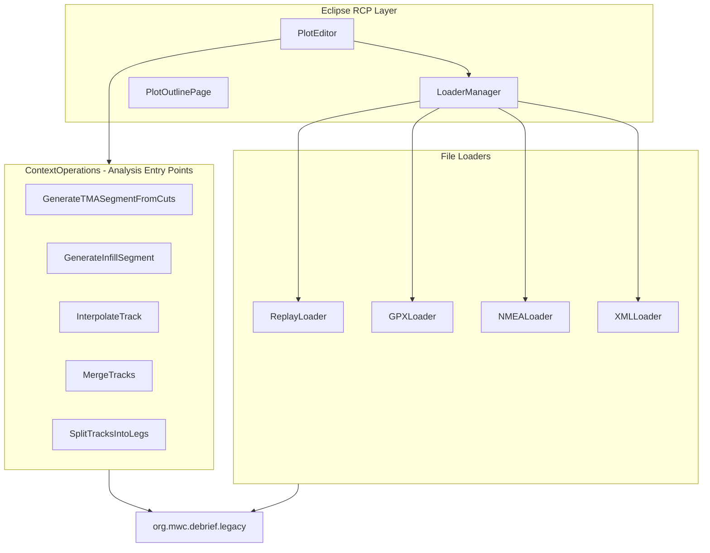
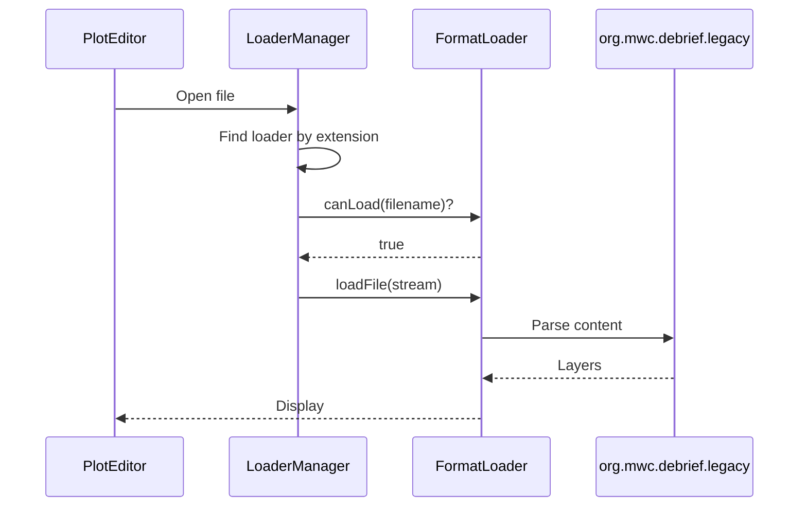

# org.mwc.debrief.core

Main Debrief plugin providing Eclipse RCP integration, file loaders, and analysis operations.

## Purpose

This plugin is the **Eclipse RCP integration layer** connecting the domain model (`org.mwc.debrief.legacy`) with the Eclipse workbench. It provides file loaders, context operations (right-click analysis), and the plot editor. **[VERIFIED]**

> **Note**: Eclipse RCP patterns (extension points, editors, actions) are **out of scope** for algorithm porting. This README focuses on the domain logic within context operations.

## Architecture



## Entry Points

| Class | Purpose | Location |
|-------|---------|----------|
| `ContextOperations/*` | Analysis algorithms (32 operations) | `org.mwc.debrief.core.ContextOperations` |
| `LoaderManager` | File format loader registry | `org.mwc.debrief.core.loaders` |
| `PlotEditor` | Main plot editor (Eclipse) | `org.mwc.debrief.core.editors` |

## Key Packages

| Package | Purpose |
|---------|---------|
| `ContextOperations` | 32 right-click analysis operations |
| `loaders` | 23 file format loaders |
| `editors` | PlotEditor, PlotOutlinePage |
| `contenttype` | File type auto-detection |

## Context Operations (Analysis Entry Points)

These are the **primary analysis algorithms** accessible via right-click context menu.

### Track Analysis & Transformation

| Operation | Purpose |
|-----------|---------|
| `CalculateTrackLength` | Compute visible track distance |
| `InterpolateTrack` | Insert fixes at regular intervals |
| `TrimTrack` | Reduce track to time window |
| `RemoveTrackJumps` | Detect and correct position discontinuities |
| `SmoothTrackJumps` | Smooth corrected jumps |
| `SplitTracksIntoLegs` | Divide tracks by time threshold |
| `MergeTracks` | Combine track segments |

### TMA Segment Generation

| Operation | Purpose |
|-----------|---------|
| `GenerateTMASegmentFromCuts` | Create TMA from sensor contacts |
| `GenerateTMASegmentFromInfillSegment` | Convert infill to TMA |
| `GenerateInfillSegment` | Create interpolated segment |
| `GenerateTUASolution` | TMA with unaligned data |
| `ConvertAbsoluteTmaToRelative` | Transform TMA type |

### Sensor Data Operations

| Operation | Purpose |
|-----------|---------|
| `GenerateNewSensor` | Create sensor on track |
| `GenerateNewSensorContact` | Add sensor observation |
| `GenerateSensorRangePlot` | Range-time plot from sensors |
| `RainbowShadeSonarCuts` | Color-code sensor contacts |
| `SelectCutsForThisTMASegment` | Highlight supporting cuts |
| `MergeContacts` | Consolidate overlapping contacts |

### Utility Operations

| Operation | Purpose |
|-----------|---------|
| `CopyBearingsToClipboard` | Export bearings |
| `ExportTrackAsCSV` | CSV export |
| `GeneratePasteRepClipboard` | REP format clipboard |

## Algorithms

### Track Interpolation

**Purpose**: Insert synthetic fixes at regular time intervals.

**Location**: `ContextOperations/InterpolateTrack.java`

```text
INTERPOLATE TRACK
INPUT: Track, interval (seconds)
OUTPUT: Track with additional fixes

1. Get track time range [startTime, endTime]
2. For t = startTime to endTime step interval:
   2.1 Find bracketing fixes (before, after)
   2.2 Linear interpolate position
   2.3 Interpolate course/speed
   2.4 Create new FixWrapper
   2.5 Insert into track
3. Return modified track
```

**[INFERRED - verify algorithm]**

---

### Track Jump Detection

**Purpose**: Find and correct discontinuous position jumps.

**Location**: `ContextOperations/RemoveTrackJumps.java`

```text
DETECT TRACK JUMPS
INPUT: Track, threshold distance
OUTPUT: List of jumps

1. For each consecutive fix pair (fix1, fix2):
   1.1 Calculate distance = fix1.location.rangeFrom(fix2.location)
   1.2 Calculate expected = fix1.speed * timeDelta
   1.3 If distance > expected * threshold:
       1.3.1 Mark as jump
2. Return jump list

CORRECT JUMPS
1. For each jump:
   1.1 Calculate offset vector
   1.2 Apply correction to subsequent fixes
```

**[INFERRED - verify algorithm]**

---

### TMA Generation from Cuts

**Purpose**: Create TMA solution from sensor bearing observations.

**Location**: `ContextOperations/GenerateTMASegmentFromCuts.java`

This operation coordinates with `org.mwc.debrief.track_shift` for the actual TMA algorithms.

**Flow**:
1. Select sensor contacts (cuts)
2. Extract bearing data with timestamps
3. Delegate to TMA solver (see track_shift plugin)
4. Create TMAWrapper with solution
5. Add to track

**[VERIFIED - flow only, algorithm in track_shift]**

## File Loaders

### Supported Formats (23 loaders)

| Category | Formats |
|----------|---------|
| Track | REP, S2087 CSV, UK CSV |
| Navigation | NMEA, NMEA Radar, Nisida, AIS |
| Proprietary | Antares, OTH-Gold, CLog |
| Geospatial | GPX, KML/KMZ, Shapefile, TIFF |
| Documents | XML/DPF, DOC, DOCX, PDF |
| Specialized | SATC, BRT |

### Loading Flow



**[VERIFIED]**

## Dependencies

| Plugin | Purpose |
|--------|---------|
| `org.mwc.debrief.legacy` | Domain model, file parsing |
| `org.mwc.cmap.legacy` | Data types, algorithms |
| `org.mwc.cmap.plotViewer` | Chart rendering |
| `org.mwc.cmap.core` | Eclipse utilities |

## Design Rationale & Lessons Learned

### Why Context Operations?

Eclipse RCP provides extension point for right-click menus. Each operation encapsulates a single analysis algorithm, making them testable and composable. **[VERIFIED]**

### What is Eclipse RCP vs Domain Logic?

| Eclipse RCP (out of scope) | Domain Logic (in scope) |
|---------------------------|-------------------------|
| MenuManager, Action | Interpolation algorithm |
| IUndoableOperation | Jump detection logic |
| Editor lifecycle | TMA calculation |
| Property sheets | CSV export format |

### Lessons Learned

**What worked well**:
- Context operations are modular and testable
- Loader extension point allows format plugins
- Separation of Eclipse from domain logic

**What could improve**:
- Some operations are tightly coupled to Eclipse
- Consider extracting algorithm core to separate classes
- Test coverage could be higher on context operations

**For Future Debrief**:
- Extract algorithm logic from context operations
- Create command pattern without Eclipse dependency
- Consider reactive/event-driven architecture

## See Also

- [CLAUDE.md](../CLAUDE.md) - Entry point
- [org.mwc.debrief.legacy README](../org.mwc.debrief.legacy/README.md) - Domain model
- [org.mwc.debrief.track_shift README](../org.mwc.debrief.track_shift/README.md) - TMA algorithms

---

## Historical Changelog

* Aug 2013 - Support for [auto-calculated range/brg labels](http://www.debrief.info/tutorial/drawing_features.html#ShowRangeCalc)
* Jul 2013 - Dragging mouse from BR to TL performs zoom-out, instead of zoom-in
* Jun 2013 - Debrief can now calculate course/speed for a track if the data isn't produced by the recording device.
* Jun 2013 - Added support for reading [Polygon shape](http://www.debrief.info/tutorial/reference.html#replay_annotation_format) from REP file
* Sept 2012 - Support irregular arcs in [Range Ring Highlighter](http://www.debrief.info/tutorial/controlling_time.html#highlight_modes)
* Sept 2012 - Allow REP position line to include [text label at end](http://www.debrief.info/tutorial/reference.html#replay_track_format)
* Aug 2012 - Introduce new, easier method of [Polygon editing](http://www.debrief.info/tutorial/drawing_features.html#the_polygon)
* May 2012 - Introduce ability to plot [XY graphs of planning tracks](http://www.debrief.info/tutorial/ch08s04.html)
* Apr 2012 - Introduce capability to use Debrief for [exercise planning](http://www.debrief.info/tutorial/ExercisePlanning.html)
* Apr 2012 - Debrief can now display a [Navigation Chart Backdrop](http://www.debrief.info/tutorial/ChartBackdrops.html)
* Mar 2012 - Add attribute to Track object, to display a [direction of travel arrow](http://www.debrief.info/tutorial/formatting_data.html#sym_intervals).
* Aug 2011 - Introduce Wizard for creation of [new Narrative entries](http://www.debrief.info/tutorial/viewing_narratives.html#more_loading_narr)


