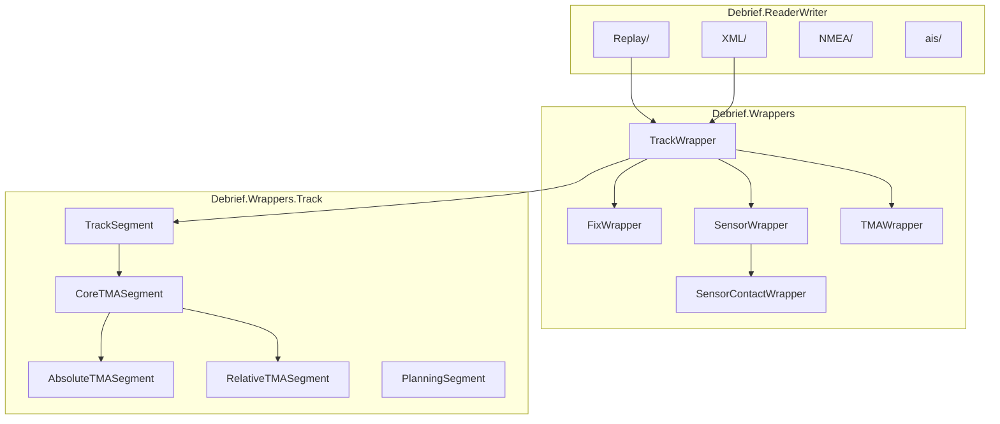
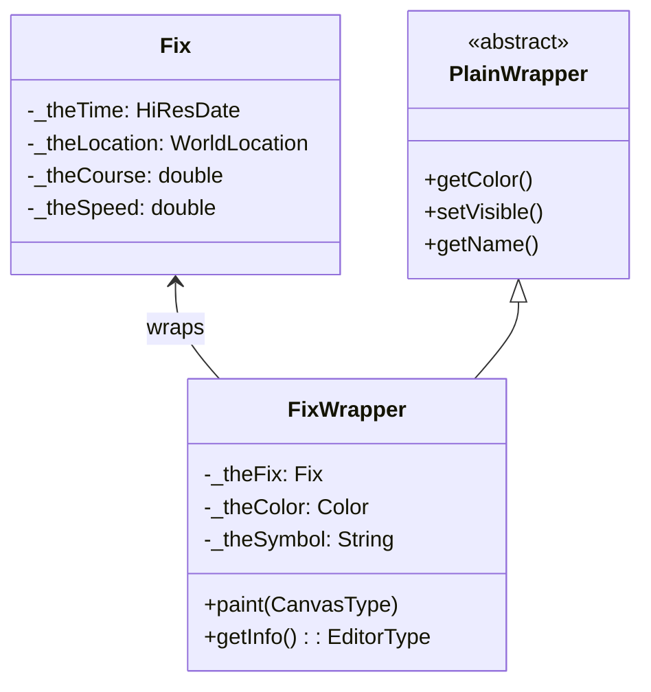
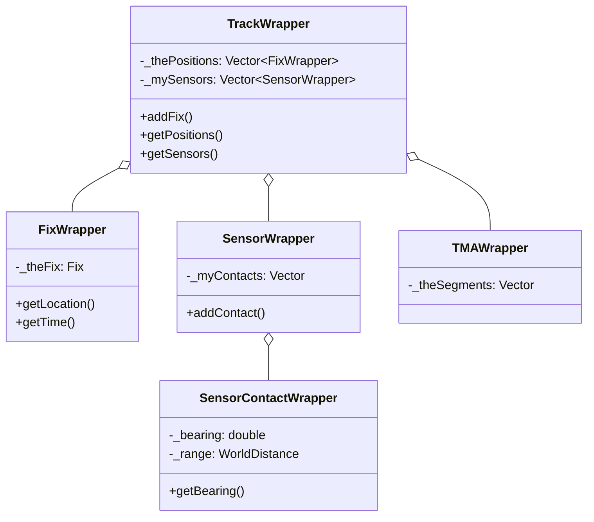
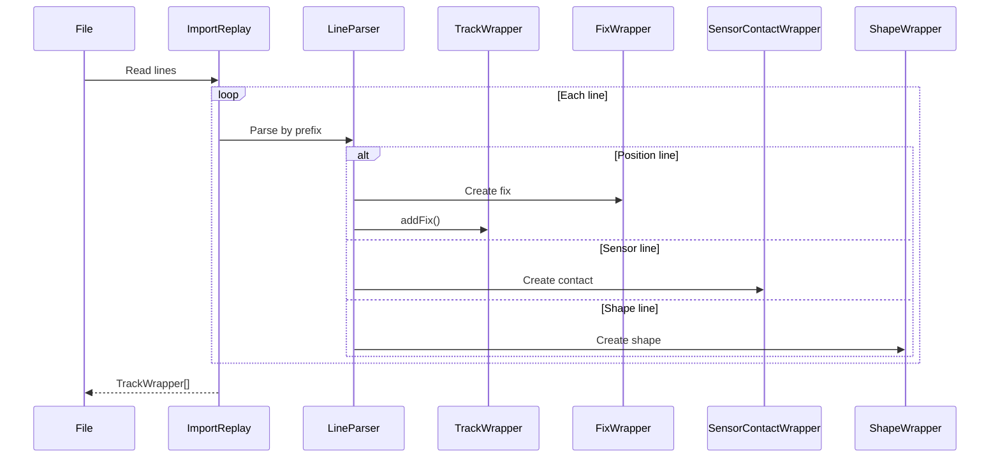
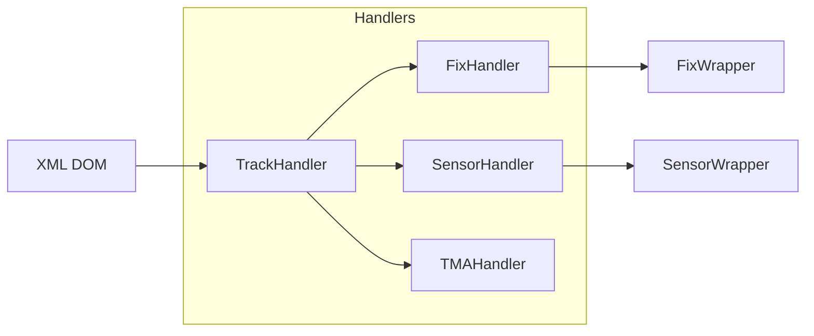

# org.mwc.debrief.legacy

Domain model wrappers and file format handlers for Debrief maritime analysis.

## Purpose

This plugin contains the **core domain model** (wrapper classes for tracks, fixes, sensors) and **file I/O** (14+ format parsers). It wraps the pure data types from `org.mwc.cmap.legacy` with GUI integration and persistence. **[VERIFIED]**

## Architecture



## Entry Points

| Class | Purpose | Location |
|-------|---------|----------|
| `TrackWrapper` | Main track container | `Debrief.Wrappers.TrackWrapper` |
| `FixWrapper` | Individual position fix | `Debrief.Wrappers.FixWrapper` |
| `SensorWrapper` | Sensor observations container | `Debrief.Wrappers.SensorWrapper` |
| `ImportReplay` | REP format parser | `Debrief.ReaderWriter.Replay.ImportReplay` |
| `DebriefXMLReaderWriter` | DPF/XML handler | `Debrief.ReaderWriter.XML.*` |

## Key Packages

| Package | Purpose |
|---------|---------|
| `Debrief.Wrappers` | Domain model: TrackWrapper, FixWrapper, SensorWrapper, TMAWrapper |
| `Debrief.Wrappers.Track` | Track segments: TrackSegment, TMA segments, PlanningSegment |
| `Debrief.ReaderWriter.Replay` | REP format import/export |
| `Debrief.ReaderWriter.XML` | DPF/XML format handler |
| `Debrief.GUI.Tote` | Tote display, snail painters |
| `Debrief.Tools` | Operations, filters |

## Domain Model

### Wrapper Pattern

All domain objects implement the **wrapper pattern** to separate data from presentation:



**Rationale**: Separates core tactical data (portable) from GUI concerns (Eclipse property sheets). **[VERIFIED]**

### Track Composition



**[VERIFIED]**

### Track Segments

| Segment Type | Class | Purpose |
|--------------|-------|---------|
| Base | `TrackSegment` | Collection of consecutive fixes |
| TMA | `CoreTMASegment` | TMA solution with course/speed |
| Absolute TMA | `AbsoluteTMASegment` | World-coordinate TMA |
| Relative TMA | `RelativeTMASegment` | Target-relative TMA |
| Planning | `PlanningSegment` | Projected route |
| Infill | `DynamicInfillSegment` | Interpolated fixes |

## File Format Handlers

### Supported Formats

| Format | Extension | Import Class | Purpose |
|--------|-----------|--------------|---------|
| Replay | `.rep` | `ImportReplay` | Primary format, tracks/sensors |
| DPF/XML | `.dpf`, `.xml` | `DebriefXMLReaderWriter` | Full plot serialization |
| NMEA | `.txt`, `.log` | `ImportNMEA` | GPS/navigation data |
| AIS | `.txt` | `ImportAIS` | Maritime AIS messages |
| GPX | `.gpx` | `GPXLoader` | GPS track exchange |
| Antares | `.txt` | `ImportAntares` | Military format |
| Nisida | `.txt` | `ImportNisida` | Naval format |
| OTH-Gold | `.txt` | `OTH_Importer` | Over-the-horizon radar |
| SATC | - | `ImportSATC` | SATC scenario files |

### REP File Parsing Flow



**[VERIFIED]**

### XML Handler Architecture



**[VERIFIED]**

## Algorithms

### Position Interpolation

**Purpose**: Generate fixes at regular intervals from sparse data.

**Location**: `TrackWrapper.getPositionAt(HiResDate)`

```text
INTERPOLATE POSITION
INPUT: Track with fixes, target time t
OUTPUT: Interpolated WorldLocation

1. Find bracketing fixes:
   fix1 = lastFix where time <= t
   fix2 = firstFix where time >= t

2. Calculate interpolation factor:
   fraction = (t - fix1.time) / (fix2.time - fix1.time)

3. Linear interpolate location:
   lat = fix1.lat + fraction * (fix2.lat - fix1.lat)
   lon = fix1.lon + fraction * (fix2.lon - fix1.lon)

4. Return new WorldLocation(lat, lon, depth)
```

**[INFERRED - verify interpolation method]**

## Spatial Rendering

### Track Rendering

Tracks render via the `paint(CanvasType)` method:

1. Iterate fixes in time order
2. For each fix, project to screen coordinates
3. Draw symbol at position
4. Connect with line to previous fix (if connected mode)
5. Draw labels based on label frequency setting

### Snail Painters

Specialized painters for time-based visualization:

| Painter | Purpose |
|---------|---------|
| `SnailDrawTrack` | Track trail with fade |
| `SnailDrawFix` | Fix symbol with time coloring |
| `SnailDrawSensorContact` | Sensor bearing lines |
| `SnailDrawTMAContact` | TMA solution display |

**[VERIFIED]**

## Dependencies

| Plugin | Purpose |
|--------|---------|
| `org.mwc.cmap.legacy` | Data types, algorithms, canvas |

**Note**: This is the only direct dependency. All Eclipse integration happens via wrapper interfaces.

## Design Rationale & Lessons Learned

### Why Wrapper Pattern?

Eclipse property sheets require `IPropertySource` interface. Rather than polluting domain classes with Eclipse dependencies, wrappers provide the integration layer. Domain classes remain portable. **[VERIFIED]**

### Why Vector Collections?

Historical code predates Java generics. `Vector` provides thread-safety for concurrent access during rendering. Modern code would use `CopyOnWriteArrayList`. **[INFERRED]**

### Why 14+ File Formats?

Maritime analysis requires data from many sources: own sensors (REP), external feeds (AIS, NMEA), exchange formats (GPX, KML), military systems (Antares, Nisida). Each format has specific record structures. **[VERIFIED]**

### Lessons Learned

**What worked well**:
- Wrapper pattern keeps domain portable
- Extensible file format architecture (add new importer without core changes)
- Segment types allow TMA, planning, and dynamic data in same track

**What could improve**:
- TrackWrapper at 3,941 lines is too large - consider splitting
- File readers sometimes create UI objects directly - cleaner separation possible
- Some formats have undocumented extensions

**For Future Debrief**:
- Consider domain events instead of property change listeners
- Extract file parsing to separate library for reuse
- Use modern collections with generics

## See Also

- [CLAUDE.md](../CLAUDE.md) - Entry point
- [org.mwc.cmap.legacy README](../org.mwc.cmap.legacy/README.md) - Foundation layer
- [Debrief.Wrappers README](src/Debrief/Wrappers/README.md) - Wrapper detail
- [Debrief.ReaderWriter README](src/Debrief/ReaderWriter/README.md) - Format detail
