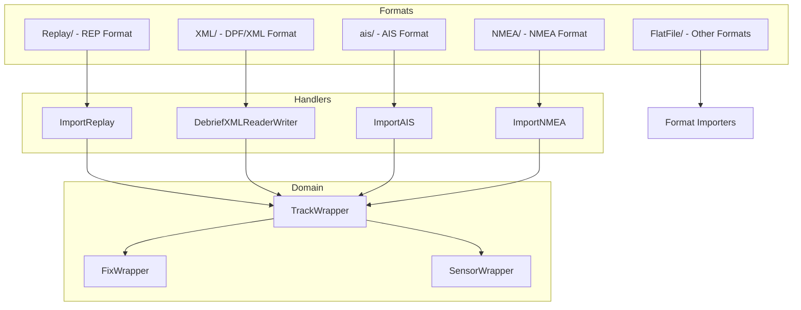
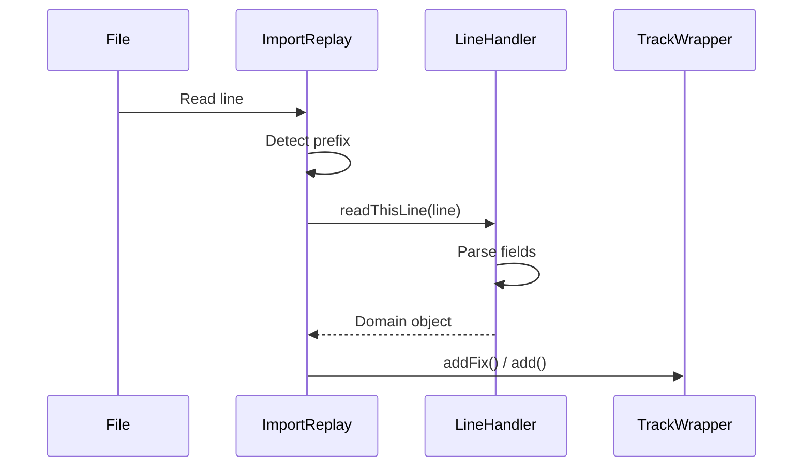

# Debrief.ReaderWriter

File format handlers for importing and exporting maritime analysis data.

## Purpose

This package provides **file I/O** for 14+ data formats: REP (primary), DPF/XML, NMEA, AIS, and specialized military formats. Extensible architecture allows new formats via handler registration. **[VERIFIED]**

## Architecture



## Entry Points

| Class | Purpose | Location |
|-------|---------|----------|
| `ImportReplay` | REP format orchestrator | `Debrief.ReaderWriter.Replay.ImportReplay` |
| `DebriefXMLReaderWriter` | XML/DPF handler | `Debrief.ReaderWriter.XML.DebriefXMLReaderWriter` |
| `ImportAIS` | AIS AIVDM parser | `Debrief.ReaderWriter.ais.ImportAIS` |
| `ImportNMEA` | NMEA sentence parser | `Debrief.ReaderWriter.NMEA.ImportNMEA` |

## Supported Formats

| Format | Extension | Handler | Complexity |
|--------|-----------|---------|------------|
| REP | `.rep` | ImportReplay (40 handlers) | High |
| XML/DPF | `.xml`, `.dpf` | DebriefXMLReaderWriter (59 handlers) | Very High |
| AIS | `.txt` | ImportAIS | Medium |
| NMEA | `.log`, `.txt` | ImportNMEA | Medium |
| CLog | `.txt` | CLogFileImporter | High |
| Antares | - | ImportAntares | Medium |
| Nisida | - | ImportNisida | Medium |

## REP Format (Replay/)

### ImportReplay Architecture

**Key Responsibilities**:
- Line-by-line parsing with prefix dispatch
- Track import mode selection (DR/OTG)
- Handler registry via `RepImportHelper`
- Export via `FormatTracks`

**Handler Pattern**:
```java
public interface AbstractPlainLineImporter {
    String getYourType();           // Line prefix (e.g., ";SENSOR:")
    Object readThisLine(String);    // Parse and create object
    void exportThis(Plottable);     // Reverse serialization
    boolean canExportThis(Object);  // Type checking
}
```

### REP Line Format Specifications

**Fix (Position) Record**:
```
YYMMDD HHMMSS[.ffffff] "TrackName" @S DD MM SS.SS H DDD MM SS.SS H CCC.C SSS.S D
```
| Field | Description |
|-------|-------------|
| Date | YYMMDD or YYYYMMDD |
| Time | HHMMSS with optional microseconds |
| Track | Quoted for multi-word names |
| Symbol | 2-char code (e.g., `@C`, `S@`) |
| Lat | DD MM SS.SS + hemisphere (N/S) |
| Lon | DDD MM SS.SS + hemisphere (E/W) |
| Course | Degrees |
| Speed | Knots |
| Depth | Metres |

**Example**:
```
951212 051600 "CARPET bag" @C 22 10 53.54 N 021 45 14.20 W 239.9 2.0 0.0
```

**Sensor Record**:
```
;SENSOR: YYMMDD HHMMSS.SSS TrackName @@ DD MM SS.SS H DDD MM SS.SS H BBB.B RRR "SensorName" label
```
| Field | Description |
|-------|-------------|
| Bearing | Degrees (BBB.B) or NULL |
| Range | Yards (RRR) |
| Sensor | Quoted sensor name |
| Label | Free text description |

**TMA Position Record**:
```
;TMA_POS: YYMMDD HHMMSS.SSS TrackName @@ DD MM SS.SS H DDD MM SS.SS H "TRACK" OOO XXXX YYYY CCC SSS DDD
```

**Shape Records**: `;CIRCLE:`, `;ELLIPSE:`, `;RECTANGLE:`, `;POLYGON:`, `;LINE:`, `;LABEL:`, `;VECTOR:`

### REP Handler Classes

| Handler | Prefix | Output |
|---------|--------|--------|
| `ImportFix` | (positional) | ReplayFix → FixWrapper |
| `ImportSensor` | `;SENSOR:` | SensorContactWrapper |
| `ImportTMA_Pos` | `;TMA_POS:` | TMAWrapper |
| `ImportTMA_RngBrg` | `;TMA_RB:` | TMAContactWrapper |
| `ImportLabel` | `;LABEL:` | LabelWrapper |
| `ImportCircle` | `;CIRCLE:` | ShapeWrapper |
| `ImportPolygon` | `;POLYGON:` | ShapeWrapper |
| `ImportNarrative` | `;NARRATIVE:` | NarrativeEntry |

**[VERIFIED]**

---

## XML Format (XML/)

### DebriefXMLReaderWriter

**Key Methods**:
- `importThis()` - Read XML/DPF file
- `exportThis()` - Write XML/DPF file
- `outputContent()` - Serialize layers

**Handler Hierarchy**:
```
PlotHandler
├── SessionHandler
│   ├── GUIHandler (UI state)
│   ├── ProjectionHandler (map projection)
│   └── DebriefLayersHandler
│       └── DebriefLayerHandler (per layer)
│           ├── TrackHandler
│           ├── FixHandler
│           ├── SensorHandler
│           └── ShapeHandlers
└── DetailsHandler (document info)
```

**Handler Pattern**:
```java
class FixHandler extends MWCXMLReader {
    void addHandler(MWCXMLReader childHandler);
    void addAttributeHandler(HandleAttribute handler);
    void elementClosed();  // Create object from attributes
}
```

**[VERIFIED]**

---

## AIS Format (ais/)

### AISParser

**Purpose**: Parse AIVDM sentences with checksum validation.

**Sentence Format**:
```
!AIVDM,1,1,,A,13u@vr0P00Pr`F0NQ:W8N?vN08R<,0*27
```

**Message Types**:
| Type | Class | Purpose |
|------|-------|---------|
| 1 | AISPositionA | Class A position report |
| B | AISPositionB | Class B position report |
| 4 | AISBaseStation | Base station position |

**Features**:
- Multi-sentence reassembly
- CRC checksum verification
- MMSI-based track creation

**[VERIFIED]**

---

## NMEA Format (NMEA/)

### ImportNMEA

**Stateful Parser**: Caches partial data across sentences.

**Message Types**:
- `VESSEL_NAME` - Vessel identifier
- `OS_POS` - Ownship position
- `OS_DEPTH`, `OS_COURSE`, `OS_SPEED`
- `CONTACT` - Target position
- `TIMESTAMP` - Time synchronization

**[VERIFIED]**

## Parsing Flow



## Design Patterns

### Strategy Pattern
`AbstractPlainLineImporter` base class with specialized handlers.

### Registry Pattern
`ImportReplay` maintains handler map, dispatches by prefix.

### Plugin Pattern
`RepImportHelper` allows external format contributions.

### Composite Pattern
Nested structures (Track → Segment → Fix).

**[VERIFIED]**

## Adding New Formats

### New REP Line Type

1. Create handler extending `AbstractPlainLineImporter`:
```java
public class ImportMyType implements AbstractPlainLineImporter {
    public String getYourType() {
        return ";MYTYPE:";
    }

    public Object readThisLine(String line) {
        // Parse line, create domain object
    }
}
```

2. Register in `ImportReplay`:
```java
addHandler(new ImportMyType());
```

### New XML Element

1. Create handler extending `MWCXMLReader`:
```java
public class MyElementHandler extends MWCXMLReader {
    public MyElementHandler() {
        super("myElement");
        addAttributeHandler(new HandleAttribute("name") {
            public void setValue(String val) { ... }
        });
    }
}
```

2. Register with parent handler.

## File Inventory

| Directory | Files | Purpose |
|-----------|-------|---------|
| `Replay/` | 42 | REP format handlers |
| `XML/` | 59 | XML/DPF handlers |
| `ais/` | 15 | AIS message parsing |
| `NMEA/` | 1 | NMEA sentence parsing |
| `FlatFile/` | 14 | CLog, OTH, etc. |
| `Antares/` | - | Sonobuoy network |
| `BRT/` | 6 | Bathymetric data |

## Dependencies

| Package | Purpose |
|---------|---------|
| `Debrief.Wrappers` | TrackWrapper, FixWrapper, etc. |
| `MWC.GenericData` | WorldLocation, HiResDate |
| `MWC.Utilities.ReaderWriter.XML` | XML parsing utilities |

## See Also

- [CLAUDE.md](../../../../CLAUDE.md) - Entry point
- [org.mwc.debrief.legacy README](../../../README.md) - Parent plugin
- [Debrief.Wrappers README](../Wrappers/README.md) - Domain model
- [ARCHITECTURE.md](../../../../ARCHITECTURE.md) - Data flow
