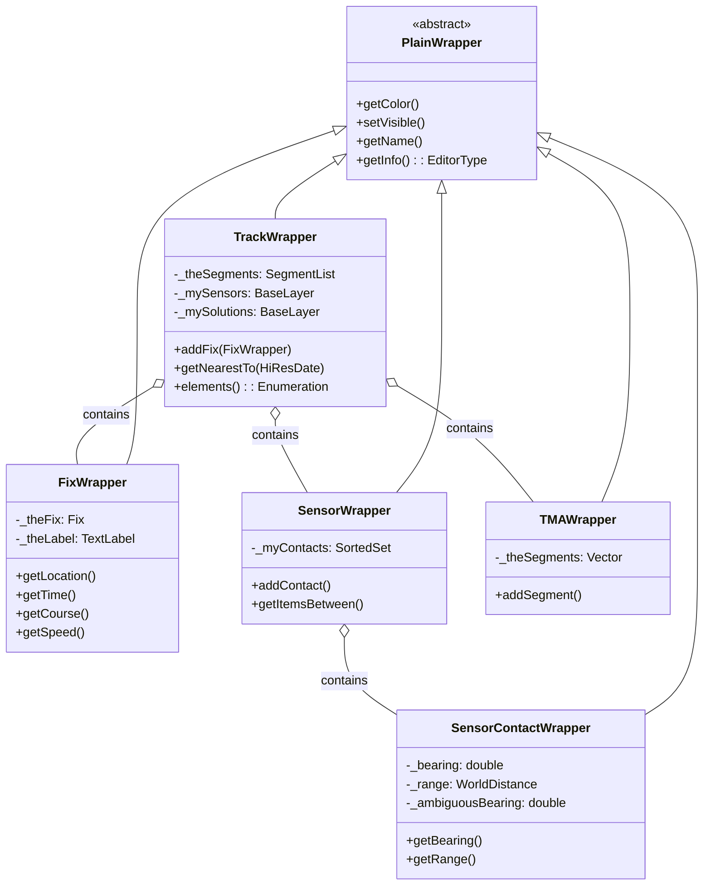
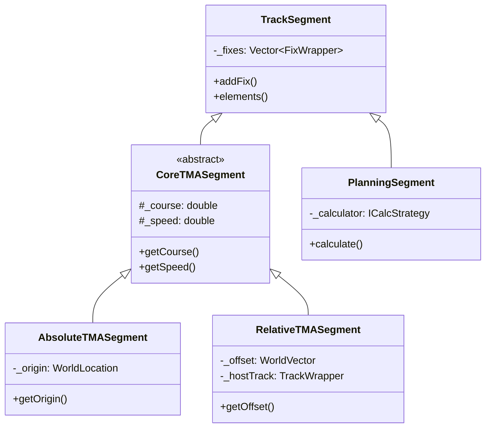
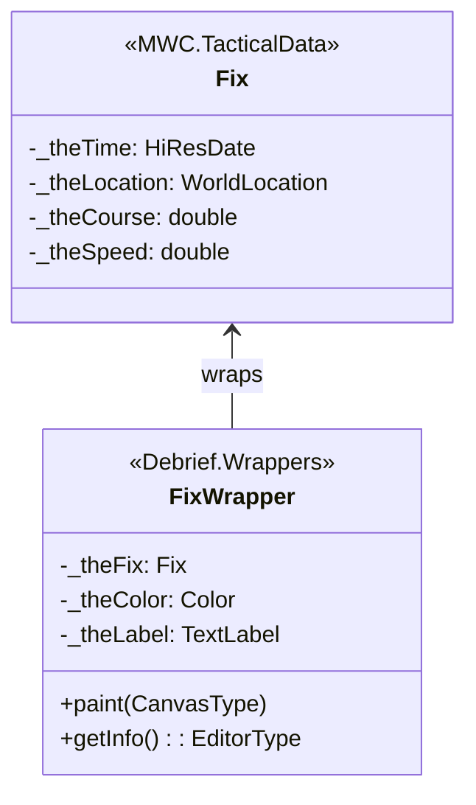
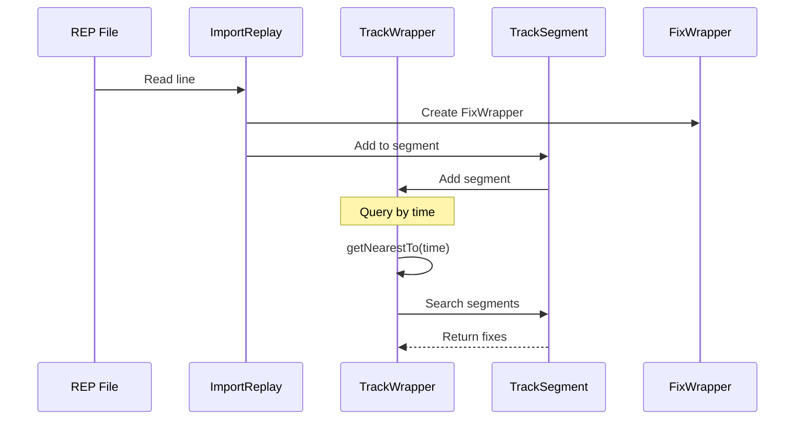

# Debrief.Wrappers

Domain model wrappers for tracks, fixes, sensors, and TMA solutions.

## Purpose

This package contains the **core domain model** for Debrief: wrapper classes that separate tactical data from presentation. TrackWrapper, FixWrapper, SensorWrapper, and TMAWrapper encapsulate the data structures for maritime analysis while providing Eclipse property sheet integration. **[VERIFIED]**

## Architecture



## Entry Points

| Class | Lines | Purpose |
|-------|-------|---------|
| `TrackWrapper` | 3,941 | Main track container |
| `FixWrapper` | 1,833 | Individual position fix |
| `SensorWrapper` | 1,639 | Sensor observations container |
| `SensorContactWrapper` | 1,544 | Single bearing/range observation |
| `TMAWrapper` | 777 | TMA solution container |
| `CompositeTrackWrapper` | 693 | Multi-leg planning track |

## Key Classes

### TrackWrapper

**Purpose**: Primary container for entire track with fixes, sensors, and TMA solutions.

**Key Fields**:
- `_theSegments` - SegmentList of TrackSegment objects containing fixes
- `_mySensors` - BaseLayer of SensorWrapper objects
- `_mySolutions` - BaseLayer of TMAWrapper objects
- `_myDynamicShapes` - Dynamic visualization shapes

**Core Methods**:
```java
// Adding data
void addFix(FixWrapper fix)
void add(SensorWrapper sensor)
void add(TMAWrapper solution)

// Time-based queries
Watchable[] getNearestTo(HiResDate dtg)
Collection<Editable> getItemsBetween(HiResDate start, HiResDate end)

// Iteration
Enumeration<Editable> elements()  // all fixes via WrappedIterators

// Manipulation
void shift(WorldVector offset)
void rotate(double bearing, WorldLocation origin)
void decimate(HiResDate threshold)
void trimTo(TimePeriod period)
```

**Performance Optimization**:
```java
// Iterator caching for repeated getNearestTo() calls
private WatchableList.IteratorWrapper _lastPosIterator;
```

**[VERIFIED]**

---

### FixWrapper

**Purpose**: Single position fix with time, location, course, speed.

**Wraps**: `MWC.TacticalData.Fix`

**Key Fields**:
- `_theFix` - The wrapped Fix object
- `_theLabel` - TextLabel for display
- `_showLabel` - Visibility flag

**Key Methods**:
```java
WorldLocation getLocation()
HiResDate getTime()
double getCourse()      // radians
double getSpeed()       // knots
double getDepth()       // metres
String getLabel()
Color getColor()
```

**Implements**: `Watchable`, `TimeStampedDataItem`, `Editable`

**[VERIFIED]**

---

### SensorWrapper

**Purpose**: Container for bearing/range observations from a sensor platform.

**Key Fields**:
- `_myContacts` - SortedSet of SensorContactWrapper (time-ordered)
- `_waveformType` - Sensor classification
- `_visible` - Display visibility

**Key Methods**:
```java
void add(SensorContactWrapper contact)
Collection<Editable> getItemsBetween(HiResDate start, HiResDate end)
Enumeration<Editable> elements()
```

**Array Geometry Support**: Calculates array centre for towed arrays.

**[VERIFIED]**

---

### SensorContactWrapper

**Purpose**: Individual bearing/range observation from sensor.

**Key Fields**:
- `_bearing` - Observed bearing (degrees)
- `_ambiguousBearing` - 180° alternate bearing
- `_range` - Range to target (WorldDistance)
- `_frequency` - Observed frequency
- `_hasBearing`, `_hasFrequency` - Data validity flags

**Key Methods**:
```java
double getBearing()              // degrees
double getAmbiguousBearing()     // 180° opposite
WorldDistance getRange()
double getFrequency()
boolean getHasAmbiguousBearing()
```

**Comparable**: Supports time-based sorting with duplicate handling.

**[VERIFIED]**

---

### TMAWrapper

**Purpose**: Container for TMA (Target Motion Analysis) solutions.

**Key Fields**:
- Holds CoreTMASegment objects (AbsoluteTMASegment or RelativeTMASegment)

**[VERIFIED]**

---

### CompositeTrackWrapper

**Purpose**: Multi-leg planning track extending TrackWrapper.

**Uses**: PlanningSegment with calculation strategies (FromRangeSpeed, etc.)

**[VERIFIED]**

## Track/ Subdirectory

### Segment Classes

| Class | Lines | Purpose |
|-------|-------|---------|
| `TrackSegment` | 1,260 | Base container for fixes |
| `CoreTMASegment` | 335 | Abstract TMA with course/speed |
| `AbsoluteTMASegment` | 456 | Fixed-origin TMA |
| `RelativeTMASegment` | 1,414 | Offset TMA relative to host |
| `PlanningSegment` | 540 | Planning leg with bearing/speed |
| `DynamicInfillSegment` | 839 | Auto-generated gap-filling |
| `LightweightTrackWrapper` | 1,253 | Minimal track for rendering |

### Segment Hierarchy



## Iterator Pattern

**WrappedIterators**: Combines multiple segment iterators seamlessly.

```java
class WrappedIterators implements Enumeration<Editable> {
    private Vector<Enumeration<Editable>> _theEnums;

    public Editable nextElement() {
        // Iterate through segments transparently
        while (currentEnum.hasMoreElements() == false) {
            moveToNextSegment();
        }
        return currentEnum.nextElement();
    }
}
```

**getNearestTo(HiResDate)** Implementation:
```java
Watchable[] getNearestTo(HiResDate dtg) {
    // Check cached iterator first (optimization)
    if (_lastPosIterator != null) {
        Watchable cached = _lastPosIterator.getNearestTo(dtg);
        if (cached != null) return new Watchable[] { cached };
    }

    // Fall back to full search
    // Can return multiple items at same time
}
```

**[VERIFIED]**

## Wrapper Pattern

All classes implement the wrapper pattern:



**Rationale**: Separates core tactical data (portable) from GUI concerns (Eclipse property sheets).

**[VERIFIED]**

## Data Manipulation Flow



## Performance Considerations

1. **Segment Organization**: Avoids iterating unnecessary fixes
2. **Iterator Caching**: `_lastPosIterator` prevents restart on repeated queries
3. **Transient Fields**: `_myPts`, `_locationListener` don't serialize
4. **Decimate Operation**: Thins data without destructive modification

**[VERIFIED]**

## Design Patterns

### Wrapper Pattern
Every class wraps raw tactical data with formatting/editing.

### Composite Pattern
TrackWrapper → TrackSegment → FixWrapper hierarchy.

### Strategy Pattern
PlanningSegment uses calculation strategies (FromRangeSpeed, etc.)

### Observer Pattern
PropertyChangeSupport for track modifications.

### Template Method
CoreTMASegment/AbsoluteTMASegment/RelativeTMASegment.

**[VERIFIED]**

## Dependencies

| Package | Purpose |
|---------|---------|
| `MWC.GenericData` | WorldLocation, HiResDate, etc. |
| `MWC.TacticalData` | Fix, Track core classes |
| `MWC.GUI` | Plottable, Editable interfaces |

## See Also

- [CLAUDE.md](../../../../CLAUDE.md) - Entry point
- [org.mwc.debrief.legacy README](../../../README.md) - Parent plugin
- [Debrief.ReaderWriter README](../ReaderWriter/README.md) - File I/O
- [KEY_CLASSES.md](../../../../KEY_CLASSES.md) - Wrapper relationships
