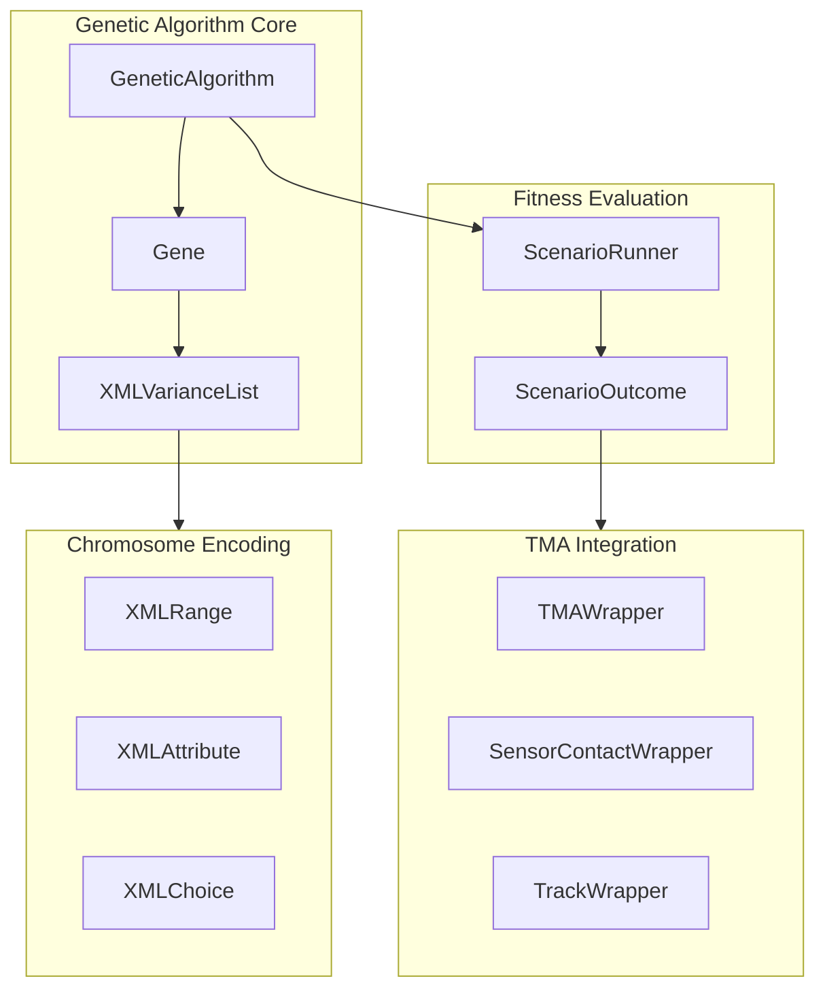
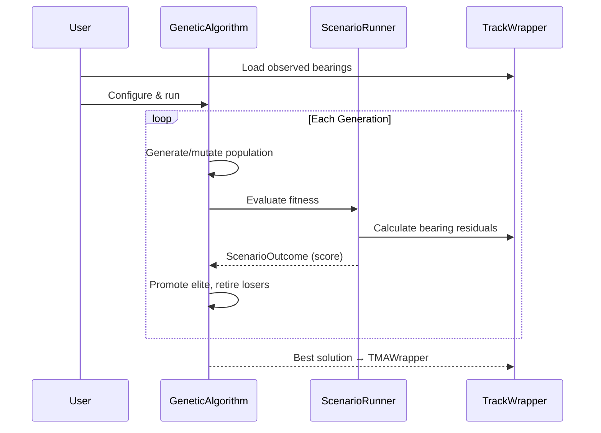

# org.mwc.debrief.satc.core

SATC (Semi-Automatic Track Construction) genetic algorithm for TMA solutions.

## Purpose

This plugin provides a **genetic algorithm framework** for Target Motion Analysis (TMA). It uses evolutionary optimization to find target track solutions that best fit observed sensor bearings. The GA framework is implemented in `org.mwc.asset.legacy` and integrated here for Debrief TMA applications. **[VERIFIED]**

## Architecture



## Entry Points

| Class | Lines | Location |
|-------|-------|----------|
| `GeneticAlgorithm` | 524 | `ASSET.Scenario.Genetic.GeneticAlgorithm` |
| `Gene` | 460 | `ASSET.Scenario.Genetic.Gene` |
| `XMLVarianceList` | 142 | `ASSET.Util.MonteCarlo.XMLVarianceList` |
| `XMLRange` | 362 | `ASSET.Util.MonteCarlo.XMLRange` |
| `ScenarioRunner` | - | `ASSET.Scenario.Genetic.ScenarioRunner` |

## Algorithms

### Main GA Loop

**Location**: `ASSET.Scenario.Genetic.GeneticAlgorithm`

```text
GENETIC ALGORITHM
INPUT: population_size, stars_size, generations, scenario_runner
OUTPUT: best_solution

1. INITIALIZE
   population = [ ]
   stars = [ ]  // Elite hall of fame

2. FOR generation = 1 to max_generations:

   2.1 GENERATE new population
       FOR i = 1 to population_size:
         new_gene = baseGene.createRandom()
         population.add(new_gene)

   2.2 MUTATE (blend with elite stars)
       IF stars not empty:
         FOR each star in stars (by fitness):
           FOR each gene in population:
             gene.mergeWith(star, probability)

   2.3 EVALUATE fitness
       FOR each gene in population:
         gene_scenario = gene.getDocument()
         outcome = scenario_runner.runThis(gene_scenario)
         gene.setFitness(outcome.score)

   2.4 SORT population by fitness (highest first)

   2.5 PROMOTE elite
       Add genes with fitness >= worst_star to stars
       Keep top stars_size only

   2.6 RETIRE (clear working population, retain stars)

3. RETURN best_solution (first in stars)
```

**[VERIFIED]**

---

### Crossover Operator

**Location**: `ASSET.Scenario.Genetic.Gene.mergeWith()`

```text
UNIFORM CROSSOVER WITH PROBABILITY
INPUT: this_gene, other_gene, probability
OUTPUT: modified this_gene

percentage_step = 0.3 / num_stars
cumulative_prob = percentage_step

FOR each star (best to worst):
  FOR each gene in population:
    FOR each allele in gene:
      IF random(0, 1) <= cumulative_prob:
        // Blend with star's allele
        new_value = other.value + gaussian(-σ, σ)
        new_value = clamp(new_value, min, max)
        allele.value = new_value

  cumulative_prob += percentage_step
```

**Crossover Rate**: First star ~10%, last star up to 30% (rank-based).

**[VERIFIED]**

---

### Mutation Operator

**Location**: `ASSET.Util.MonteCarlo.XMLRange.newPermutation()`

```text
VALUE GENERATION
INPUT: min, max, step, RandomModel
OUTPUT: new_value

IF number_permutations specified:
  // Fixed set of values
  IF _myPerms not initialized:
    FOR i = 1 to number_permutations:
      _myPerms.add(generateRandom())
  index = random(0, |_myPerms|)
  RETURN _myPerms[index]

ELSE IF step specified:
  // Discrete steps
  num_steps = (max - min) / step
  random_step = random(0, num_steps)
  RETURN min + random_step * step

ELSE:
  // Continuous random
  SWITCH RandomModel:
    UNIFORM: RETURN random(min, max)
    NORMAL: RETURN gaussian(mean, sigma)
    NORMAL_CONSTRAINED: RETURN clamp(gaussian(), min, max)
```

**[VERIFIED]**

---

### Elite Selection

**Location**: `ASSET.Scenario.Genetic.GeneticAlgorithm.promote()`

```text
ELITE PROMOTION (μ+λ Strategy)
INPUT: population, stars, stars_size
OUTPUT: updated stars

IF stars is empty:
  stars = top stars_size from population
  RETURN

worst_star_fitness = stars.first().fitness

candidates = [genes where fitness >= worst_star_fitness]
stars.addAll(candidates)

Sort stars by fitness descending
stars = take top stars_size
```

**[VERIFIED]**

## TMA Problem Formulation

### Decision Variables (Chromosome)

| Variable | Type | Bounds | Description |
|----------|------|--------|-------------|
| Target Latitude | XMLRange | ±5° from estimate | Initial position |
| Target Longitude | XMLRange | ±5° from estimate | Initial position |
| Target Course | XMLRange | 0-359.9° | Direction of travel |
| Target Speed | XMLRange | 0-30 kts | Speed over ground |

### Fitness Function (Minimize)

```text
fitness = Σ |observed_bearing[i] - predicted_bearing[i]|²
        + α × Σ |observed_range[i] - predicted_range[i]|²
        + β × course_acceleration_penalty

Where:
  predicted_position = initial_pos + speed × course × time
  predicted_bearing = atan2(target_north - ownship_north,
                           target_east - ownship_east)
```

### Constraint Handling

**Bounds Enforcement** (XMLRange):
```java
void merge(XMLRange other) {
    _currentValue = other._currentValue + random_variance;
    _currentValue = Math.max(_currentValue, _min);
    _currentValue = Math.min(_currentValue, _max);
}
```

**[VERIFIED]**

## GA Parameters

| Parameter | Typical Value | Purpose |
|-----------|---------------|---------|
| `population_size` | 20-50 | Working population |
| `stars_size` | 5-10 | Elite set size |
| `generations` | 100-500 | Evolution iterations |
| `crossover_prob` | 0.3/stars | Star blending probability |
| `mutation_variance` | 5% | Offspring variance |

### XMLRange Configuration

```xml
<!-- Position: 0.1 degree resolution -->
<Range min="40.0" max="44.0" step="0.1" RandomModel="UNIFORM" />

<!-- Speed: Normal distribution -->
<Range min="0" max="30" RandomModel="NORMAL" />

<!-- Course: Discrete 5-degree steps -->
<Range min="0" max="359.9" step="5" RandomModel="UNIFORM" />
```

## Integration with Debrief



**Data Flow**:
1. Load observed bearings from `SensorContactWrapper`
2. GA varies target position/course/speed
3. Predict bearings from varied parameters
4. Calculate residuals vs observed
5. Best solution creates `TMAWrapper`

## Design Patterns

### Strategy Pattern
`ScenarioRunner` interface allows pluggable fitness evaluation.

### Flyweight Pattern
`_myPerms` caches random values for fixed permutation sets.

### Template Method
`Gene.createRandom()` and `Gene.mergeWith()` define skeleton with customizable alleles.

**[VERIFIED]**

## Strengths & Limitations

**Strengths**:
- Flexible XML-based chromosome encoding
- Configurable bounds (continuous, discrete, gaussian)
- Elite preservation prevents loss of best solutions
- Variance injection prevents premature convergence

**Limitations**:
- Fixed population size (no dynamic adjustment)
- No explicit diversity maintenance
- Sequential fitness evaluation (no parallelization)
- Multi-modal fitness landscape may trap in local optima

## Dependencies

| Package | Purpose |
|---------|---------|
| `org.mwc.asset.legacy` | GA framework |
| `org.mwc.debrief.legacy` | TMAWrapper, TrackWrapper |
| `MWC.GenericData` | WorldLocation, WorldSpeed |

## See Also

- [CLAUDE.md](../CLAUDE.md) - Entry point
- [org.mwc.debrief.track_shift README](../org.mwc.debrief.track_shift/README.md) - TMA algorithms
- [org.mwc.asset.legacy README](../org.mwc.asset.legacy/README.md) - GA framework source
