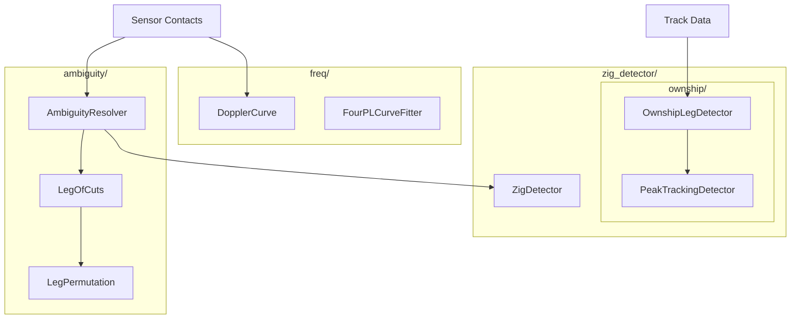

# org.mwc.debrief.track_shift

TMA (Target Motion Analysis) and bearing analysis algorithms.

## Purpose

This plugin implements **advanced maritime TMA algorithms** for analyzing bearing-only sensor data to estimate target course and speed. It includes ambiguity resolution, zig detection, leg identification, and Doppler curve fitting. **[VERIFIED]**

## Architecture



## Entry Points

| Class | Purpose | Location |
|-------|---------|----------|
| `AmbiguityResolver` | Resolve bearing ambiguity | `ambiguity.AmbiguityResolver` |
| `ZigDetector` | Detect target course changes | `zig_detector.ZigDetector` |
| `OwnshipLegDetector` | Detect ownship steady legs | `zig_detector.ownship.*` |
| `DopplerCurve` | Fit frequency shift data | `freq.DopplerCurve` |

## Key Packages

| Package | Purpose |
|---------|---------|
| `ambiguity` | Bearing ambiguity resolution, leg slicing |
| `zig_detector` | Target zig detection |
| `zig_detector.ownship` | Ownship leg detection |
| `zig_detector.moving_average` | Moving average filters |
| `freq` | Doppler/frequency analysis |
| `views` | Residual plotting |

## Algorithms

### Bearing Ambiguity Resolution

**Purpose**: Resolve 180° ambiguity in passive sonar bearings across multiple legs.

**Location**: `ambiguity/AmbiguityResolver.java`

**Problem**: Passive sonar detects bearing but cannot determine if target is on the measured bearing or 180° opposite.

```text
AMBIGUITY RESOLUTION ALGORITHM
INPUT: List of legs, each with CORE and AMBIGUOUS bearing data
OUTPUT: Best assignment (CORE or AMBIGUOUS) per leg

1. DIVIDE legs into chunks (max 20 legs to avoid 2^n explosion)

2. FOR each chunk:
   2.1 GENERATE all 2^n permutations (CORE/AMBIG per leg)
   2.2 FOR each permutation:
       2.2.1 Extract bearing curves at leg boundaries:
             - Early period: first 8 cuts (quadratic fit)
             - Late period: last 8 cuts (quadratic fit)
       2.2.2 Calculate score = sum of turn angles at zig points
       2.2.3 Store permutation with score
   2.3 SELECT permutation with minimum total turn angle

3. APPLY best assignment to leg data

SCORING (PermScore):
  For each zig point between legs[i] and legs[i+1]:
    bearing_delta = getEndBearing(legs[i]) - getStartBearing(legs[i+1])
    // Normalize to [-180, 180]
    score += |bearing_delta|
```

**Complexity**: O(2^n) where n ≤ 20 legs per chunk

**[VERIFIED]**

---

### Zig Detection (Leg Slicing)

**Purpose**: Detect when target changes course (zig) vs maintains steady course (leg).

**Location**: `ambiguity/AmbiguityResolver.sliceSensorIntoLegsUsingAmbiguity()`

```text
ZIG DETECTION ALGORITHM
INPUT: Sensor contacts with CORE and AMBIGUOUS bearings
OUTPUT: List of legs and zigs

1. FOR each sensor contact:
   1.1 Calculate delta = AmbiguousBearing - CoreBearing
   1.2 Handle domain wraparound (0°/360° boundary)
   1.3 Calculate rate = |delta[i] - delta[i-1]| / timeInterval

2. CLASSIFY contact:
   IF rate > minZig threshold (typically 2.2 deg/sec):
     Mark as ZIG (target turning)
   ELSE IF rate > minBoth AND both bearings changing same direction:
     Mark as TRIP_ZIG
   ELSE:
     Mark as LEG (steady course)

3. GROUP contacts:
   - Accumulate steady contacts into LEG
   - Accumulate turning contacts into ZIG
   - Require minLegLength (240 sec) for valid leg

4. RETURN List<LegOfCuts>, List<ZigCuts>
```

**Key Thresholds**:
| Parameter | Value | Purpose |
|-----------|-------|---------|
| `minZig` | 2.2 deg/sec | Rate to trigger zig |
| `minBoth` | 0.2 deg/sec | Both bearings changing |
| `minLegLength` | 240 sec | Minimum leg duration |

**[VERIFIED]**

---

### Bearing Curve Fitting

**Purpose**: Fit quadratic polynomial to bearing data for trend extraction.

**Location**: `ambiguity/LegOfCuts.getCurve()`

```text
BEARING CURVE FITTING
INPUT: Leg of sensor cuts, period (EARLY/LATE/ALL), bearing type (CORE/AMBIG)
OUTPUT: Polynomial coefficients [intercept, linear, quadratic]

1. SELECT data portion:
   - EARLY: First 8 cuts
   - LATE: Last 8 cuts
   - ALL: All cuts (or endpoints if > 16)

2. WEIGHT observations:
   - First quarter: weight = 0.001 (array settling)
   - Rest: weight = 1.0

3. HANDLE domain wraparound:
   - Detect jumps > 180°
   - Adjust to maintain continuity

4. FIT polynomial:
   - Use Apache Commons Math PolynomialCurveFitter
   - Degree = 2 (quadratic)
   - y = a + b*t + c*t^2

5. RETURN [a, b, c]
```

**[VERIFIED]**

---

### Ownship Leg Detection

**Purpose**: Detect periods when ownship maintains steady course/speed.

**Location**: `zig_detector/ownship/`

**Three Implementations**:

#### 1. Moving Average Detector

```text
MOVING AVERAGE LEG DETECTION
INPUT: Ownship course/speed over time
OUTPUT: Leg boundaries

1. Apply 5-minute time-based moving average to course
2. Calculate course rate = |course[i] - course[i-1]| / time
3. IF rate exceeds tolerance AND > 30 sec since last:
   3.1 Mark new leg boundary
4. Tolerances:
   - HIGH precision: 0.05 deg/sec
   - MEDIUM: 0.08 deg/sec
   - LOW: 0.2 deg/sec
```

#### 2. Peak Tracking Detector

```text
PEAK TRACKING LEG DETECTION
INPUT: Ownship course over time
OUTPUT: Leg boundaries with leg IDs

1. MAKE course continuous (unwrap 360° jumps)
2. COMPUTE course deltas (first derivative)
3. FIND peaks and troughs (zero crossings in delta)
4. FOR each point:
   4.1 Track downward min/max (from start to point)
   4.2 Track upward min/max (from point to end)
   4.3 Compute diff = |downMin - upMin| and |downMax - upMax|
5. IF diff exceeds 6° threshold:
   5.1 Increment leg ID
6. DETERMINE if half-legs are legs or zigs:
   6.1 Compare mean course delta in whole vs half segments
```

**[VERIFIED]**

---

### Doppler Curve Fitting

**Purpose**: Fit frequency shift data to detect closest point of approach (CPA).

**Location**: `freq/DopplerCurve.java`

```text
DOPPLER CURVE FITTING (4-Parameter Logistic)
INPUT: Frequency measurements over time
OUTPUT: CPA time and frequency

1. NORMALIZE data:
   - Time: map to [0, 1]
   - Frequency: map to [0, 1]

2. FIT Four-Parameter Logistic (4PL) curve:
   f(x) = ((a-d)/(1 + (x/c)^b)) + d

   Parameters:
   - a = upper asymptote (high frequency)
   - b = slope steepness
   - c = inflection point (CPA location)
   - d = lower asymptote (low frequency)

3. FIND inflection point:
   - Compute second derivative
   - Use bisection solver to find zero crossing
   - Tolerance: 1e-12

4. RETURN inflectionTime (CPA), inflectionFreq

Uses: Apache Commons Math FourPLCurveFitter
```

**[VERIFIED]**

---

### Target Zig Detection

**Purpose**: Find target course changes from bearing residuals.

**Location**: `zig_detector/ZigDetector.java`

```text
TARGET ZIG DETECTION
INPUT: Bearing residuals (forecast error)
OUTPUT: Zig boundaries

1. WALK array tracking sign (above/below zero)
2. ACCUMULATE consecutive same-side counts
3. WHEN sign flips AND count exceeded threshold:
   3.1 Mark as zig boundary
4. Use Flanagan arctan minimization for course fitting:
   Forecast = atan2(sinB + P*t, cosB + Q*t)
   Minimize: sum((forecast - measured)^2)
```

**[VERIFIED]**

## Dependencies

| Plugin | Purpose |
|--------|---------|
| `org.mwc.cmap.legacy` | Data types, algorithms |
| `org.mwc.debrief.legacy` | Wrappers, domain model |
| `org.mwc.debrief.core` | Eclipse integration |
| `org.mwc.cmap.plotViewer` | Chart display |

**External Libraries**:
- Apache Commons Math3 - Curve fitting, bisection solver
- Flanagan - Arctan minimization

## Design Rationale & Lessons Learned

### Why Chunked Permutation Search?

With n legs, there are 2^n possible bearing assignments. For n > 20, this exceeds memory limits. Chunking processes 20 legs at a time, trading optimality for tractability. **[VERIFIED]**

### Why Quadratic Curve Fitting?

Bearings typically change smoothly during steady legs. Quadratic polynomial (y = a + bt + ct²) captures this trend while being robust to noise. Higher degrees overfit. **[INFERRED]**

### Why Multiple Leg Detectors?

Different data characteristics require different approaches:
- Moving average: works well for clean data
- Peak tracking: handles noisy data better
- Artificial: for simulated data with perfect straights

**[VERIFIED]**

### Lessons Learned

**What worked well**:
- Polynomial curve fitting provides robust trend extraction
- 4PL sigmoid captures Doppler shift characteristics
- Domain wraparound handling prevents false zigs at 0°/360°

**What could improve**:
- 2^n complexity limits leg count
- Consider machine learning for ambiguity resolution
- Better handling of crossing tracks

**For Future Debrief**:
- Investigate neural network approaches for TMA
- Consider Kalman filtering for track estimation
- GPU acceleration for permutation search

## See Also

- [CLAUDE.md](../CLAUDE.md) - Entry point
- [DOMAIN_GLOSSARY.md](../DOMAIN_GLOSSARY.md) - TMA terminology
- [org.mwc.debrief.satc.core README](../org.mwc.debrief.satc.core/README.md) - Genetic algorithm TMA
